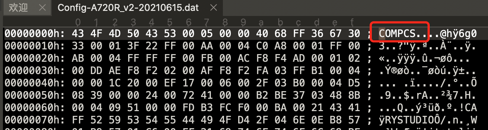
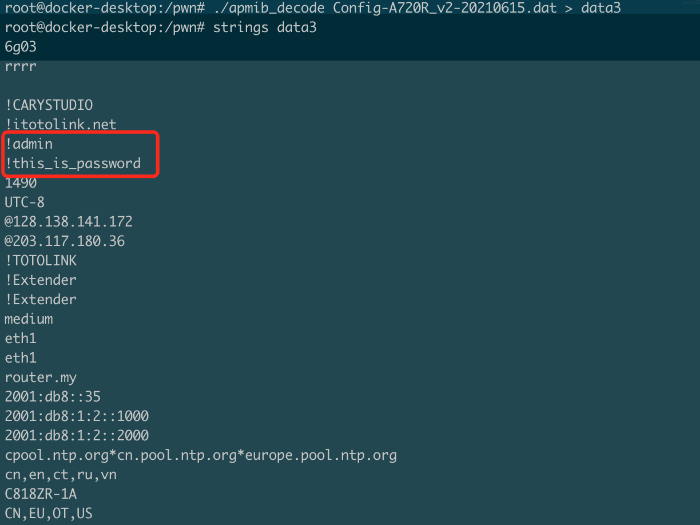

# TOTOLINK Vulnerability

Vendor:TOTOLINK

Product:A720R

Version:A720R_Firmware(V4.1.5cu.470_B20200911)

Type:Sensitive data disclosure

Author:Huizhao Wang, Chuan Qin

Institution:wanghuizhao@iie.ac.cn, qinchuan@iie.ac.cn

## Vulnerability description

We found a sensitive data disclosure vulnerability in TOTOLINK Technology router with firmware which was released recently, allows remote attackers to download `Config-A720R_v2-xxxxxxxx.dat`.

We use a binary editor to view the contents of the file, it starts with `COMPCS`. We can know that this is apmib configuration file. 

Then, sensitive information such as username and password can be found in the decoded file.

## POC

Sending GET request http://192.168.0.1/cgi-bin/ExportSettings.sh , this shell script can return the apmib configuration file. Then, we can decode the configuration file and get username, password.

## CVE info

CVE-2021-35326
