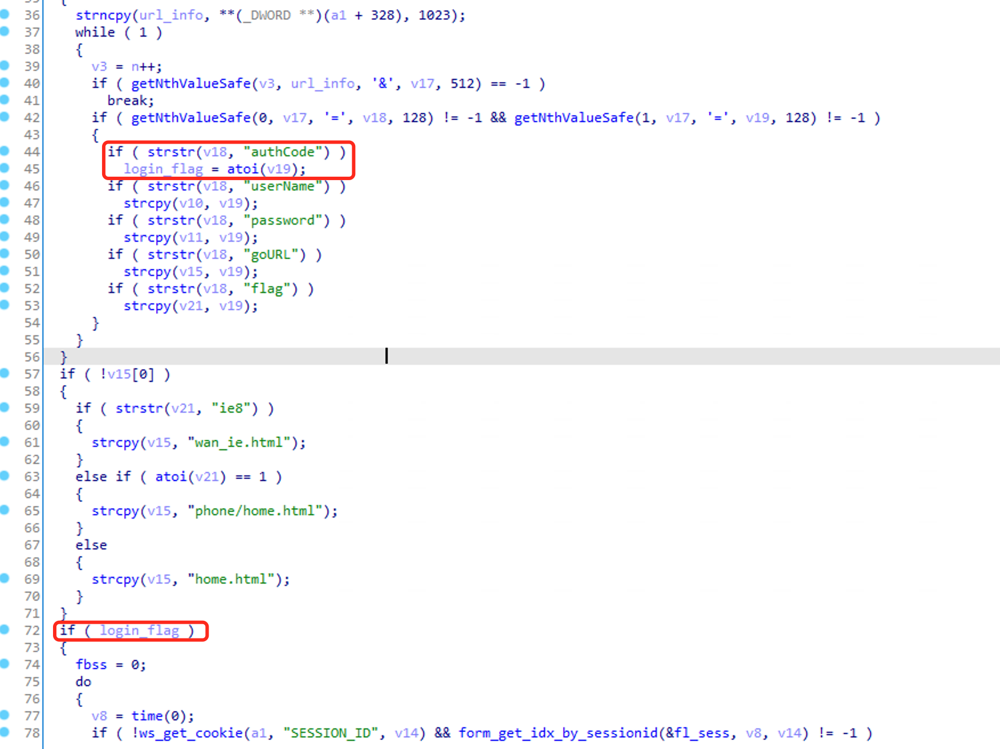

# TOTOLINK Vulnerability

Vendor:TOTOLINK

Product:A720R

Version:A720R_Firmware(V4.1.5cu.470_B20200911)

Type:Login bypass

Author:Huizhao Wang, Chuan Qin

Institution:wanghuizhao@iie.ac.cn, qinchuan@iie.ac.cn

## Vulnerability description

We found a Login bypass vulnerability in TOTOLINK Technology router with firmware which was released recently, allows remote attackers to login admin page without password.

In `Form_Login` function, `getNthValueSafe` loops to get url parameters. If there is `authCode` in the url parameter and its value is `1`, then the following check will pass directly.

## POC

We set `authCode=1` and `userName=admin` , then sending GET request such as:

http://192.168.0.1/formLoginAuth.htm?authCode=1&userName=admin&goURL=home.html&action=login

Finally, we enter the admin page as an admin user.

## CVE info

CVE-2021-35324
