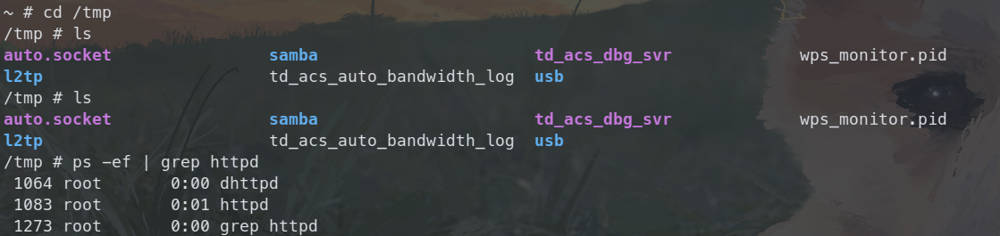
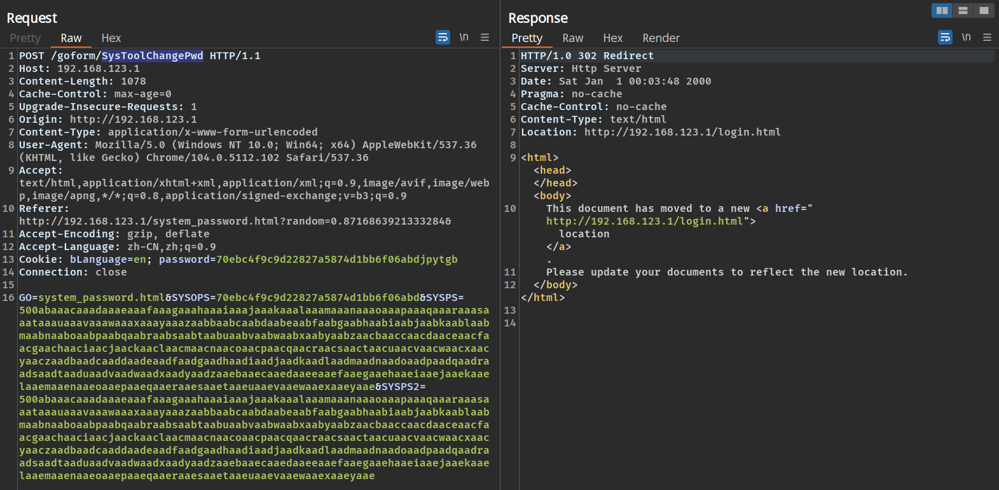
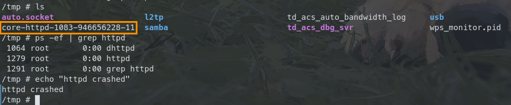
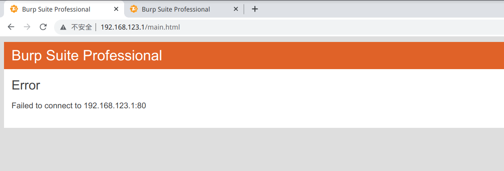
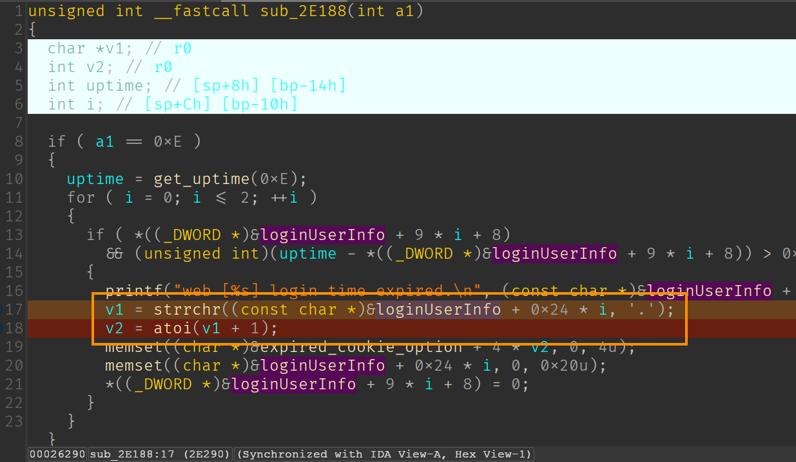
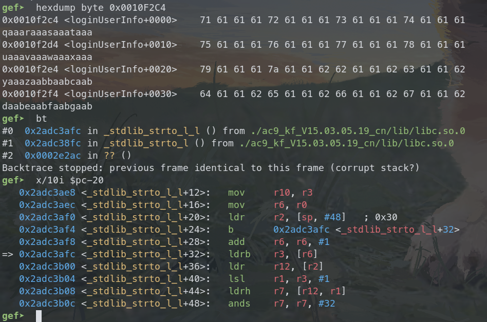

# Tenda AC9 V1 stack buffer overflow vulnerability

## Overview

- Manufacturer's website: <https://www.tenda.com.cn/>
- Firmware download: <https://www.tenda.com.cn/product/download/AC9.html>

## Vulnerability information

A stack buffer overflow vulnerability has been found in Tenda AC9 V1. If exploited, the vulnerability allows attackers to perform a DoS attack or execute arbitary code.

## Affected version(s)

We have verified this vulnerability in the following version(s):

- V15.03.05.19_multi

Figure shows the v1 latest firmware ：V15.03.05.19_multi，and V1 and v3 are different hardware.

## Reproduce the vulnerability

First, we login to the shell of the device through telnet and view the `/tmp` directory and the process number of the netctrl program to check that the device is working as expected.

We then use burp suite to send the constructed payload to `/goform/SysToolChangePwd` with the parameter `SYSPS` and `SYSPS2` set to 500 characters.

Then we can find that the httpd program crashes and there is a coredump file for httpd generated in the `/tmp` directory. And although program httpd is restarted, we are still unable to access the web anymore.

## Vulnerability details

The vulnerability exists in function `sub_2E188`(I don't know what the exact function name is, it's a function related to mataining web sessions) in `/bin/httpd` program.

When we send the payload, the global variable `g_Pass` and `loginUserInfo` is overwritten, so in function `sub_2E188`, when `strrchr` tries to find the character `.`, it returns zero because there is no character `.` in our payload. Then the zero value is passed to the following `atoi`, in which the program tries to dereference the invalid address, causing the program to crash.

This analysis above can be verified if we further debug the generated coredump file. If we construct a payload that avoids the program crashes , we are able to hijick the control flow to anywhere we want, as well as execute arbitrary code.

## CVE-ID

unsigned
