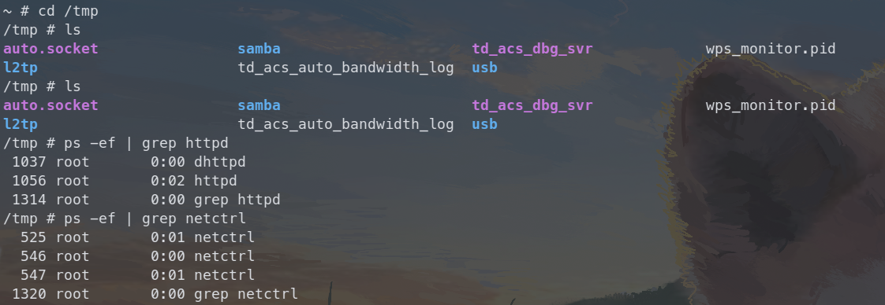
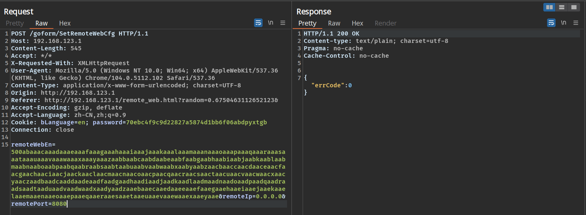
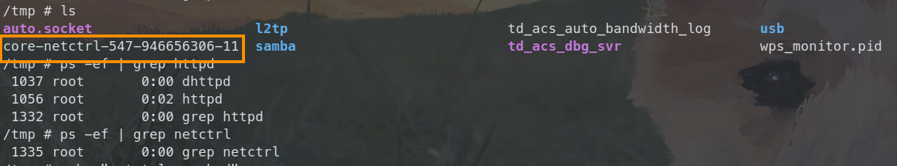
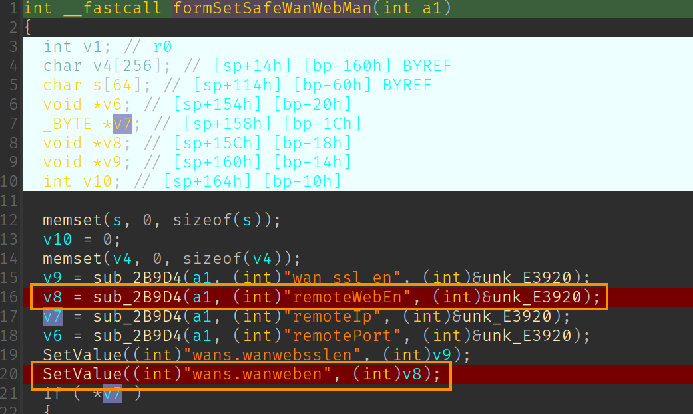
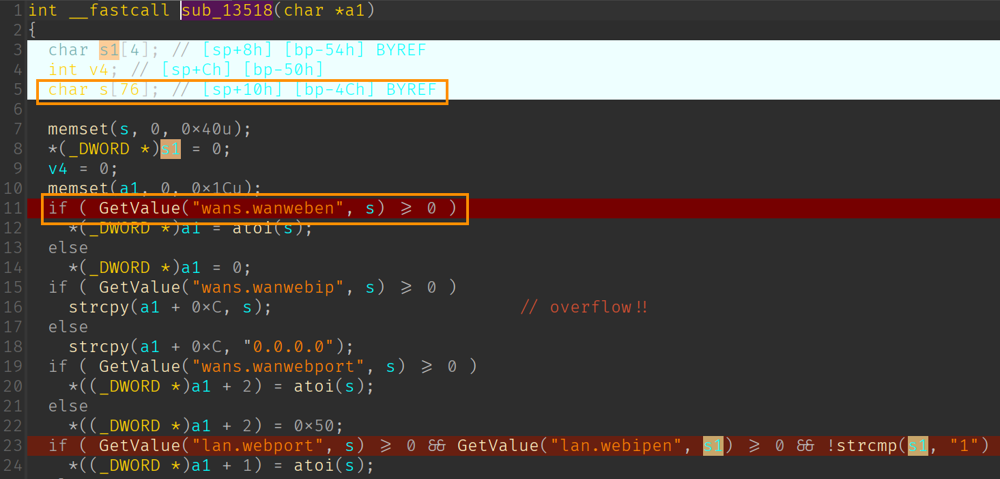
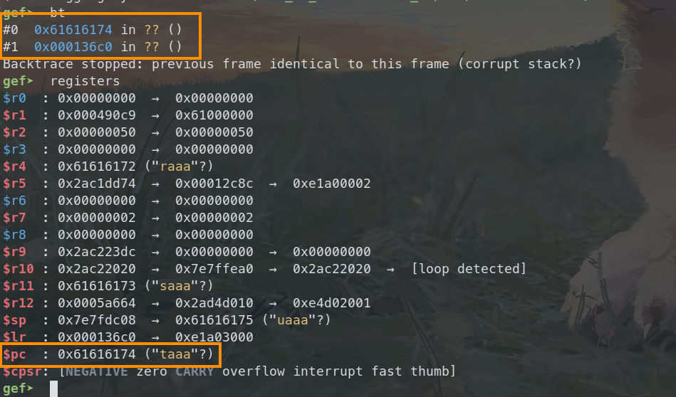

# Tenda AC9 V1 stack buffer overflow vulnerability

## Overview

- Manufacturer's website: <https://www.tenda.com.cn/>
- Firmware download: <https://www.tenda.com.cn/product/download/AC9.html>

## Vulnerability information

A stack buffer overflow vulnerability has been found in Tenda AC9 V1. If exploited, the vulnerability allows attackers to perform a DoS attack or execute arbitary code.

## Affected version(s)

We have verified this vulnerability in the following version(s):

- V15.03.05.19_multi

Figure shows the v1 latest firmware ：V15.03.05.19_multi，and V1 and v3 are different hardware.

## Reproduce the vulnerabilities

First, we login to the shell of the device through telnet and view the `/tmp` directory and the process number of the program httpd and time_check to check that the device is working as expected.

We then use burp suite to send the constructed payload to `/goform/SetRemoteWebCfg` with the parameter`remoteWebEn` set to 500 characters.

Then we can find that the program `netctrl` crashes and there is a coredump file for `netctrl` generated in the `/tmp` directory. We can also notice that the program `netctrl` is not restarted after the crash.

## Vulnerability details

The vulnerability exists in function `sub_13518`(I don't know what the exact function name is, it's a function related to setting upnp and wifi configurations) in `/bin/netctrl` program, and the source point which sets the relevant configurations is located in function `formSetSafeWanWebMan` of the `httpd` program.

First the value of  parameter`remoteWebEn` is stored persistently for key `wans.wanweben` in `httpd` program.

Then in function `sub_13518` of `/bin/netctrl`, the previously stored very long string is copied into array `s` by function `GetValue` , causing the return address of function `sub_13518` to be **overwritten**, so when the programa tries to return to the invalid "address", it crashes.

The analysis above can be verified if we further debug the generated coredump file. We can notice that the return address of function `sub_13518` pointed to by `r11` is overridden as `0x64616174` and is loaded to register `pc`.  It's not difficult to hijick the control flow to anywhere we want, as well as execute arbitrary code.

## CVE-ID

unsigned
