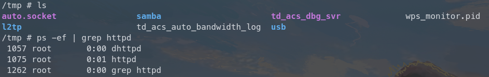
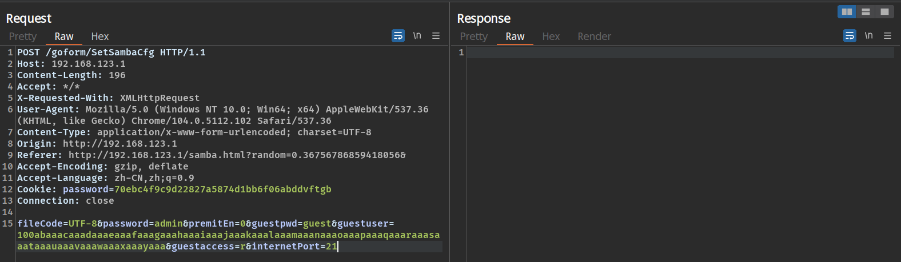
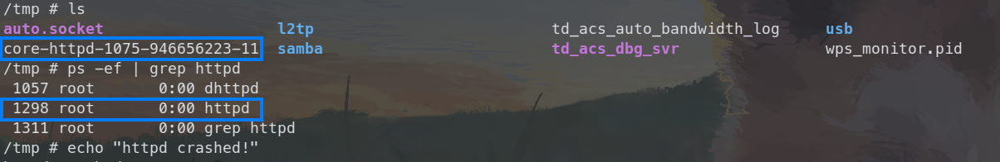
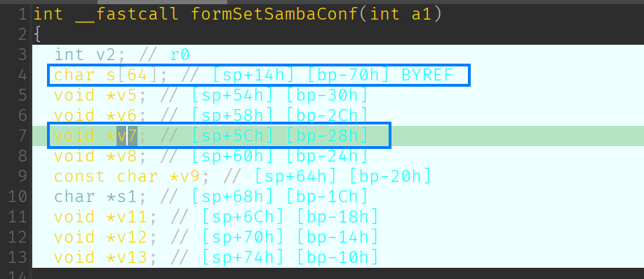
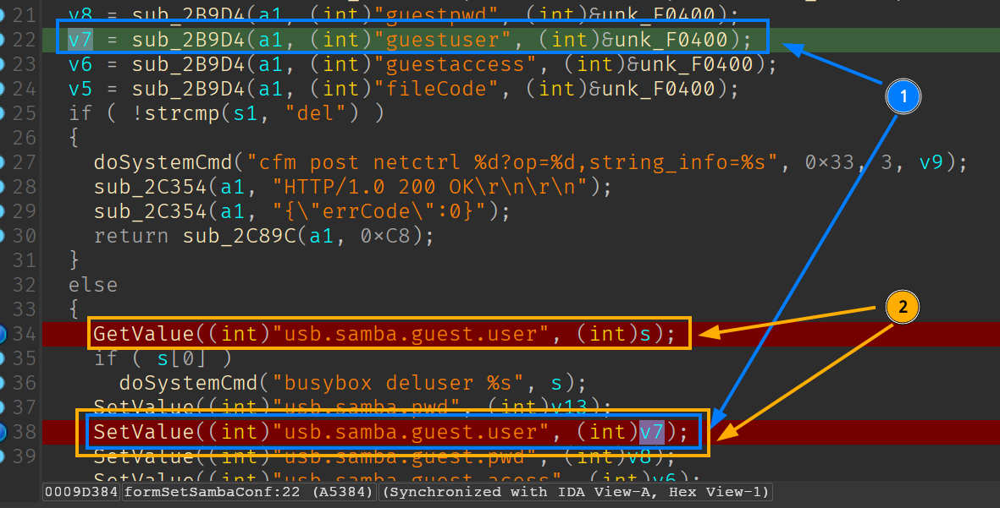
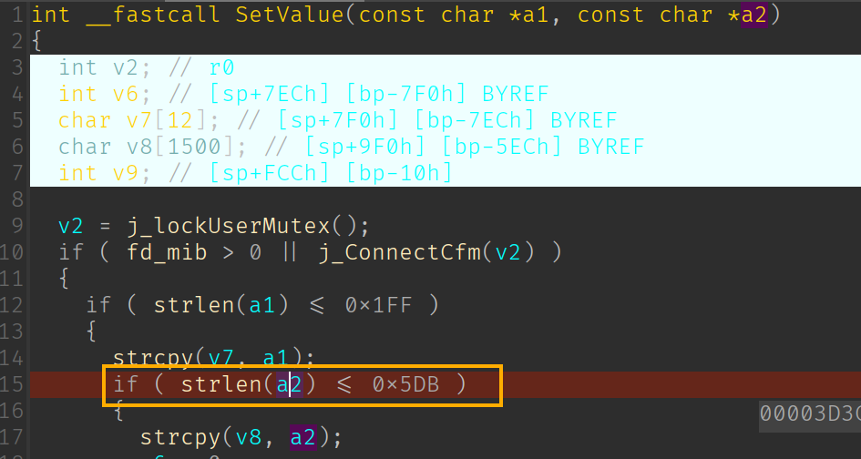
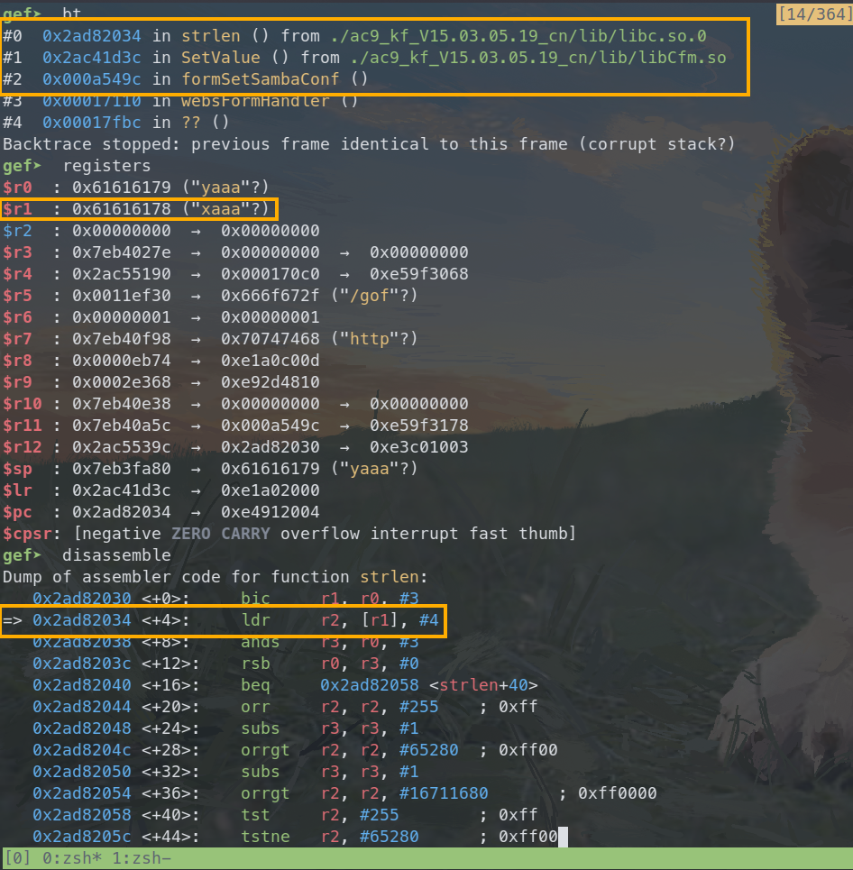

# Tenda AC9 V1 stack buffer overflow vulnerability

## Overview

- Manufacturer's website: <https://www.tenda.com.cn/>
- Firmware download: <https://www.tenda.com.cn/product/download/AC9.html>

## Vulnerability information

A stack buffer overflow vulnerability has been found in Tenda AC9 V1. If exploited, the vulnerability allows attackers to perform a DoS attack or execute arbitary code.

## Affected version(s)

We have verified these vulnerability in the following version(s):

- V15.03.05.19_multi

Figure shows the v1 latest firmware ：V15.03.05.19_multi，and V1 and v3 are different hardware.

## Reproduce the vulnerability

First, we login to the shell of the device through telnet and view the `/tmp` directory and the process number of the netctrl program to check that the device is working as expected.

We then use burp suite to send the constructed payload with the `guestuser` field set to 100 characters. Then nothing happens and the device works just as before, we can check the `/tmp` directory and the process number of the httpd program to verify that.

But when I construct the request to send the same payload again (actually it doesn't matter what the payload is), we can find that the httpd program crashes and there is a coredump file for netctrl generated in the `/tmp` directory.

## Vulnerability details

The vulnerability exists in function `formSetSambaConf` in `/bin/httpd` program. There are two variables associated with triggering this vulnerability: array `s` and pointer `v7`.

In the first request, the value of `guestuser` is stored into the memory space pointed to by `v7`, and then it's stored persistently for key `usb.samba.guest.user`. Then in the second request, the very long value is loaded into array `s`. The value is much longer than the size of array `s`, causing the pointer `v7` to be **overwritten**.

The overridden pointer `v7` is then passed to `SetValue` as the second argument, which inturn passes the pointer to function `strlen`, causing the function to dereference a nonexistent address and crash the program.

The analysis above can be verified if we further debug the generated coredump file. And if we construct a payload that avoids `strlen` crashes but also overwrites the return address of the function `formSetSambaConf`, we could hijack the control flow to anywhere we want, as well as execute arbitrary code.

## CVE-ID

unsigned
