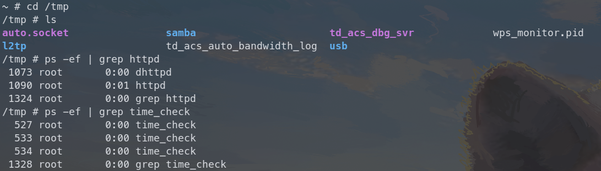
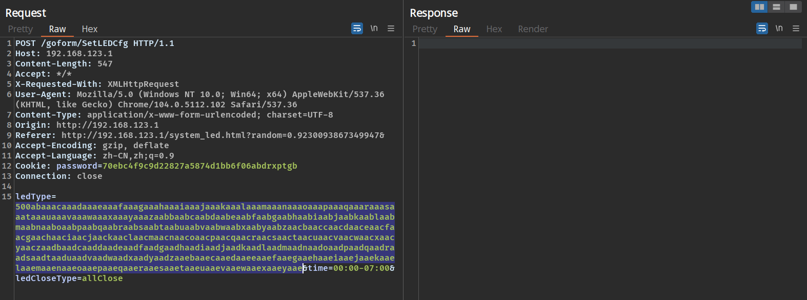
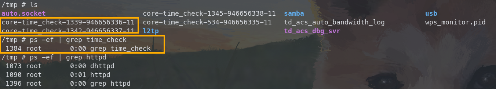
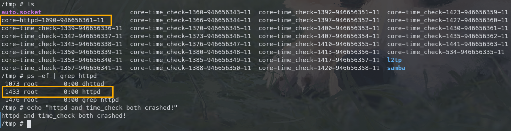
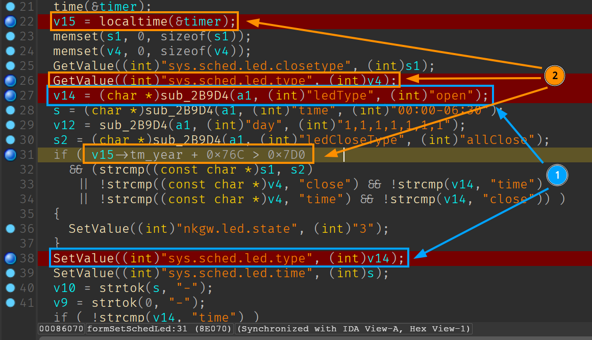
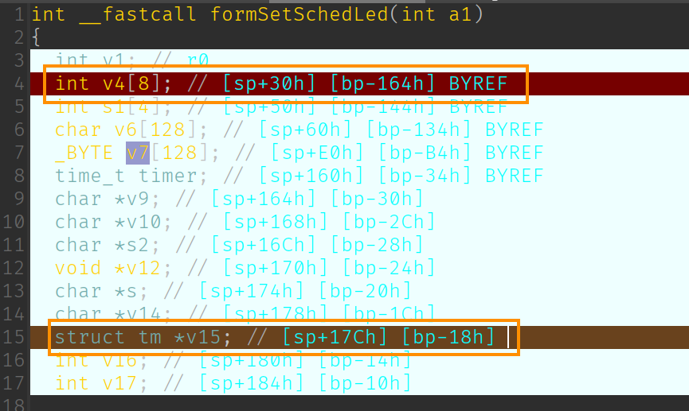
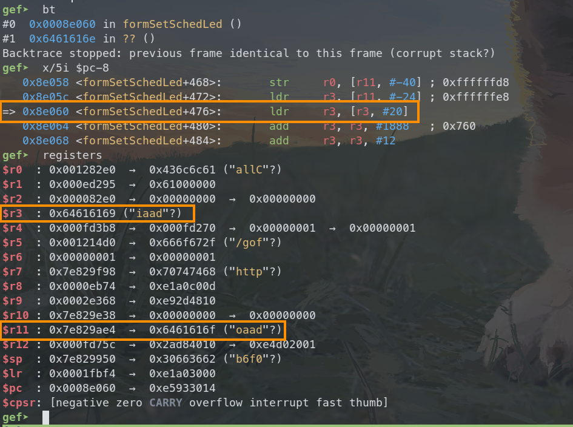
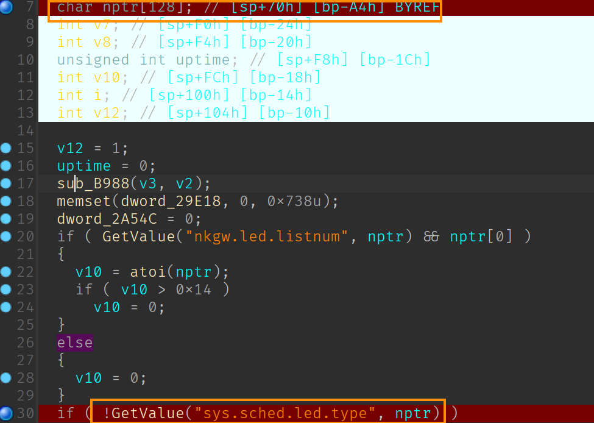
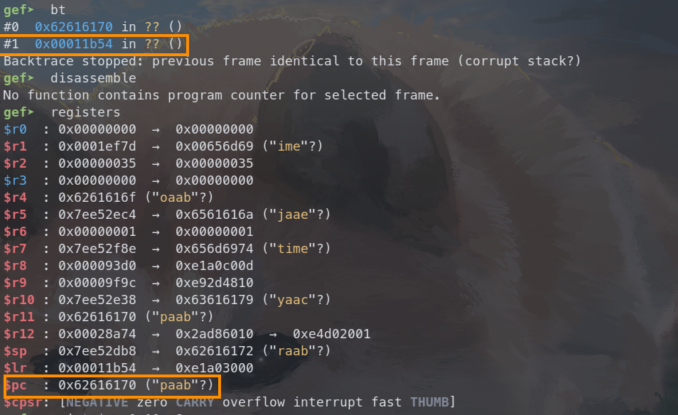

# Tenda AC9 V1 stack buffer overflow vulnerabilities

## Overview

- Manufacturer's website: <https://www.tenda.com.cn/>
- Firmware download: <https://www.tenda.com.cn/product/download/AC9.html>

## Vulnerability information

Two stack buffer overflow vulnerabilities have been found in Tenda AC9 V1. If exploited, the vulnerabilities allow attackers to perform a DoS attack or execute arbitary code.

## Affected version(s)

We have verified these vulnerabilities in the following version(s):

- V15.03.05.19_multi

Figure shows the v1 latest firmware ：V15.03.05.19_multi，and V1 and v3 are different hardware.

## Reproduce the vulnerabilities

First, we login to the shell of the device through telnet and view the `/tmp` directory and the process number of the program httpd and time_check to check that the device is working as expected.

We then use burp suite to send the constructed payload to `/goform/SetLEDCfg` with the parameter`ledType` set to 500 characters.

Then we can find that the program `time_check` crashes and there is a coredump file for `time_check` generated in the `/tmp` directory. We can also notice that the program `time_check` is not restarted after the crash, and at this time the `httpd` is still running.

But when we construct the request to send the same payload again (actually it doesn't matter what the payload is), we can find that the httpd program also crashes and there is a coredump file generated for httpd in the `/tmp` directory.

## Vulnerability details

There are two vulnerabilities triggered by this POST request, one in program `httpd` and one in program `time_check`.

### Vulnerability in httpd

The vulnerability in program `httpd` is located in function `formSetSchedLed`.

In the first request, the value of parameter `ledType` is stored persistently for `sys.sched.led.type`. Then in the second request, the very long value is loaded into array `v4`. The value is much longer than the size of array `v4`, causing the pointer `v15` to be **overwritten**. When the program tries to access the field `v15->tm_year`(which points to an invalid address now), the program crashes.

The analysis above can be verified if we further debug the generated coredump file. We can also notice that the return address of function `formSetSchedLed` pointed to by `r11` is overridden as `0x6461616f`. If we construct a payload that avoids the program crashes but also overwrites the return address of the function `formSetSchedLed`, we could hijick the control flow to anywhere we want, as well as execute arbitrary code.

### Vulnerability in time_check

The vulnerability in program `time_check` is located in function `sub_11988`.

The previously stored very long value is loaded into array `nptr`, causing the return address of function `sub_11988` to be overwritten, so the program crashes.

We can also verify this by debugging the coredump file. Obviously, the value of the register `pc` is overwritten as `0x62616170`, and it's not difficult for us to hijick the control flow to anywhere we want, as well as execute arbitrary code.

## CVE-ID

unsigned
