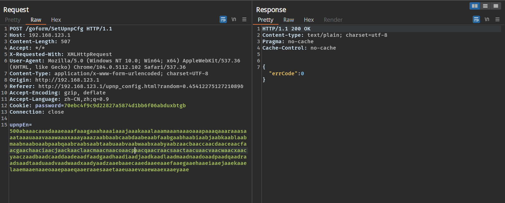
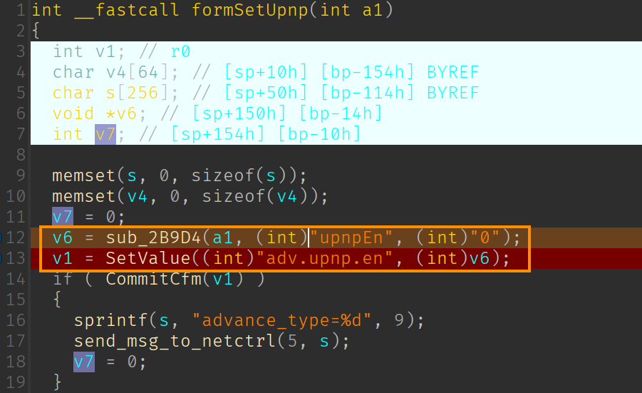
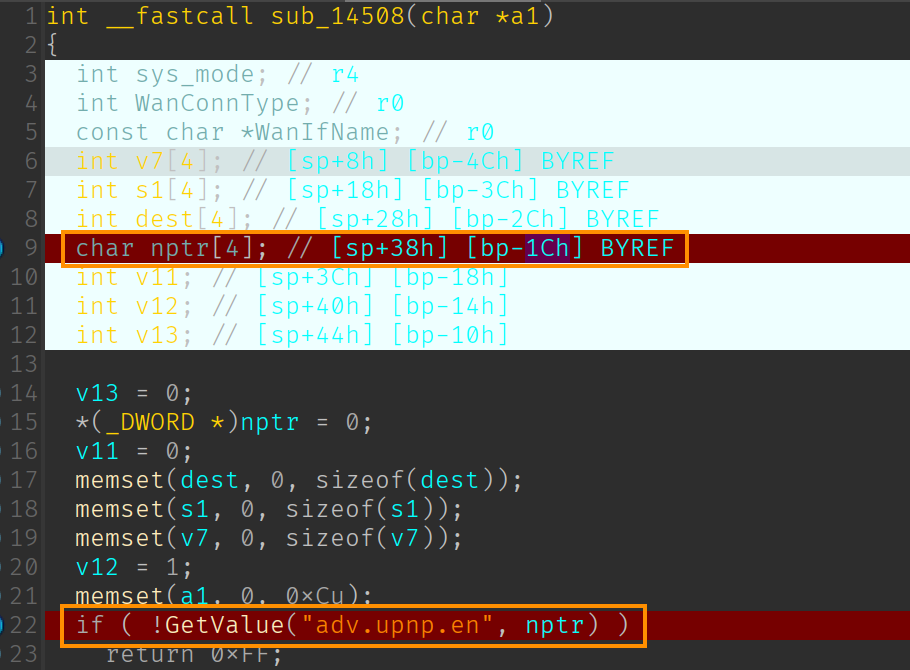
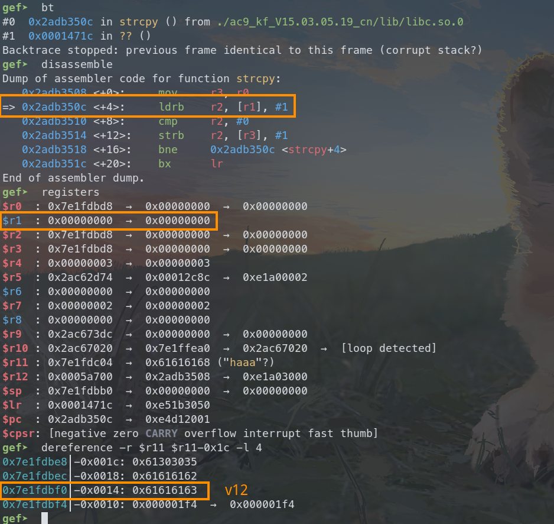

# Tenda AC9 V1 stack buffer overflow vulnerability

## Overview

- Manufacturer's website: <https://www.tenda.com.cn/>
- Firmware download: <https://www.tenda.com.cn/product/download/AC9.html>

## Vulnerability information

A stack buffer overflow vulnerability has been found in Tenda AC9 V1. If exploited, the vulnerability allows attackers to perform a DoS attack or execute arbitary code.

## Affected version(s)

We have verified this vulnerability in the following version(s):

- V15.03.05.19_multi

Figure shows the v1 latest firmware ：V15.03.05.19_multi，and V1 and v3 are different hardware.

## Reproduce the vulnerability

First, we login to the shell of the device through telnet and view the `/tmp` directory and the process number of the netctrl program to check that the device is working as expected.

We then use burp suite to send the constructed payload to `/goform/SetUpnpCfg` with the parameter `upnpEn` set to 500 characters.

Then we can find that the netctrl program crashes and there is a coredump file for netctrl generated in the `/tmp` directory. We can also notice that the netctrl program is not restarted after the crash.

## Vulnerability details

The vulnerability exists in function `sub_14508`(I don't know what the exact function name is, it's a function related to setting upnp and wifi configurations) in `/bin/netctrl` program, and the source point which sets the relevant configurations is located in function `formSetUpnp` of the `httpd` program.

First the value of `upnpEn` is stored persistently for key `adv.upnp.en` in `httpd` program.

Then in function `sub_14508` of `/bin/netctrl`, the previously stored very long string is copied into array `nptr` by function `GetValue` , causing the local variable `v12` to be **overwritten** to a large value.

`v12` is then passed as the first argument to function `getWanIfName`, which returns zero. Finally the "zero" pointer is passed to strcpy as the second argument, causing the function to dereference a NULL pointer, so the program netctrl crashes.

This analysis above can be verified if we further debug the generated coredump file. We can notice that the local variable `v12` is overwritten to `0x61616163`. If we construct a payload that sets a appropriate value for `v12` to avoid the program crashes but also overwrites the return address of the function `sub_14508`, we could hijick the control flow to anywhere we want, as well as execute arbitrary code.

## CVE-ID

unsigned
