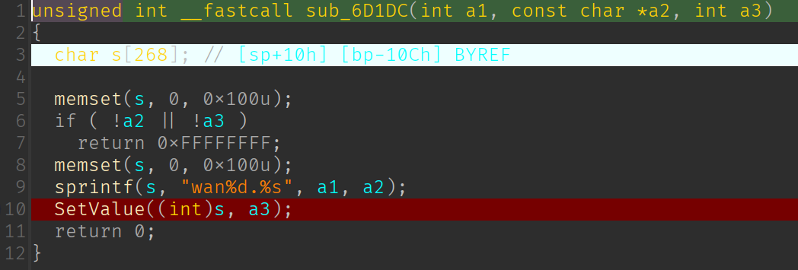

# Tenda AC9 V1 stack buffer overflow vulnerability

## Overview

- Manufacturer's website: <https://www.tenda.com.cn/>
- Firmware download: <https://www.tenda.com.cn/product/download/AC9.html>

## Vulnerability information

A stack buffer overflow vulnerability has been found in Tenda AC9 V1. If exploited, the vulnerability allows attackers to perform a DoS attack or execute arbitary code.

## Affected version(s)

We have verified this vulnerability in the following version(s):

- V15.03.05.19_multi

Figure shows the v1 latest firmware ：V15.03.05.19_multi，and V1 and v3 are different hardware.

## Reproduce the vulnerability

First, we log in to the shell of the device through telnet and view the `/tmp` directory and the process number of the netctrl program to check that the device is working as expected.

We then use burp suite to send the constructed payload to `/goform/WanParameterSettings` with the parameter `downSpeedLimit` set to 1000 characters.

Then we can find that the netctrl program crashes and there is a coredump file for netctrl generated in the `/tmp` directory. We can also notice that the netctrl program is not restarted after the crash.

## Vulnerability details

The vulnerability exists in function `sub_24444`(I don't know what the exact function name is, it's a function related to reading the wan configurations) in `/bin/netctrl` program, and the source point which sets the relevant configurations is located in function `formWanParameterSetting` of the `httpd` program.

First the value of `downSpeedLimit` is stored persistently for key `wan1.downrate` in `httpd` program. (The call chain is `formWanParameterSetting` -> `sub_6FB24` -> `sub_6FA50` -> `sub_6D1DC` in program `httpd`)

Then in function `sub_24444` of `/bin/netctrl`, the previously stored very long string is copied into array `cp` by function `GetValue` , causing the local variable `i` to be **overwritten**. And then the function tries to store a value to the invalid "address" `a1[i+5]`, so the program crashes.

This analysis above can be verified if we further debug the generated coredump file. And if we construct a payload that sets a appropriate value for `i` to avoid the program crashes but also overwrites the return address of the function `sub_24444`, we could hijick the control flow to anywhere we want, as well as execute arbitrary code.

## CVE-ID

unsigned
