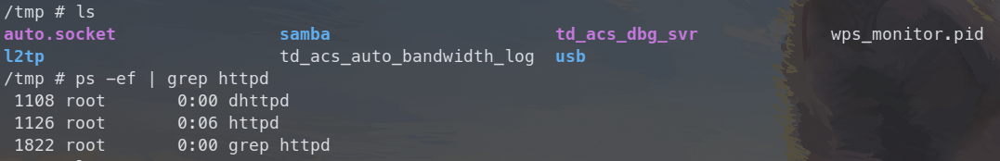

# Tenda AC9 V1 stack buffer overflow vulnerabilities

## Overview

- Manufacturer's website: <https://www.tenda.com.cn/>
- Firmware download: <https://www.tenda.com.cn/product/download/AC9.html>

## Vulnerability information

Six stack buffer overflow vulnerabilities have been found in Tenda AC9 V1. If exploited, the vulnerabilities allow attackers to perform a DoS attack or execute arbitary code.

## Affected version(s)

We have verified these vulnerabilities in the following version(s):

- V15.03.05.19_multi

Figure shows the v1 latest firmware ：V15.03.05.19_multi，and V1 and v3 are different hardware.

## Reproduce the vulnerability

First, we log in to the shell of the device through telnet and view the `/tmp` directory and the process number of the httpd program to check that the device is working as expected.

We then use burp suite to send the constructed payload with the `adv_mode` field set to 500 characters. Then nothing happens and the device works just as before, we can check the `/tmp` directory and the process number of the httpd program to verify that.

But when I construct the request to send the same payload again (actually it doesn't matter what the payload is), the httpd program crashes and there is a coredump file for httpd generated in the `/tmp` directory. We can also notice that the httpd program's process number has changed because it was restarted after the crash.

## Vulnerability details

The vulnerability exists in function `formWifiRadioSet` in `/bin/httpd` program. There are three variables associated with triggering this vulnerability: array `v10`, pointer `v30` and pointer `s1`.

First the value of `adv_mode` is stored into the memory space pointed to by `v30`, and then in the first request the very long value is stored for key `wl2g.public.nettype`.

In the second request, the very long value is then loaded into array `v10`. The value is much longer than the size of array `v10`, causing the pointer `s1` to be **overwritten**. The pointer `s1` is then passed to strcmp, which causes the function to dereference a nonexistent address, and crash the httpd program.

This analysis above can be verified if we further debug the generated coredump file.

And whats more? Notice that in the call stack printed by the `bt` command, the third return address has been overwritten as `0x65616168("haae")`(which is part of the payload we crafted, and we can calculate the offset is `428`). If we construct a payload avoiding the httpd program to crash, the return address can be controlled. It's not difficult to gain the ability to execute arbitrary code on that device.

## Go further

In fact, all six fields of this post request, not just the `adv_mode` , can overflow the stack and overwrite the `s1` pointer and return address. For example, if we put the very long string in the `adv_mode_5g` field, the httpd program will also crash and the return address will be overwritten. The only difference in exploiting is the offset to the return address we want to control.

## CVE-ID

unsigned
