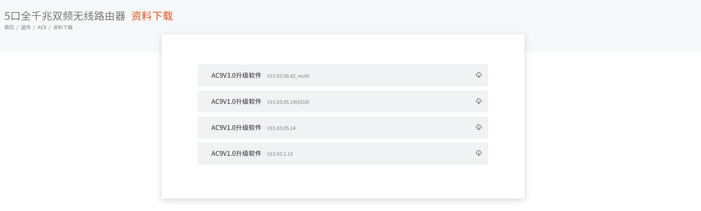
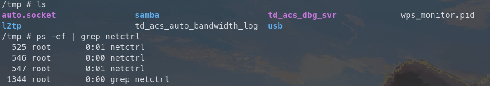
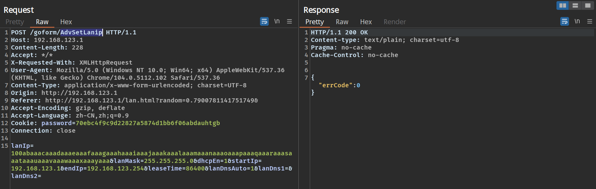
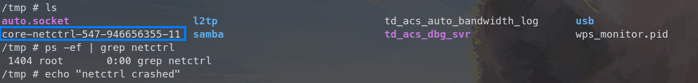
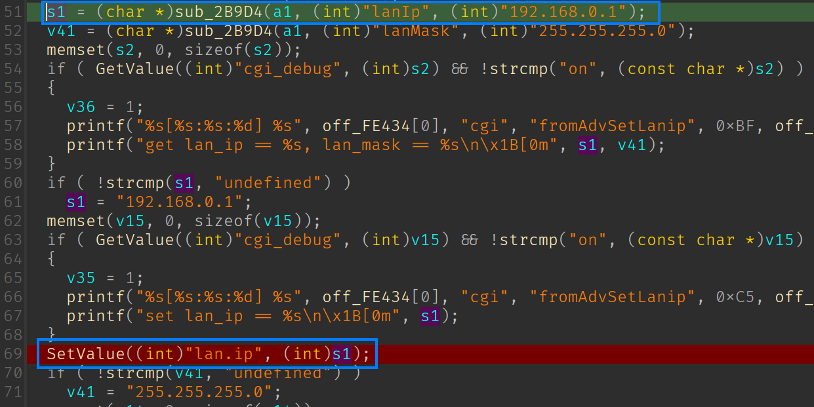
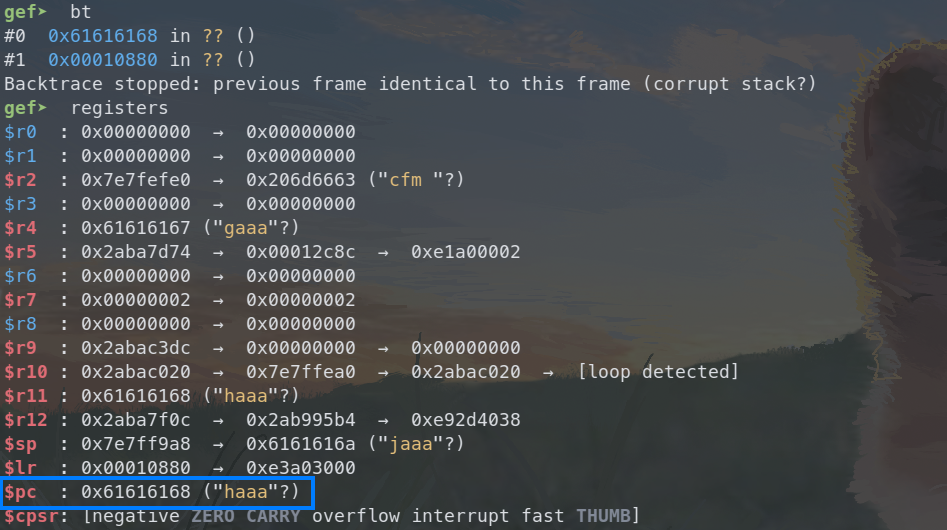

# Tenda AC9 V1 stack buffer overflow vulnerability

## Overview

- Manufacturer's website: <https://www.tenda.com.cn/>
- Firmware download: <https://www.tenda.com.cn/product/download/AC9.html>

## Vulnerability information

A stack buffer overflow vulnerability has been found in Tenda AC9 V1. If exploited, the vulnerability allows attackers to perform a DoS attack or execute arbitary code.

## Affected version(s)

We have verified this vulnerability in the following version(s):

- V15.03.05.19_multi

Figure shows the v1 latest firmware ：V15.03.05.19_multi，and V1 and v3 are different hardware.

## Reproduce the vulnerability

First, we login to the shell of the device through telnet and view the `/tmp` directory and the process number of the netctrl program to check that the device is working as expected.

We then use burp suite to send the constructed payload with the `lanIp` field set to 100 characters.

Then we can find that the netctrl program crashes and there is a coredump file for netctrl generated in the `/tmp` directory. We can also notice that the netctrl program is not restarted after the crash.

## Vulnerability details

The vulnerability exists in function `sub_10600`(I don't know what the exact function name is, it's a function related to reading the lan configurations) in `/bin/netctrl` program, and the source point which sets the relevant configurations is located in function `fromAdvSetLanip` of the `httpd` program.

First the value of `lanIp` is stored for key `lan.ip` in function `fromAdvSetLanip` of `httpd` program.

Then in function `sub_10600` of `/bin/netctrl`, the previously stored very long string is copied into array `s1` by function `GetValue` , causing the return address saved for function call to `sub_10600` to be **overwritten**. And when the function finishes and tries to return, it certainly has no way to return to the nonexistent address that we have overridden, so the program crashes.

The crash is the same if we provide the very long string to any of the fields `lanMask`, `dhcpEn`, `startIp`, `endIp`, `leaseTime`, `lanDnsAuto`, `lanDns1` and `lanDns2` in the request parameters.

This analysis above can be verified if we further debug the generated coredump file. We notice that the register `pc` is **overwritten** as `0x61616168`, and it's not difficult to calculate that the offset we need to control this return address is 28. We can hijick the control flow to anywhere we want, as well as execute arbitrary code.

## CVE-ID

unsigned
