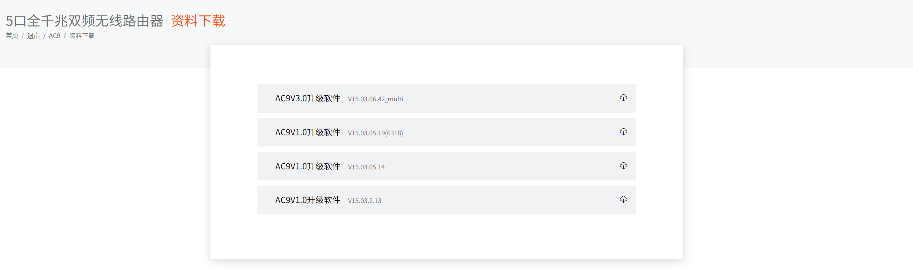
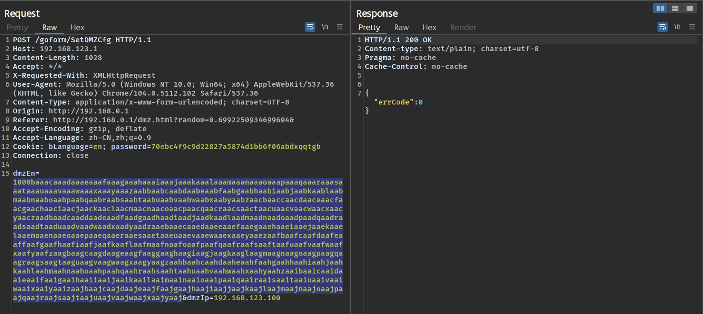
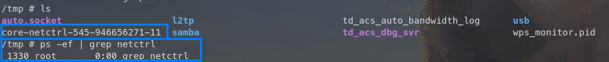

# Tenda AC9 V1 stack buffer overflow vulnerability

## Overview

- Manufacturer's website: <https://www.tenda.com.cn/>
- Firmware download: <https://www.tenda.com.cn/product/download/AC9.html>

## Vulnerability information

A stack buffer overflow vulnerability has been found in Tenda AC9 V1. If exploited, the vulnerability allows attackers to perform a DoS attack or execute arbitary code.

## Affected version(s)

We have verified this vulnerability in the following version(s):

- V15.03.05.19_multi

Figure shows the v1 latest firmware ：V15.03.05.19_multi，and V1 and v3 are different hardware.

## Reproduce the vulnerability

First, we login to the shell of the device through telnet and view the `/tmp` directory and the process number of the netctrl program to check that the device is working as expected.

We then use burp suite to send the constructed payload with the `dmzEn` field set to 1000 characters.

Then we can find that the netctrl program crashes and there is a coredump file for netctrl generated in the `/tmp` directory. We can also notice that the netctrl program is not restarted after the crash.

## Vulnerability details

The vulnerability exists in function `sub_12B44`(I don't know what the exact function name is, it's a function related to reading the dmz configurations) in `/bin/netctrl` program, and the source point which sets the relevant configurations is located in `mDMZSetCfg` function of the `httpd` program.

First the value of `dmzEn` and `dmzIp` are stored for key `wan1.dmzen` and `wan1.dmzip` in `mDMZSetCfg` function of `httpd` program.

Then in function `sub_12B44` of `/bin/netctrl`, the previously stored very long string is copied into array `dest` by function `GetValue` , causing the argument `a1` to be **overwritten**. Function strcpy then tries to dereference the nonexistent address `a1`, causing the `netctrl`program to crash.

The crash is the same if we provide the very long string to `wan1.dmzip`.

This analysis above can be verified if we further debug the generated coredump file.

And whats more? If we check the data on the stack, we can find that the return address saved for function call to `sub_12B44` is **overwritten** as `0x61616175`. It's not difficult to calculate that the offset we need to control this return address is 80. If we construct a payload avoiding the netctrl program to crash, the return address can be controlled. It's not difficult to gain the ability to execute arbitrary code on that device.

## CVE-ID

unsigned
