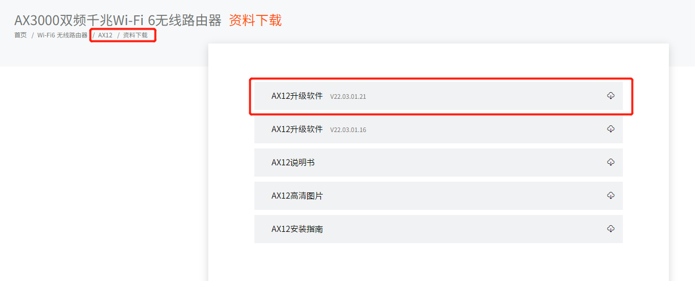
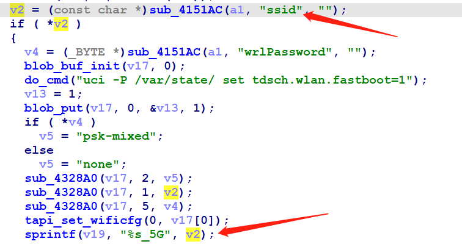
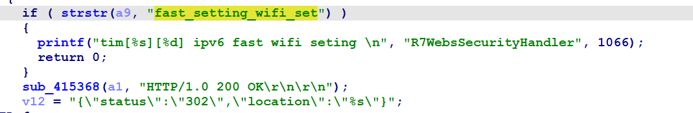
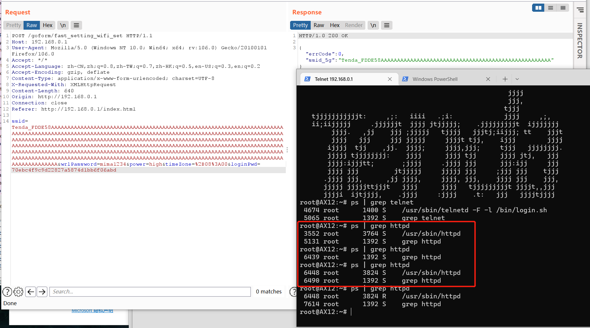
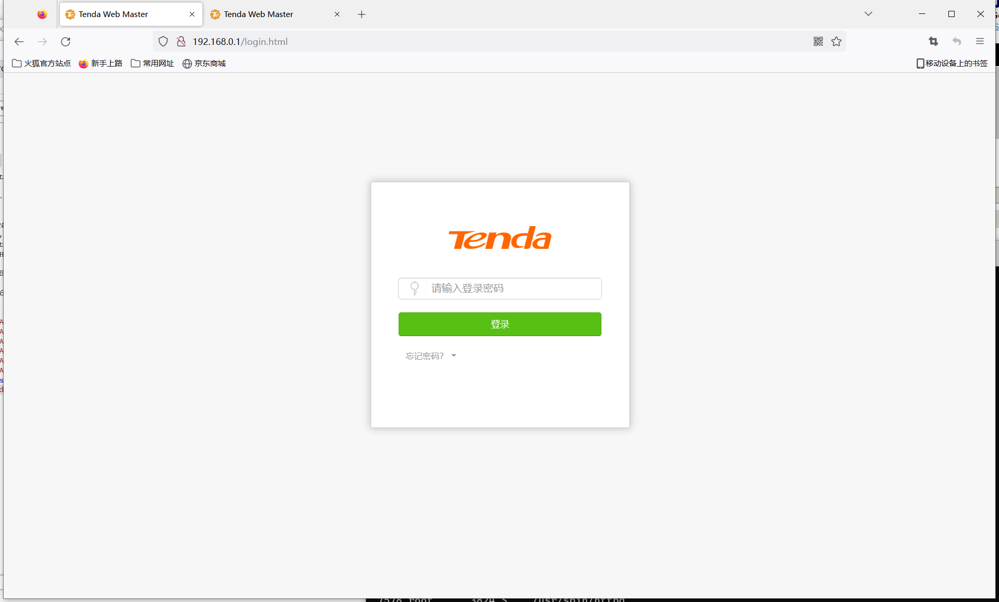
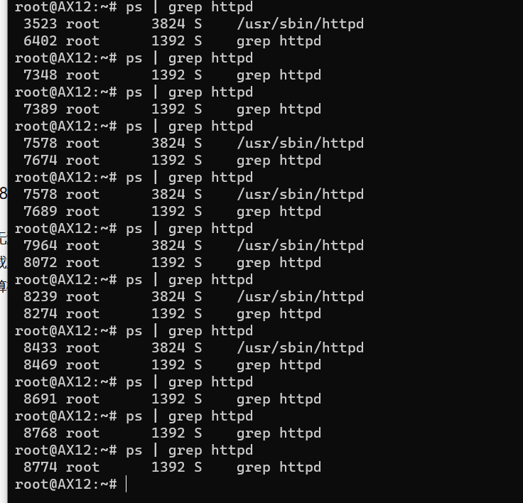

# Tenda AX12 unauthorized Buffer overflow vulnerability
## Overview
- Manufacturer's website information：https://www.tenda.com.cn/
- Firmware download address ：https://www.tenda.com.cn/download/detail-3237.html

## Vulnerability information
There is an unauthorized buffer overflow vulnerability in tenda ax12v22.03.01.21 _ cn, which can cause httpd to crash. Using this vulnerability can cause the web service not to restart or even execute arbitrary code.
It is a different vulnerability from CVE-2022-2414.
## Affected version



Figure shows the latest firmware ：V22.03.01.21_cn of the router
## Vulnerability details
open telnet  http://192.168.0.1/goform/telnet
telnet admin/password is root/ Fireitup

using ida to analysis httpd, in function sub_4335C0, the corresponding function field is fast_setting_wifi_set.



The program passes the contents obtained by the ssid parameter to V2
Then, format the matching content of V2 through the sprintf function into V19.
There is no size check, so there is a vulnerability that can cause buffer overflow through ssid field.

## Vulnerability exploitation condition
However, there are certain utilization conditions here, and it can be found in the function sub_417D94 that the field fast_setting_wifi_set will be checked.



The corresponding function of fast_setting_wifi_set is to initialize the network function when the device is started, and this function can only be triggered when the device is started initially or after reset. The data packet sent with this function during the normal operation of the device will not be processed, because it is filtered by the function in the above figure.

When the device is initially started, the web password is empty, so it can be used without authorization.

The functional data packets are as follows, and we will use this to construct poc.

```http
POST /goform/fast_setting_wifi_set HTTP/1.1
Host: 192.168.0.1
User-Agent: Mozilla/5.0 (Windows NT 10.0; Win64; x64; rv:106.0) Gecko/20100101 Firefox/106.0
Accept: */*
Accept-Language: zh-CN,zh;q=0.8,zh-TW;q=0.7,zh-HK;q=0.5,en-US;q=0.3,en;q=0.2
Accept-Encoding: gzip, deflate
Content-Type: application/x-www-form-urlencoded; charset=UTF-8
X-Requested-With: XMLHttpRequest
Content-Length: 111
Origin: http://192.168.0.1
Connection: close
Referer: http://192.168.0.1/index.html

ssid=Tenda_FDDE58&wrlPassword=mima1234&power=high&timeZone=%2B08%3A00&loginPwd=70ebc4f9c9d22827a5874d1bb6f06abd
```

## Recurring vulnerabilities and POC
In order to reproduce the vulnerability, the following steps can be followed:
1. Connect physical devices
2. Attack with the following POC


The reproduction results are as follows:




Figure shows POC attack effect, the binary httpd restarts.

Running exp without logging in can also attack, and several more attacks will cause httpd to restart all the time.



Finally, through observation, we found that httpd will not restart after several attacks.




## CVE-ID
unsigned