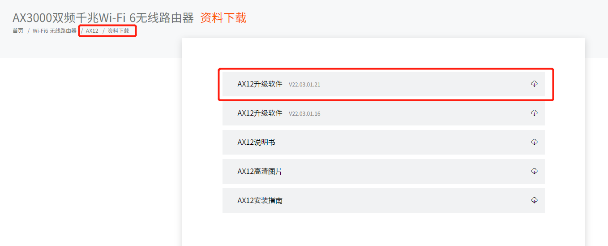
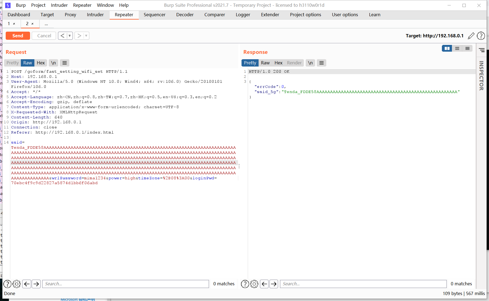
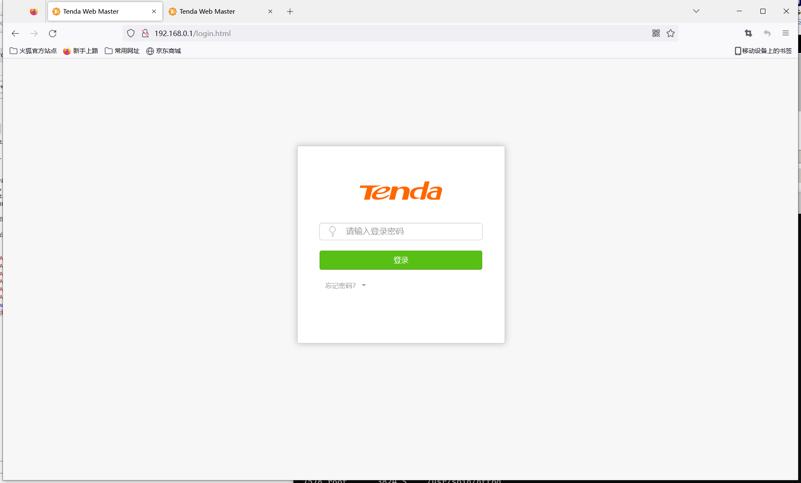
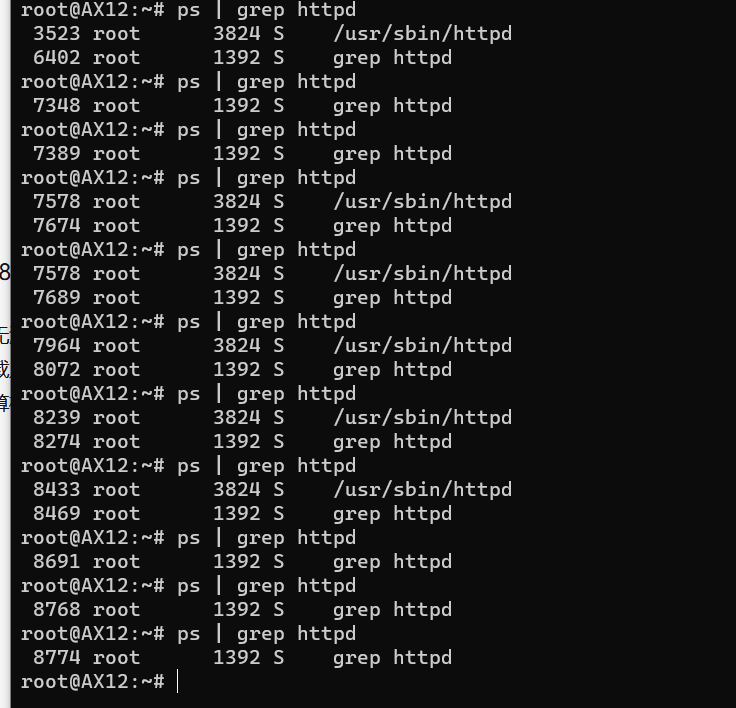

# Tenda AX12 未授权缓冲区溢出漏洞
## Overview
- 厂商官网：https://www.tenda.com.cn/
- 固件下载地址 ：https://www.tenda.com.cn/download/detail-3237.html

## Vulnerability information
tenda ax12v22.03.01.21 _ cn中存在未经授权的缓冲区溢出漏洞，可导致httpd崩溃。利用此漏洞会导致web服务消失甚至导致任意代码。
这是一个不同于CVE-2022-2414的漏洞。
## Affected version



图中显示了路由器的最新固件:V22.03.01.21_cn
## Vulnerability details
开启telnet  http://192.168.0.1/goform/telnet
telnet admin/password is root/ Fireitup

用ida分析httpd，在函数sub_4335C0中，对应的功能字段是fast_setting_wifi_set。


该程序将通过ssid参数获得的内容传递给V2，然后通过sprintf函数将V2匹配的内容格式化为V19。
这里没有大小检查，因此存在通过ssid字段导致的缓冲区溢出的漏洞。

## Vulnerability exploitation condition
但是这里有一定的利用条件，在函数sub_417D94中可以发现，会检查字段fast_setting_wifi_set。


fast_setting_wifi_set对应的功能是在设备启动时初始化网络功能，该功能只能在设备初始启动或复位后触发。在设备正常运行期间使用此功能发送的数据包将不会被处理，因为它已被上图中的功能过滤。

设备初始启动时，web密码未空，所以可以不授权使用。

功能数据包如下，我们将使用它来构建poc。

```http
POST /goform/fast_setting_wifi_set HTTP/1.1
Host: 192.168.0.1
User-Agent: Mozilla/5.0 (Windows NT 10.0; Win64; x64; rv:106.0) Gecko/20100101 Firefox/106.0
Accept: */*
Accept-Language: zh-CN,zh;q=0.8,zh-TW;q=0.7,zh-HK;q=0.5,en-US;q=0.3,en;q=0.2
Accept-Encoding: gzip, deflate
Content-Type: application/x-www-form-urlencoded; charset=UTF-8
X-Requested-With: XMLHttpRequest
Content-Length: 111
Origin: http://192.168.0.1
Connection: close
Referer: http://192.168.0.1/index.html

ssid=Tenda_FDDE58&wrlPassword=mima1234&power=high&timeZone=%2B08%3A00&loginPwd=70ebc4f9c9d22827a5874d1bb6f06abd
```

## Recurring vulnerabilities and POC
为了重现该漏洞，可以遵循以下步骤:
1.连接物理设备
2.使用以下poc进行攻击



结果如下:


图为POC攻击效果，二进制httpd重启。

不登录运行exp也能进行攻击，多攻击几次会导致httpd一直重启。



最后，通过观察，我们发现httpd程序会在连续攻击几次后消失。




## CVE-ID
unsigned