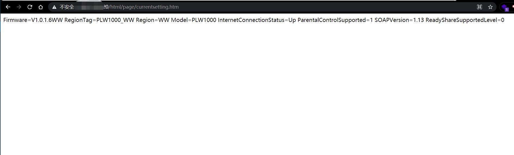

# PoC

The Netgear-PLW1000 router has an unauthorized access vulnerability. The attacker can access http://ip/html/page/currentsetting.htm without authorization, revealing the setting of the router

#### http://ip/html/page/currentsetting.htm

#### Acknowledgement

Thanks to the partners who discovered the vulnerability together：

Yi-fei Gao

Zhen-hua Wang

En-Ze Wang

Wei Xie