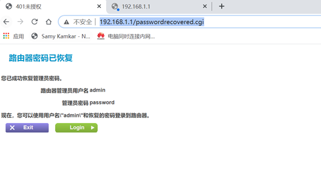

# PoC

There is an unauthorized access vulnerability in Netgear -WNDR4000 router. Attackers can access http://ip/passwordrecovered.cgi without authorization, which makes the router give away the password

#### http://ip/passwordrecovered.cgi

#### Acknowledgement

Thanks to the partners who discovered the vulnerability together：

Yi-fei Gao

Zhen-hua Wang

En-Ze Wang

Wei Xie