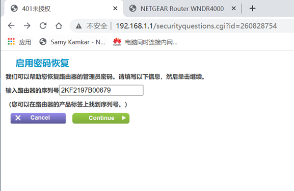
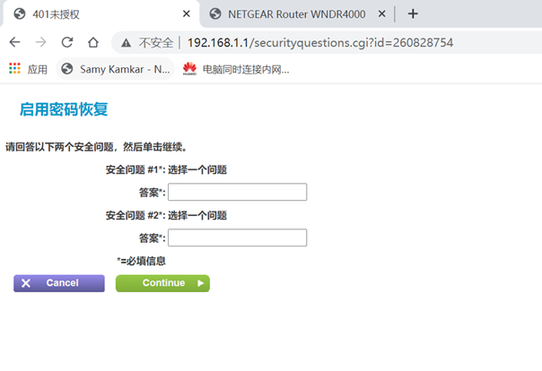

# PoC

The Netgear-WNDR4000 router has an unauthorized access vulnerability. The attacker can access http://ip/securityquestions.cgi without authorization. After the user enters the correct serial number, the answers to the security questions are empty by default, then the attacker can view the administrative password of the current router

#### http://ip/securityquestions.cgi

#### Acknowledgement

Thanks to the partners who discovered the vulnerability together：

Yi-fei Gao

Zhen-hua Wang

En-Ze Wang

Wei Xie