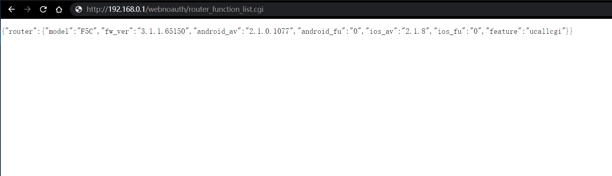

# PoC

There is an unauthorized access vulnerability in Qihu360-F5C router. Attackers can access http://ip/webnoauth/router_function_list.cgi without authorization, which result in the version information of each module of the firmware system to be leaked

#### http://ip/webnoauth/router_function_list.cgi

#### Acknowledgement

Thanks to the partners who discovered the vulnerability together：

Yi-fei Gao

Zhen-hua Wang

En-Ze Wang

Wei Xie